# 🛡️ Cyber Range Platform — 공방(攻防) 통합 훈련 플랫폼

> **위성 지상국 · 전력망(SCADA) · 사내망 + 정유/석유화학 · 스마트팩토리 · 수도 · LNG · 철도 · 공항 ·
> 데이터센터 · 병원** 등 **11개 ICS/OT 섹터**를 모사한 디지털 트윈 위에서
> Red(공격) · Blue(방어) · 관전자 · 교관이 함께 훈련하는 **풀스택 사이버 레인지**입니다.
> 취약 서비스 트윈(**60종**), EDR, SIEM, 시나리오 엔진, 실시간 대시보드, 자동 채점(AAR),
> 그리고 7개 분야 **69개 CTF 챌린지**를 하나의 `docker compose`로 기동합니다.
>
> 여기에 **실제 Modbus/TCP 를 말하는 ICS 트윈**(공격→물리 파괴→탐지→방어 완전 공방 루프),
> **SSE 실시간 상황판 + 단일 관리 콘솔(Control Tower)**, **인시던트·안티치트·위기 인젝트**,
> **Prometheus 관측성·시나리오 저작 도구**까지 갖춘 운영형 레인지입니다.

## 처음 시작하기

Docker와 Docker Compose v2, Node.js 20+가 설치돼 있다면 아래 순서만 따라 하면
됩니다. 첫 실행은 image build 때문에 시간이 조금 걸릴 수 있습니다.

### 전체 실전 훈련 환경 한 번에 관리

저장소 루트에서 다음 명령만 사용하면 됩니다.

```bash
make training-up       # 전체 백엔드·트윈·A/D 경기·대시보드 시작
make training-status   # 컨테이너와 대시보드 상태 확인
make training-down     # 전체 프로세스와 컨테이너 한 번에 종료
```

`training-up`은 세 팀의 실제 게임 서비스와 Red/Blue Portal, EDR, SIEM,
Live Fire, Control Tower를 함께 띄웁니다. Red Portal은 CTF 문제 카드 대신
허용된 상대 팀의 실제 Notes/Vault 포트로 HTTP 요청을 보내고 획득한 라운드
플래그를 게임 엔진에 제출하는 공격 워크벤치입니다.

| 화면 | URL |
|---|---|
| Red 실제 서비스 공격 | `http://localhost:5176` |
| Blue 방어 운영 | `http://localhost:5177` |
| EDR / SIEM | `http://localhost:5173` / `http://localhost:5175` |
| Live Fire | `http://localhost:5178/?mode=attack_defense` |
| Control Tower | `http://localhost:5180` |

`training-down`은 훈련 진행 데이터가 든 Docker volume은 보존합니다. 완전한
새 경기로 초기화해야 할 때만 종료 후 해당 데이터 volume을 명시적으로
삭제하십시오.

### 1. 경기 서버 시작

```bash
git clone https://github.com/MintKangaroo/Cyber-Offensive-and-Defensive-Exercise.git
cd Cyber-Offensive-and-Defensive-Exercise
make attack-defense-demo
```

이 명령 하나가 다음을 준비합니다.

- Attack/Defense API와 자동 round engine
- Operator 1명, 참가팀 3개
- 모든 팀에 동일한 Vulnerable Notes와 File Vault
- flag injector와 기능/SLA checker
- 패치 검증용 local registry

정상 기동 확인:

```bash
curl http://localhost:8100/health
python3 -m services.attack_defense.cli ad round-status ad-demo
docker compose ps
```

### 2. Live Fire 화면 시작

새 터미널을 열고 실행합니다.

```bash
cd Cyber-Offensive-and-Defensive-Exercise/dashboards/livefire
npm install
npm run dev -- --host 0.0.0.0 --port 5178
```

브라우저에서 `http://localhost:5178/?mode=attack_defense`를 엽니다.

| 사용 목적 | 아이디 | 비밀번호 |
|---|---|---|
| 경기 운영 | `instructor` | `demo-operator-change-me` |
| Team 01 참가 | `team01` | `demo-team-01-change-me` |
| Team 02 참가 | `team02` | `demo-team-02-change-me` |
| Team 03 참가 | `team03` | `demo-team-03-change-me` |

> 위 계정과 기본 secret은 로컬 데모 전용입니다. 공유 서버나 실제 경기에서는
> 반드시 `.env`의 비밀번호·JWT·HMAC secret을 교체하십시오.

### 3. 바로 체험하기

1. `team01`로 로그인해 **Battle Overview**에서 자기 서비스가 정상인지 확인합니다.
2. `http://localhost:9102` 또는 `http://localhost:9202`처럼 상대 팀 서비스를
   테스트합니다. 데모는 공격 exploit을 자동 실행하지 않습니다.
3. 획득한 `FLAG{...}`를 **Attack Console**에 붙여넣습니다.
4. **Defense Console**에서 checker, image digest와 patch 상태를 확인합니다.
5. `instructor`로 로그인하면 **Command Center**에서 전체 팀×서비스 상태,
   round 제어, restart/rollback과 감사 로그를 확인할 수 있습니다.

## 경기 모드

기존 CCE 스타일 기능을 유지하면서 다음 세 모드를 독립적으로 지원합니다.

| 모드 | 설명 |
|---|---|
| `exercise` | 기존 Red Team 대 Blue Team 훈련. 운영진 시나리오·위기 인젝트와 Blue 탐지·차단·복구·보고 |
| `attack_defense` | DEF CON Finals 스타일 대칭 공방. 전 팀 동일 서비스, 라운드 플래그, SLA checker, 패치, Attack/Defense/Availability ledger |
| `hybrid_live_fire` | 대칭 공방에 운영진 Red 시나리오·인젝트를 명시적으로 결합. Detection/Containment/Recovery/Incident Response/Mission Inject를 별도 채점 |

`exercise`는 기존 `range_control`/scenario/inject/scoring 경로를 그대로
사용합니다. 신규 엔진은 exercise에 라운드 플래그나 팀 대 팀 공격을 강제하지
않으며, `attack_defense`에는 위기 인젝트를 필수로 적용하지 않습니다.

### 모드별 실행 경계

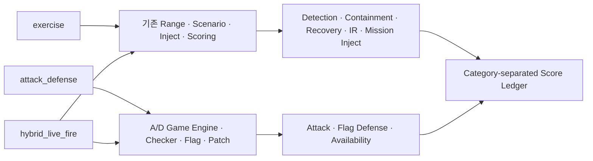

- `MatchModeStrategy`, `ScoringPolicy`, `AttackPolicy`, `CheckerPolicy`,
  `InjectPolicy`, `ServiceDeploymentPolicy`, `ScoreVisibilityPolicy`가 모드별
  동작을 분리합니다.
- `hybrid_live_fire`는 두 모델을 명시적으로 조합하며, 경기 설정에서 사용할
  점수 카테고리와 가중치를 선택합니다.
- 모든 점수 변경은 합계 테이블을 직접 수정하지 않고 idempotency key가 있는
  append-only `ScoreLedger`에 기록됩니다.

### Attack/Defense 경기 루프

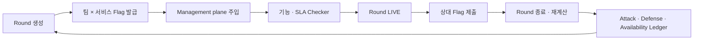

MVP는 3개 팀에 동일한 두 서비스인 **Vulnerable Notes**와 **File Vault**를
배포합니다. 플래그는 `match × round × victim team × service` 범위의 HMAC
opaque token이며 평문을 DB, 일반 로그, metric label, 이벤트 payload에 남기지
않습니다. 패치는 허용 registry와 팀 namespace를 확인한 뒤 digest로 고정하고,
sandbox 정상 기능·flag put/get 검사 후 live 교체하며 실패 시 이전 digest로
rollback합니다.

### Live Fire Operations UI

| 역할 | 기본 화면 | 공개 범위 |
|---|---|---|
| Competitor | Battle Overview, Attack/Defense Console, Services, Patches, Scoreboard | 자기 서비스 상세와 공개 공격면 |
| Operator | Command Center, Team × Service Matrix, Round/Flag/Checker/Patch/Score/Evidence | 실시간 운영 정보와 감사 사유가 필요한 제어 액션 |
| Observer | Live Overview, 지연 Scoreboard, Timeline, 서비스 aggregate | 팀 내부 상태·endpoint·checker 증거·image reference 제외 |

상단 Live Match Header에서 경기 상태, 현재 라운드, 서버 기준 남은 시간, 전체
경과 시간, SSE 연결 지연을 확인할 수 있습니다. 이벤트 스트림은
`Last-Event-ID`, 중복 제거, out-of-order 정렬, exponential backoff reconnect를
지원하며 `prefers-reduced-motion`, 키보드 탐색과 `Ctrl/Cmd + K` command palette를
제공합니다.

검증된 상태:

- 기존 exercise/ICS를 포함한 Python 전체 회귀: **349 passed, 6 skipped**
  (PostgreSQL 전용 6개는 별도 PostgreSQL 17 실행에서 모두 통과)
- React/Vitest 컴포넌트 테스트: **19 passed**
- Playwright 역할·권한·키보드·시각 회귀: **5 passed**
- 3팀 × 2서비스 실제 Compose health, round 재시작 복구, flag 제출·중복 차단,
  digest-pinned patch 배포·rollback 경로 검증
- Vite production build 및 `npm audit` 통과

### 상세 명령과 접속 정보

```bash
make attack-defense-demo
```

이 명령은 3팀 × 동일한 2개 서비스(Vulnerable Notes, File Vault), 로컬
registry, 자동 라운드/checker와 공개 scoreboard를 기동합니다.

데모 계정(로컬 전용):

- Operator: `instructor` / `demo-operator-change-me`
- Competitors: `team01` / `demo-team-01-change-me`,
  `team02` / `demo-team-02-change-me`,
  `team03` / `demo-team-03-change-me`

API는 `http://localhost:8100`이며 주요 경로는
`POST /api/attack-defense/matches/{id}/flags/submit`,
`POST /api/attack-defense/matches/{id}/services/{service}/patches`,
`GET /api/attack-defense/matches/{id}/scoreboard`입니다. 전체 실행 절차는
[Attack/Defense Demo](docs/attack-defense-demo.md), 구조는
[Architecture](docs/attack-defense-architecture.md), 보안 경계와 현재 한계는
[Security Review](docs/attack-defense-security.md)를 참고하십시오.

Live Fire UI 실행:

```bash
cd dashboards/livefire
npm install
npm run dev -- --host 0.0.0.0 --port 5178
```

- 일반 UI: `http://localhost:5178/?mode=attack_defense`
- Hybrid UI: `http://localhost:5178/?mode=hybrid_live_fire`
- 방송 안전 Observer: `http://localhost:5178/observer/live?mode=attack_defense`

운영 CLI와 trusted patch runner:

```bash
python3 -m services.attack_defense.cli ad round-status ad-demo
python3 -m services.attack_defense.cli ad flag-submit ad-demo 'FLAG{...}'
make attack-defense-runtime-work
```

> **보안 주의:** 데모 비밀번호·JWT/HMAC 키는 공유 또는 운영 환경에서 반드시
> 교체해야 합니다. Docker Compose의 네트워크 분리는 대회급 방향성 egress,
> bandwidth/connection 제한을 완전히 보장하지 않습니다. API 컨테이너에는 Docker
> socket을 절대 마운트하지 마십시오.

Live Fire UI 실제 API 캡처:

| Competitor Battle Overview | Operator Command Center |
|---|---|
| 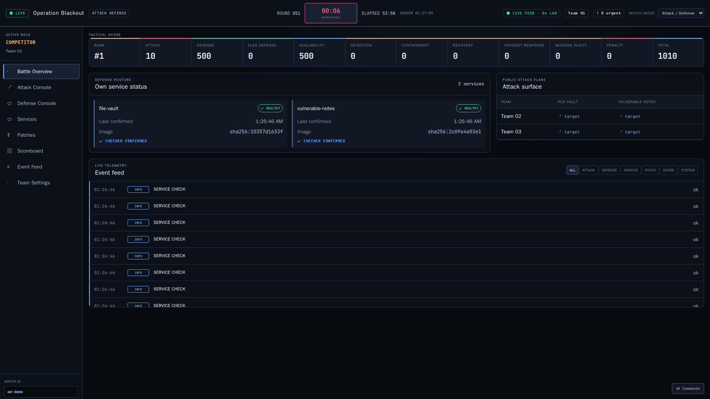 | 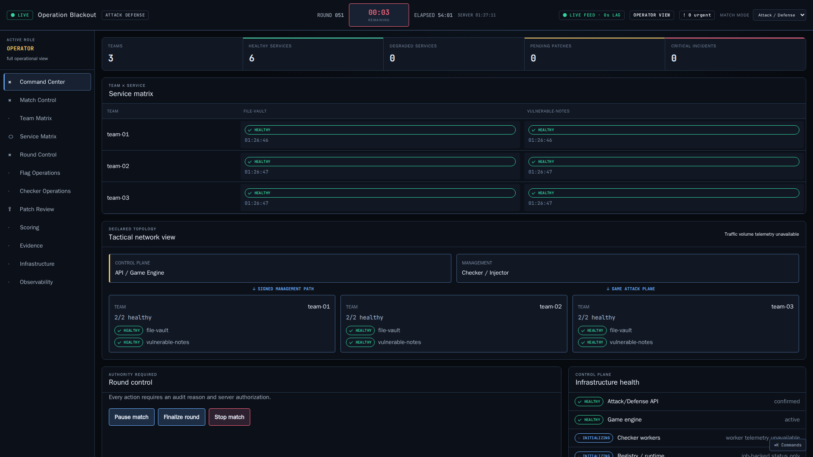 |

Observer/broadcast-safe 화면과 노트북 viewport 캡처는
[Live Fire Screen Specification](docs/ui/live-fire-screen-specification.md)에 있습니다.

## 경기 운영 방법

### 참가자: 공격과 방어

- **공격:** 상대 서비스에서 획득한 flag를 `Attack Console`에 제출합니다. 같은
  팀이 동일 flag를 다시 제출하거나 자기 flag를 제출하면 점수가 지급되지 않습니다.
- **방어:** 자기 서비스의 정상 기능을 유지하면서 취약점을 패치합니다. 단순
  `/health`가 아니라 회원가입·로그인·데이터 생성/조회와 flag put/get까지 checker가
  수행합니다.
- **점수:** 상대 flag 최초 제출은 Attack, 자기 flag 보호는 Defense, 정상 기능
  유지는 Availability로 각각 기록됩니다.

서비스 접속 주소:

| 팀 | Vulnerable Notes | File Vault |
|---|---:|---:|
| Team 01 | `http://localhost:9101` | `http://localhost:9201` |
| Team 02 | `http://localhost:9102` | `http://localhost:9202` |
| Team 03 | `http://localhost:9103` | `http://localhost:9203` |

CLI로 flag를 제출하려면 Auth API에서 받은 access token을 사용합니다.

```bash
curl -s http://localhost:8051/auth/login \
  -H 'Content-Type: application/json' \
  -d '{"username":"team01","password":"demo-team-01-change-me"}'

export ATTACK_DEFENSE_COMPETITOR_TOKEN='<응답의 access_token>'
python3 -m services.attack_defense.cli ad flag-submit ad-demo 'FLAG{...}'
```

### 운영자: 경기 제어

데모는 bootstrap 직후 자동으로 첫 round를 시작합니다. 운영자는 UI 또는 다음
CLI로 상태를 확인하고 경기를 제어할 수 있습니다.

```bash
# 현재 round와 전체 서비스 확인
python3 -m services.attack_defense.cli ad round-status ad-demo
python3 -m services.attack_defense.cli ad service-list ad-demo

# 인프라 장애 조사 시 일시정지/재개
python3 -m services.attack_defense.cli ad match-pause ad-demo \
  --reason "checker infrastructure investigation"
python3 -m services.attack_defense.cli ad match-resume ad-demo \
  --reason "checker infrastructure recovered"

# 현재 round 강제 종료 또는 전체 점수 재계산
python3 -m services.attack_defense.cli ad round-finalize ad-demo
python3 -m services.attack_defense.cli ad score-recalculate ad-demo
```

운영 액션에는 반드시 영향 범위를 확인하고 감사 사유를 입력합니다. 팀 서비스
문제로 인한 장애와 checker/database 같은 경기 인프라 장애를 구분하고, 운영
인프라 장애라면 팀이 불이익을 받기 전에 경기를 pause하는 것이 기본 운영 원칙입니다.

### 패치 제출과 배포

1. 참가팀이 자기 namespace에 patch image를 build합니다. 호스트에서 push할 때는
   `localhost:5000/<team>/<service>:<tag>`를 사용합니다.
2. UI의 **Patches**에는 control-plane 주소인
   `registry.local:5000/<team>/<service>:<tag>`를 제출합니다. `latest` tag는 사용할
   수 없습니다.
3. 운영 호스트에서 아래 명령을 실행해 sandbox와 live deploy job을 처리합니다.

```bash
make attack-defense-runtime-work
```

한 번 실행할 때 durable job 하나를 처리합니다. 다음 단계가 남아 있으면 다시
실행합니다. 정상 기능 또는 flag workflow 검사가 실패하면 live image를 바꾸지
않거나 이전 digest로 rollback합니다. API 컨테이너에 Docker socket을 연결하지
마십시오.

### 선택 사항: Kubernetes에 팀 서비스 배포

기본 데모는 Docker Compose이므로 Kubernetes가 없어도 됩니다. 실제 CNI 기반 격리가
필요한 운영자는 팀 서비스와 patch sandbox만 Kubernetes runtime으로 전환할 수
있습니다. API에 kubeconfig를 넣지 않고 신뢰된 운영 호스트에서만 실행합니다.

```bash
# .env에서 GAME_RUNTIME=kubernetes, KUBERNETES_IMAGE_REGISTRY,
# ATTACK_DEFENSE_MANAGEMENT_TOKEN을 먼저 설정합니다.

# 1) 리소스 생성 없이 manifest·보안 정책 검사
python3 -m services.attack_defense.cli ad runtime-reconcile ad-demo \
  --runtime kubernetes --kube-context range-production

# 2) 출력과 context를 확인한 뒤 실제 배포
python3 -m services.attack_defense.cli ad runtime-reconcile ad-demo \
  --runtime kubernetes --kube-context range-production --apply-kubernetes \
  --reason "initial tournament deployment"

# 3) 대기 중인 patch/restart/rollback 작업 한 건 처리
python3 -m services.attack_defense.cli ad runtime-work \
  --runtime kubernetes --kube-context range-production \
  --apply-kubernetes --runner-id k8s-runner-01
```

Kubernetes runtime은 팀·sandbox별 namespace, restricted Pod Security,
deny-by-default NetworkPolicy, quota, digest 고정 image, readiness 기반 rolling
배포를 생성합니다. 단, CNI·registry·RWX storage·API control-plane 배포·image
signature 검증은 자동 설치하지 않습니다. 기본 `ad-demo` 이미지를 사용하려면
먼저 운영 registry로 mirror하고 서비스 정의의 digest가 registry manifest digest와
일치해야 합니다. 사전 조건과 정확한 운영 절차는
[Kubernetes Runtime](docs/attack-defense-kubernetes.md)을 먼저 확인하십시오.

### 선택 사항: PostgreSQL 기반 다중 Game Engine 실행

기본 `make attack-defense-demo`는 단일 API와 SQLite를 사용합니다. API 또는 game
engine 인스턴스 장애 시 다른 인스턴스가 경기를 이어받아야 하는 운영 리허설에는
PostgreSQL 공유 상태와 HAProxy를 사용하는 HA 프로필을 실행합니다.

```bash
cp .env.example .env
./scripts/gen_secrets.sh
make attack-defense-ha-demo

# 두 API가 같은 DB·round lock·rate limit을 공유하는지 확인
make attack-defense-ha-status
curl -fsS http://localhost:8110/ready
```

HA API 주소는 `http://localhost:8110`입니다. 이 프로필은 새 PostgreSQL DB를
사용하므로 기존 SQLite 경기를 자동 이전하지 않습니다. 로컬 HAProxy에는 TLS가
없고 PostgreSQL도 단일 컨테이너이므로 대회 운영용 database HA 구성이 아닙니다.
운영 요구사항과 장애 복구 절차는
[High-Availability Mode](docs/attack-defense-high-availability.md)를 참고하십시오.

### 선택 사항: KOTH 소유권 경기 켜기

KOTH는 네 번째 경기 모드가 아닙니다. `attack_defense` 또는
`hybrid_live_fire` 경기에서만 선택적으로 켜는 소유권·채점 규칙입니다. 상대
서비스의 정상적인 새 라운드 플래그를 제출하면 해당 팀×서비스 hill의 제한된
round lease를 획득하며, 서비스 정상 기능이 유지될 때만 별도 KOTH 점수를 받습니다.

이미 실행 중인 데모에서는 먼저 경기를 pause합니다.

```bash
python3 -m services.attack_defense.cli ad match-pause ad-demo \
  --reason "enable KOTH scoring"
python3 -m services.attack_defense.cli ad koth-configure ad-demo \
  --service-id service-vulnerable-notes \
  --lease-rounds 2 --points-per-round 3 --score-weight 1 \
  --reason "approved KOTH rules"
python3 -m services.attack_defense.cli ad match-resume ad-demo \
  --reason "KOTH policy applied"
python3 -m services.attack_defense.cli ad koth-status ad-demo
```

Live Fire 화면에는 실제 API에서 받은 현재 소유 팀과 남은 lease round가 표시됩니다.
플래그·내부 endpoint·checker 상세·공격 기법은 공개하지 않습니다. 전체 규칙과
비활성화 절차는 [KOTH Policy](docs/attack-defense-koth.md)를 참고하십시오.

### 선택 사항: Stealth Mode 켜기

Stealth Mode도 네 번째 경기 모드가 아닙니다. `attack_defense`와
`hybrid_live_fire`에서만 선택적으로 켜며, 기존 flag 제출 형식과 Attack 점수는
바꾸지 않습니다. 공격 성공 정보는 운영자에게만 즉시 보이고 참가자·관전자에게는
설정한 round만큼 지연됩니다. 방어팀은 공개 알림을 보기 전에 자체 SIEM/EDR 증거의
SHA-256을 제출할 수 있습니다.

```bash
python3 -m services.attack_defense.cli ad match-pause ad-demo \
  --reason "enable delayed disclosure"
python3 -m services.attack_defense.cli ad stealth-configure ad-demo \
  --alert-delay-rounds 2 --detection-window-rounds 2 \
  --attacker-points 2 --defender-points 2 \
  --reason "approved Stealth rules"
python3 -m services.attack_defense.cli ad match-resume ad-demo \
  --reason "Stealth policy applied"
python3 -m services.attack_defense.cli ad stealth-status ad-demo
```

증거 제출 결과는 실제 incident 일치 여부와 관계없이 항상
`pending_verification`으로 응답하므로 탐지 oracle로 사용할 수 없습니다. 공개
scoreboard와 KOTH 상태에도 동일한 공개 지연 하한이 적용됩니다. 자세한 사용법과
한계는 [Stealth Mode Policy](docs/attack-defense-stealth.md)를 참고하십시오.

### 선택 사항: LiveCTF 토너먼트 운영

LiveCTF는 네 번째 경기 모드가 아닙니다. 여러 개의 `attack_defense` 또는
`hybrid_live_fire` 경기를 단일 탈락 대진으로 묶는 상위 운영 계층입니다. 각
대진은 새 Match·팀 ID·서비스 인스턴스·플래그·점수 ledger를 사용하므로 이전
대진의 토큰이나 패치 상태가 다음 대진으로 넘어가지 않습니다. 기존 `exercise`
모드는 토너먼트에 등록되지 않으며 그대로 유지됩니다.

가장 짧은 4팀 생성 흐름은 다음과 같습니다.

```bash
export INSTRUCTOR_TOKEN='<operator token>'

# 1) 토너먼트 생성
python3 -m services.attack_defense.cli ad tournament-create \
  --id livectf-demo --name "LiveCTF Demo" --bracket-size 4 \
  --match-mode attack_defense

# 2) 팀 등록: identity-subject는 로그인 username/JWT sub와 일치시킵니다.
for n in 1 2 3 4; do
  python3 -m services.attack_defense.cli ad tournament-entry-add livectf-demo \
    --id "entry-${n}" --slug "team-0${n}" --name "Team ${n}" \
    --identity-subject "team0${n}" --seed "${n}"
done

# 3) 공통 취약 서비스 등록(두 번째 서비스도 같은 방식으로 추가 가능)
python3 -m services.attack_defense.cli ad tournament-service-add livectf-demo \
  --id tournament-notes --slug vulnerable-notes --name "Vulnerable Notes" \
  --base-image registry.local:5000/base/vulnerable-notes:v1 \
  --internal-port 9000 --checker-type vulnerable_notes \
  --config '{"endpoint_template":"http://{team_slug}-{service_slug}:9000","management_endpoint_template":"http://{team_slug}-{service_slug}:9001"}'

# 4) 대진 확정 및 토너먼트 시작
python3 -m services.attack_defense.cli ad tournament-seed livectf-demo \
  --reason "approved tournament seeding"
python3 -m services.attack_defense.cli ad tournament-start livectf-demo \
  --reason "competition window opened"
python3 -m services.attack_defense.cli ad tournament-status livectf-demo
```

`tournament-status`에서 `scheduled` fixture의 ID와 Match ID를 확인하고, 서비스
배포 및 참가자용 새 Match JWT 발급이 끝난 뒤 경기를 시작합니다.

```bash
python3 -m services.attack_defense.cli ad tournament-fixture-start \
  livectf-demo '<fixture-id>' --reason "teams and checker ready"
python3 -m services.attack_defense.cli ad tournament-fixture-finalize \
  livectf-demo '<fixture-id>' --reason "fixture and dispute window closed"
```

점수가 완전히 같으면 자동 진출자를 정하지 않습니다. 심판 판정이 필요할 때만
`--winner-entry-id <entry-id>`를 추가하고 구체적인 사유를 기록합니다. 프로세스
재시작 후에는 `tournament-reconcile`을 실행하면 다음 대진을 중복 없이 복구합니다.
Live Fire UI는 토너먼트 Match에서 **Tournament Bracket** 메뉴를 자동 표시하며,
관전자 화면에는 Match ID·계정 매핑·운영 사유가 노출되지 않습니다.

> 현재 기본 Docker Compose 데모는 고정 3팀 서비스만 실행하므로 임의 대진의
> 컨테이너를 동적으로 만들지 않습니다. 실제 토너먼트 서비스는 Kubernetes
> runtime 또는 별도로 검토한 대진별 Compose project에 배포해야 합니다. 상세
> 절차와 보안 경계는
> [LiveCTF Tournament](docs/attack-defense-tournament.md)를 참고하십시오.

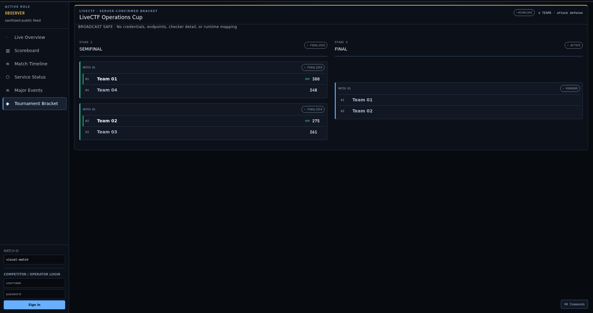

### 선택 사항: OBS 방송 오버레이

Live Fire는 일반 관전자 화면과 별도로, 내비게이션이나 로그인 UI가 없는
1920×1080 방송 소스를 제공합니다. OBS Browser Source에 다음 URL 중 하나를
입력합니다.

```text
# 투명 하단 scorebar
http://localhost:5178/broadcast/overlay?match_id=ad-demo&layout=scorebar&background=transparent

# 전체 순위/서비스 집계 화면
http://localhost:5178/broadcast/overlay?match_id=ad-demo&layout=standings&background=solid

# LiveCTF 대진표
http://localhost:5178/broadcast/overlay?match_id=<fixture-match>&layout=bracket&background=solid
```

방송 경로는 브라우저에 운영자 토큰이 남아 있어도 이를 읽거나 전송하지 않고,
무인증 공개 전용 snapshot API만 호출합니다. 화면에 표시되는 점수는 public delay
정책과 Stealth disclosure floor를 그대로 따르며, 서비스 상태는 팀 매핑 없는
aggregate입니다. 이벤트, endpoint, flag, checker/patch 증거, image digest와 계정
매핑은 snapshot에 포함되지 않습니다. 투명 배경 외에 `background=chroma`, 표시 팀
수 `max_teams=2..16`, URL 인코딩한 6자리 `accent` 색을 지정할 수 있습니다.

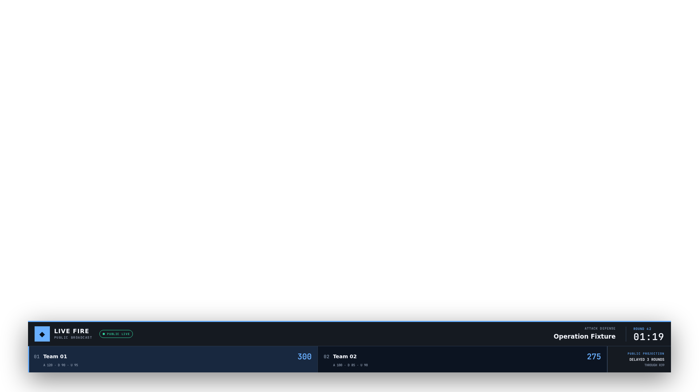

OBS 설정, 장애 시 stale 동작과 전체 보안 경계는
[Broadcast Graphics Overlay](docs/attack-defense-broadcast.md)를 참고하십시오.

### 관전과 운영 모니터링

- Observer 화면: `http://localhost:5178/observer/live?mode=attack_defense`
- API health: `curl http://localhost:8100/health`
- Prometheus metrics: `curl http://localhost:8100/metrics`
- Engine 로그: `docker compose logs -f attack_defense`
- 특정 서비스 로그: `docker compose logs -f ad_team_01_notes`

Observer는 공개 scoreboard, round 시간과 서비스 aggregate만 봅니다. 실제 flag,
팀별 내부 상태, endpoint, checker 상세 증거와 patch image 정보는 공개하지 않습니다.

### PCAP 증거를 안전하게 제공하기

운영자는 승인된 classic PCAP 파일을 업로드할 수 있습니다. 서버는 원본을 저장하지
않고 IP·MAC을 가명화하고 flag·비밀번호·token을 지운 정제본만 보관합니다.
정해진 지연 시간이 지나면 참가자의 **Captures** 화면에 다운로드 버튼이 열리며,
팀마다 주소가 다시 가명화되고 서로 다른 watermark가 적용됩니다.

```bash
# 운영자: PCAP 정제·등록 및 상태 확인
python3 -m services.attack_defense.cli ad capture-upload \
  ad-demo ./round-042.pcap --reason "round 42 post-round evidence"
python3 -m services.attack_defense.cli ad capture-list ad-demo

# 참가자: 공개 시간이 지난 정제본 다운로드
export ATTACK_DEFENSE_COMPETITOR_TOKEN='<access_token>'
python3 -m services.attack_defense.cli ad capture-download \
  ad-demo '<capture-id>' ./evidence/round-042.pcap
```

현재는 Ethernet/raw-IP/Linux cooked-v1 형식의 classic PCAP만 지원합니다.
PCAPNG와 자동 TAP/CNI 캡처는 아직 지원하지 않으며, 지원하지 않는 입력은 원본을
그대로 통과시키지 않고 거절합니다. 상세 정책은
[PCAP Privacy and Delayed Delivery](docs/attack-defense-pcap.md)를 참고하십시오.

### 기존 Exercise 모드 사용

기존 CCE 스타일 Red Team 대 Blue Team 훈련은 전체 플랫폼을 기동한 뒤 Live Fire
UI에서 `Exercise / CCE`를 선택합니다.

```bash
docker compose up -d --build
```

이 모드에서는 기존 Scenario/Inject/EDR/SIEM/Incident/AAR 흐름을 사용하며,
Attack/Defense round flag나 팀 대 팀 채점을 강제로 적용하지 않습니다.

### 안전하게 종료

```bash
# A/D 데모만 중지
docker compose stop attack_defense ad_registry \
  ad_team_01_notes ad_team_01_vault \
  ad_team_02_notes ad_team_02_vault \
  ad_team_03_notes ad_team_03_vault

# 전체 플랫폼 중지
docker compose down
```

일반 종료 시 `docker compose down -v`를 사용하지 마십시오. `-v`는 경기 상태,
점수 ledger, 감사 기록과 서비스 데이터를 담은 volume까지 삭제합니다.

## 현재 MVP 보안 경계

- Compose bridge는 방향성 egress, 대회급 bandwidth/connection quota를 완전히
  강제하지 못합니다. 운영 환경에서는 CNI 기반 deny-by-default NetworkPolicy가
  필요합니다.
- SQLite lease는 단일 프로세스 개발·데모용입니다. 다중 game-engine은 구현된
  PostgreSQL advisory lock, DB 기준 시각, 분산 rate limit 프로필을 사용해야 합니다.
  Compose의 단일 PostgreSQL은 coordination 데모이며 database HA는 별도입니다.
- 로컬 registry는 운영용 trust boundary가 아닙니다. 운영 전 image signature,
  provenance/SBOM, 인증 registry와 microVM/gVisor 계열 sandbox가 필요합니다.
- API 컨테이너에 Docker socket, privileged, host network/PID/IPC 또는 host mount를
  제공하지 않습니다. 배포 명령은 별도의 trusted host runner가 durable job으로
  처리합니다.
- PCAP 원본은 저장하지 않으며 정제본만 `ad_data`에 보관합니다. 실제 경기에서는
  PCAP 익명화·watermark secret을 경기마다 교체하고, 캡처 센서 서명·암호화 object
  storage·보존 정책을 추가해야 합니다.
- Kubernetes runtime은 팀 서비스 배치만 담당합니다. API/control-plane chart,
  CNI, ingress, RWX storage, Secret encryption/RBAC, image signature admission은
  운영 환경에서 별도로 준비해야 합니다.

<p align="center">
  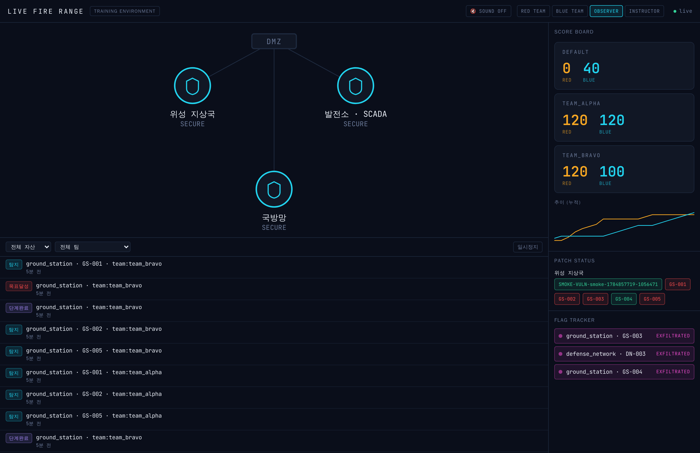
  <br/>
  <em>Live Fire Range — 네트워크 토폴로지 · 팀별 실시간 점수 · 공격/방어 이벤트 피드 · 플래그 트래커</em>
</p>

---

## 목차

**소개 · 구조**
- [무엇을 하는 플랫폼인가](#무엇을-하는-플랫폼인가) · [아키텍처](#아키텍처) · [주요 화면](#주요-화면-스크린샷) · [핵심 기능](#핵심-기능)
- [트윈 취약 서비스 (60종)](#트윈-취약-서비스-60종) · [챌린지 카탈로그 (69종)](#챌린지-카탈로그-69종)

**시작 · 품질 · 접근제어**
- [처음 시작하기](#처음-시작하기) · [경기 운영 방법](#경기-운영-방법) · [빠른 시작](#빠른-시작)
- [검증 · 품질 게이트](#검증--품질-게이트) · [RBAC](#rbac-역할-기반-접근제어)

**플랫폼 · 운영 도구**
- [실시간 푸시 (SSE, P0-4)](#실시간-푸시-p0-4--폴링-제거) · [통합 관리 콘솔 — Control Tower](#통합-관리-콘솔--control-tower-단일-화면-운영)
- [실전 운영 (다중 팀 · 초기화 · 안전 통제)](#실전-운영-다중-팀--초기화--안전-통제) — #9~#11
- [경쟁 무결성 · SOC 케이스 운영](#경쟁-무결성--soc-케이스-운영) — #12 안티치트 · #13 인시던트 · #14 인젝트
- [플랫폼 관측성 · 시나리오 저작](#플랫폼-관측성--시나리오-저작) — #15 관측성 · #16 저작

**ICS·OT 리얼리즘**
- [실제 Modbus 프로토콜 · 물리 시뮬 · 종합 리포트](#icsot-프로토콜-리얼리즘--종합-리포트) — #17~#18
- 📖 심화: [ICS 킬체인 엔드투엔드](docs/ICS-KILLCHAIN.md) · [멀티테넌트](docs/MULTI-TENANT.md) · [갭 분석](docs/GAP_ANALYSIS.md)

**기타**
- [저장소 구조](#저장소-구조) · [라이선스 · 주의](#라이선스--주의)

---

## 무엇을 하는 플랫폼인가

실제 인프라를 공격할 수 없으니, **핵심기반시설을 모사한 디지털 트윈**을 안전한 컨테이너 안에
띄우고 그 위에서 공방 훈련을 진행합니다.

- **Red(공격팀)** 은 취약한 트윈 서비스와 CTF 챌린지를 익스플로잇해 플래그를 획득합니다.
- **Blue(방어팀)** 은 EDR로 침해를 탐지·격리·차단하고, SIEM 탐지 규칙을 작성하며, 서비스를 패치·복구합니다.
- **교관(Instructor)** 은 시나리오를 주입·제어하고 점수를 조정합니다.
- **관전자(Observer)** 는 읽기 전용으로 전 과정을 모니터링합니다.
- 종료 후에는 **AAR(After-Action Report)** 가 MTTD/MTTR·탐지율·ATT&CK 히트맵·PDF 리포트를 자동 생성합니다.

전 과정이 **MITRE ATT&CK / ATT&CK for ICS** 기법으로 태깅되어, 공격과 탐지가 같은 언어로 상관됩니다.

---

## 아키텍처

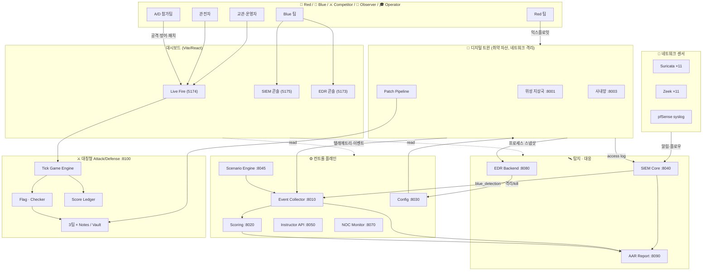

**포트 요약**: 트윈 8001–8003·8201–8208(nginx 게이트웨이 경유) · Event 8010 · Scoring 8020 · Config 8030 ·
SIEM 8040 · Scenario 8045 · Instructor 8050 · **Range Control 8055** · **Challenge Portal 8060** · NOC 8070 ·
EDR 8080 · AAR 8090 · **Attack/Defense 8100** · **Match vhost 8088** · 대시보드
5173–5177(EDR/LiveFire/SIEM/**RedPortal**/**BluePortal**).

---

## 주요 화면 (스크린샷)

### 🔥 Live Fire Range — 통합 상황판
네트워크 토폴로지, 팀별 Red/Blue 실시간 점수와 누적 추이, 패치 상태, 플래그 트래커,
그리고 공격·탐지·단계완료가 흐르는 라이브 이벤트 피드.


### 🏭 Process Impact — ICS 사보타주 물리 임팩트
추상적 자산 상태(compromised/recovered)를 **각 OT 섹터의 실제 물리 결과**로 번역합니다 —
"계통 주파수 붕괴 57.2Hz / SIS 인터록 해제 · 반응기 과압 / CRAC 냉방 오버라이드 · 흡기 41℃"처럼.
심각도(정상·교란·사보타주·복구중)를 색상 게이지와 계기값으로 표시해, 사보타주가 물리 세계에
무엇을 의미하는지 직관적으로 전달합니다. 기존 이벤트 스트림만으로 동작(추가 백엔드 없음).

<p align="center">
  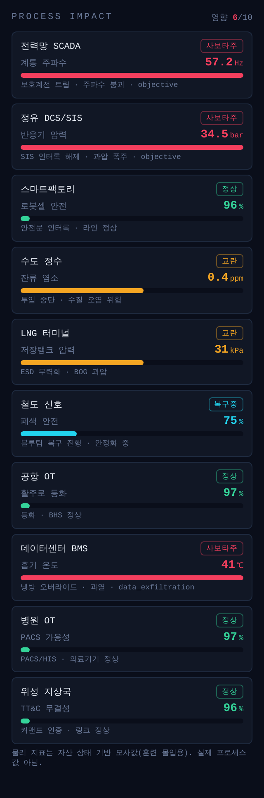
  <br/><em>Process Impact(실제 event_collector 이벤트로 렌더) — 전력망 트립 · 정유 SIS 해제 ·
  데이터센터 냉방 오버라이드가 사보타주로, 수도·LNG는 교란, 철도는 블루팀 복구중으로 표시.
  각 이벤트의 phase(objective·data_exfiltration)까지 반영</em>
</p>

### 🖥️ EDR 콘솔 — 침해 대응
호스트 인벤토리(온라인 상태), 프로세스 트리 탐색, 실시간 탐지 알림(리버스쉘/웹서버-셸 생성),
그리고 **호스트 격리(Isolate) / 프로세스 종료(Kill)** 원클릭 대응.

| 개요 (호스트 · 탐지) | 호스트 선택 (프로세스 탐색 · 격리) |
|---|---|
| 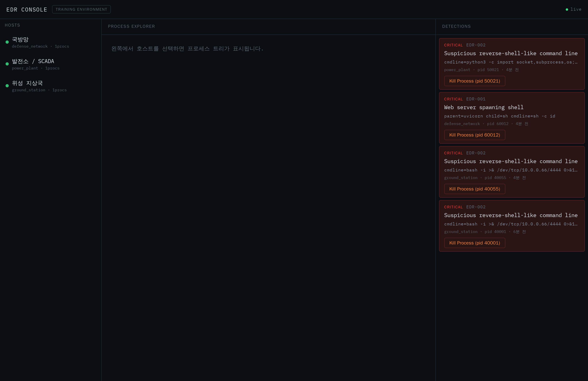 | 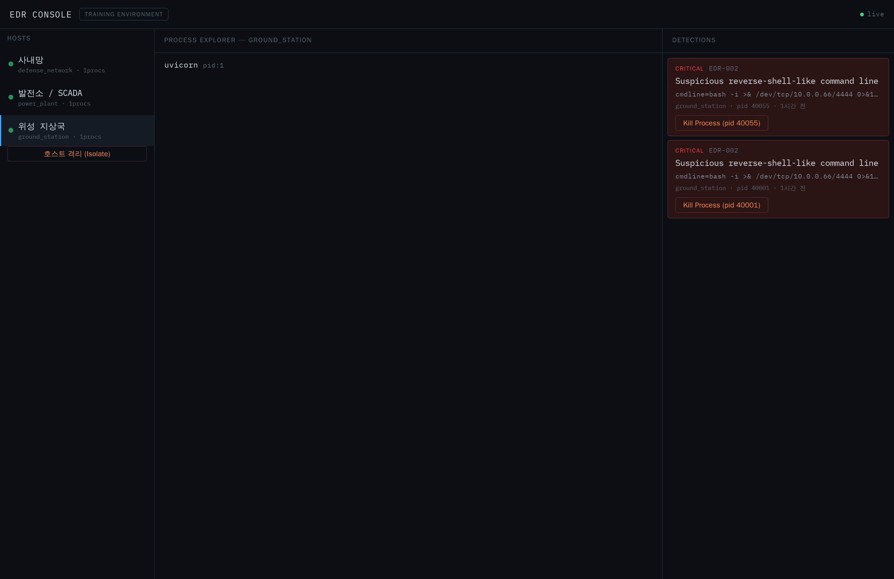 |

### 🔎 SIEM 콘솔 — 탐지 · 헌팅
전문(full-text) 로그 검색(Discover), 실시간 탐지 알림(Alerts), MITRE ATT&CK 커버리지(Coverage),
그리고 Suricata/Zeek/트윈/pfSense 소스 헬스.

| Discover (로그 검색) | Alerts (탐지) | Coverage (ATT&CK) |
|---|---|---|
| 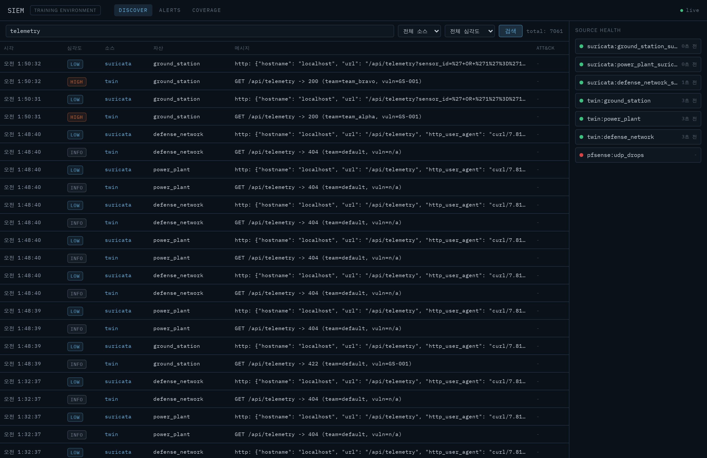 | 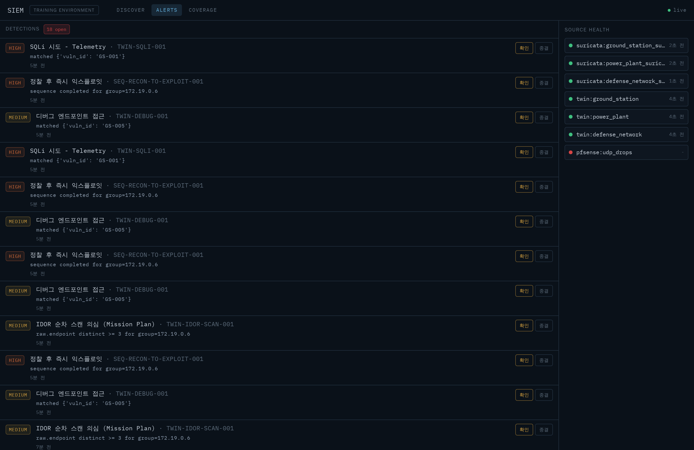 | 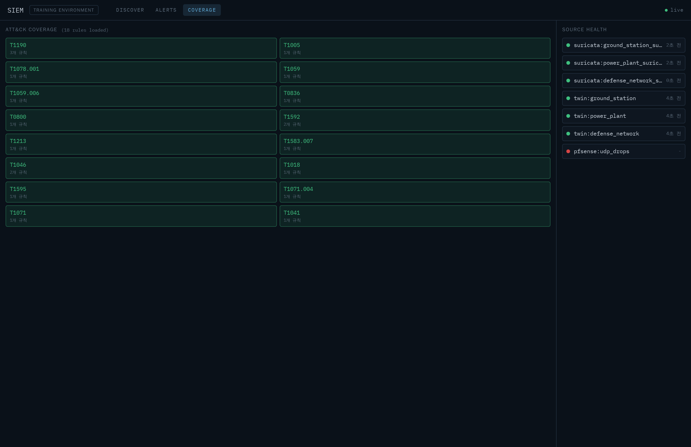 |

---

## 핵심 기능

| 영역 | 내용 |
|---|---|
| **디지털 트윈** | **11개 ICS/OT 섹터**(위성·전력·사내망 + 정유·스마트팩토리·수도·LNG·철도·공항·데이터센터·병원)에 **취약 서비스 60종**(SQLi/IDOR/RCE/명령주입/SSRF/XXE/LDAP + OPC UA·Modbus·HART·SIS·ESD·Profinet 등 OT 프로토콜)을 내장하고 텔레메트리·access log를 발생. **11개 섹터 전부 per-twin 네트워크 격리**(nginx 게이트웨이 + internal 네트워크)로 lateral·egress 차단. |
| **클라우드 네이티브 공격면** | `cloud_native` 트윈 — **IMDS SSRF**(자격증명 탈취, T1552.005)·**노출 Docker API**(T1610)·**kubelet 익명 exec**(T1609)·**시크릿 노출**(T1552.001)·**SSTI RCE**(T1059). SIEM 규칙 5종으로 탐지→채점. ICS 외 현대 공격면. |
| **EDR** | 프로세스 스냅샷 수집 → 리버스쉘·웹서버발 셸 생성 등 행위 탐지 → 호스트 격리/프로세스 kill(감사 로그). |
| **SIEM** | 인제스천(11개 트윈 로그·Suricata·Zeek·pfSense syslog) → 정규화 → 규칙(match/threshold/sequence/periodicity, **ICS/OT 섹터 규칙 19종**: match 16 + 섹터 킬체인 sequence 2 + OT 다중취약점 threshold 1) 탐지 → Live Fire 점수 연동. ATT&CK 커버리지 매핑. |
| **시나리오 엔진** | 코드로 정의된 킬체인 시나리오(순서 강제, chain bonus). **14개 시나리오** 로드 — **11개 섹터 전부 전용 킬체인** + 크로스오버 3(**IT→OT 피벗** 포함: 사내망 발판→자격증명 탈취→정유 OPC UA 정찰→SIS 사보타주로 Purdue 경계를 넘는 멀티에셋 킬체인). |
| **점수/AAR** | 이벤트 → 자동 채점(Red 목표 / Blue 탐지·복구). MTTD/MTTR·탐지율·오탐률·ATT&CK 히트맵·**PDF 리포트** 자동 생성. |
| **복구 판정** | NOC Monitor가 트윈 헬스를 폴링, 침해→패치→복구를 판정해 MTTR 산출·Blue 가점. |
| **RBAC** | instructor/red/blue/observer 역할별 토큰. 방어 액션은 instructor·blue, 조작은 instructor, **관전자는 읽기 전용**. |
| **실전 운영(Range Control)** | **다중 팀 테넌트 격리**(Range→Match→Team→TwinSet, 매치별 물리 트윈 셋·플래그 회전) · **재현 가능 초기화**(snapshot/reset/drift/verify-baseline) · **교관 안전 통제**(긴급정지·격리 상태). → [실전 운영 섹션](#실전-운영-다중-팀--초기화--안전-통제) |
| **실시간 상황판** | **SSE 단일 허브**(폴링 제거, 관전자 100명 반영지연 p95 77ms) + **Control Tower**(전 서비스 헬스·라이브 피드·시나리오/긴급정지 단일 관리, 워룸·모바일 반응형). → [실시간 푸시](#실시간-푸시-p0-4--폴링-제거) · [Control Tower](#통합-관리-콘솔--control-tower-단일-화면-운영) |
| **경쟁 무결성 · SOC** | 플래그 **rate-limit·lockout·담합 탐지**(안티치트) · **인시던트 케이스**(알림→승격·SLA·MTTA/MTTR·AAR) · **비기술 인젝트**(언론/규제 위기대응·루브릭 채점). → [무결성·SOC](#경쟁-무결성--soc-케이스-운영) |
| **관측성 · 저작** | Prometheus `/metrics` 전 서비스 집계 · 시나리오 **lint·dry-run·phase-clock** 저작 도구. → [관측성·저작](#플랫폼-관측성--시나리오-저작) |
| **ICS 실프로토콜 공방** | power_plant·water_utility가 **실제 Modbus/TCP(502)** 를 말함 → 공격(SIS 무력화·과속) → **연속 물리 파괴** → MITRE ICS 탐지(SIEM) → Blue **SIS 재무장 방어**. → [ICS 킬체인](docs/ICS-KILLCHAIN.md) |
| **69 챌린지** | 7개 분야 × easy~insane. 팀별 동적 플래그(HMAC)로 답 공유 방지. 전부 자동 QA 통과. |

---

## 트윈 취약 서비스 (60종)

11개 ICS/OT 섹터 트윈에 내장된 취약 서비스 목록입니다. 각 취약점은 `PATCH_<ID>=true` 환경변수 또는
교관 콘솔의 무중단 패치 토글로 개별 비활성화되며, `python3 shared/safe_probe.py` 로 60종 전부의
patched/vulnerable 상태를 한 번에 판정합니다.

> **섹터별 blue 자동 패치검증**: `--asset <섹터>` 로 특정 섹터만 재검증(blue 팀이 자기 담당 섹터만),
> `--summary`/`--json` 으로 섹터별 패치율 집계, `--no-emit` 으로 발행 없는 dry-run. 패치가 실제로
> 닫혔는지 엔드포인트를 능동 probe해 확인된 것만 `blue_patch_verified`(+50) 를 발행합니다(플래그
> 신뢰가 아닌 실측 기반). 분류·필터·발행억제 로직은 유닛 테스트로 검증.
> ```bash
> python3 shared/safe_probe.py --asset refinery_plant --summary   # 정유 섹터만 재검증
> python3 shared/safe_probe.py --json --no-emit                    # 전체 dry-run(자동화/대시보드용)
> python3 shared/safe_probe.py --watch 30                          # 30초 간격 자동 재검증 데몬
> python3 shared/safe_probe.py --asset water_utility --watch 15    # 수도 섹터만 15초 간격 감시
> ```
> **`--watch <초>` 데몬 모드**: 지정 간격으로 계속 재검증하며 blue 패치가 반영되는 즉시
> `blue_patch_verified`(+50)를 발행하고, 직전 사이클 대비 **새로 patched/회귀된 취약점을 델타로**
> 실시간 보고(`✅신규패치 REF-001` / `⚠️회귀 …`). blue 팀이 패치 작업 중 별도 창에 띄워두면
> 패치가 실제로 닫혔는지 즉시 피드백을 받는다(호스트 사이드 실행 — 트윈 게시포트 경유).

<p align="center">
  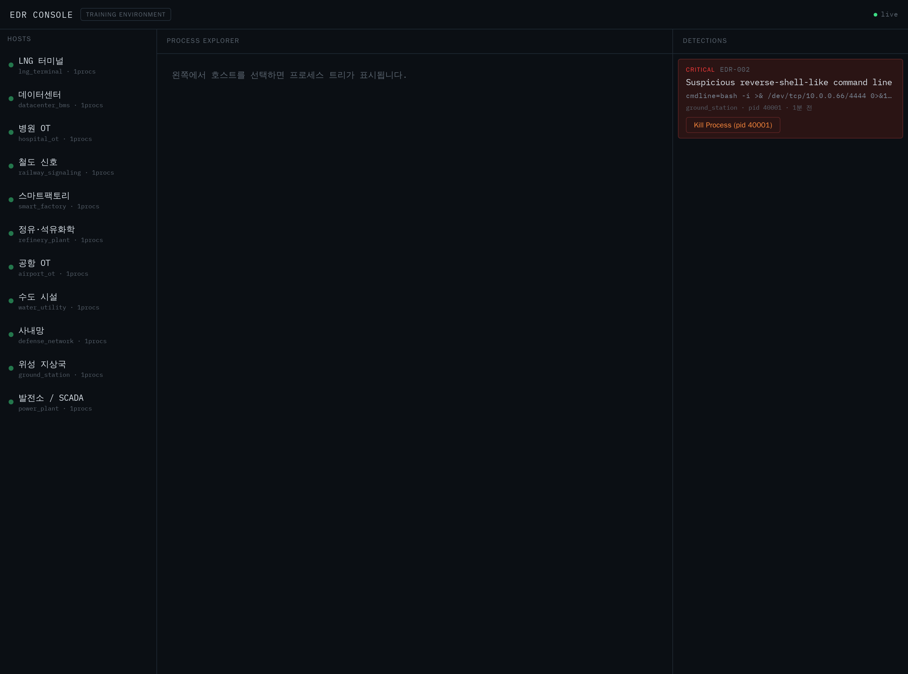
  <br/><em>EDR 콘솔 — 11개 ICS/OT 섹터 자산이 온라인으로 관측되는 모습</em>
</p>

### 11개 ICS/OT 섹터
| # | 섹터 | 자산 키 | 주요 서브시스템 / 프로토콜 | 상태 |
|---|---|---|---|---|
| 1 | 전력망 SCADA | `power_plant` | 발전소·EMS·RTU/IED / IEC 104·DNP3·Modbus·IEC 61850 | 기존 |
| 2 | 위성 지상국 | `ground_station` | TT&C·안테나제어·RF·GPS·Mission Control | 기존 |
| 3 | 사내망 | `defense_network` | AD·SMB·파일서버·메일 | 기존 |
| 4 | 정유·석유화학 | `refinery_plant` | DCS·SIS·Tank Farm / OPC UA·Modbus·HART | **신규** |
| 5 | 스마트팩토리 | `smart_factory` | PLC·Robot·MES·Conveyor / Profinet·S7 | **신규** |
| 6 | 수도 시설 | `water_utility` | 정수장·펌프·염소투입 / SCADA·Modbus | **신규** |
| 7 | LNG 터미널 | `lng_terminal` | Storage·BOG·Cryogenic·F&G·ESD | **신규** |
| 8 | 철도 신호 | `railway_signaling` | 신호·ATS·ATP·CTC·전력공급 | **신규** |
| 9 | 공항 OT | `airport_ot` | BHS·활주로조명·Fuel Farm·ATC | **신규** |
| 10 | 데이터센터 | `datacenter_bms` | UPS·CRAC·Generator·BMS·DCIM | **신규** |
| 11 | 병원 OT | `hospital_ot` | PACS·HIS·의료기기 VLAN·BMS | **신규** |

> 신규 8개 섹터는 공통 **ICS 트윈 팩토리**(`shared/ics_twin.py`)로 구축되어 EDR 에이전트 / SIEM
> access log / Config 무중단 패치 / 격리·킬스위치 / 이벤트 발행 계약을 그대로 상속합니다.
> **11개 섹터 모두 per-twin nginx 게이트웨이 + `internal` 네트워크로 격리**되어(로드맵 F 패리티),
> 컨테이너 실측 기준 섹터간 lateral·인터넷 egress가 차단되고 트윈→코어 통신만 허용됩니다.
> **11개 섹터 전부 Suricata + Zeek 사이드카**(총 22개)가 각 트윈의 netns를 공유(`network_mode:
> service:<twin>`)해 격리 네트워크 내부 트래픽을 관측합니다 — 격리를 깨지 않고(사이드카는 트윈
> netns 안에 존재), 호스트 sudo 없이 docker 데몬이 `NET_ADMIN`/`NET_RAW`를 부여. 신규 섹터 실측:
> `eve.json`(Suricata HTTP/flow)·`conn.log`(Zeek, 트윈→코어 8030 연결까지 포착)이 `siem_logs`
> 볼륨에 쌓이고 SIEM이 자산별로 tail.

### 핵심 3종

#### 🛰️ 위성 지상국 (`ground_station`) — 7종
| ID | 취약점 | CWE | ATT&CK | 엔드포인트 |
|---|---|---|---|---|
| GS-001 | Telemetry API SQL Injection | CWE-89 | T1190 | `GET /api/telemetry?sensor_id=` |
| GS-002 | Hardcoded Admin Credentials / Weak JWT | CWE-798 | T1078,T1552.001 | `POST /api/login` |
| GS-003 | Mission Plan IDOR | CWE-639 | T1213 | `GET /api/mission-plan/{id}` |
| GS-004 | File Download Path Traversal | CWE-22 | T1005 | `GET /api/download?file=` |
| GS-005 | Debug Endpoint Config Exposure | CWE-215 | T1592 | `GET /api/debug/config` |
| **GS-006** | **TLE Import SSRF** | CWE-918 | T1090 | `POST /api/tle/import` |
| **GS-007** | **Config XML XXE** | CWE-611 | T1005 | `POST /api/config/xml-import` |

#### ⚡ 발전소 · SCADA (`power_plant`) — 7종
| ID | 취약점 | CWE | ATT&CK | 엔드포인트 |
|---|---|---|---|---|
| PP-001 | Unauthenticated PLC Register Write | CWE-306 | T0836 | `POST /api/plc/write` |
| PP-002 | Default HMI Credentials | CWE-521 | T1078.001 | `POST /api/hmi/login` |
| PP-003 | Diagnostics Command Injection | CWE-78 | T1059 | `POST /api/diagnostics/ping` |
| PP-004 | Historian Insecure Deserialization | CWE-502 | T1059.006 | `POST /api/historian/export` |
| PP-005 | Safety Monitor Bypass | CWE-284 | T0800 | `POST /api/safety/override` |
| **PP-006** | **Unauthorized Modbus Register Write (ICS)** | CWE-306 | T0836,T0855 | `POST /api/modbus/write-register` |
| **PP-007** | **Unsigned Firmware Update (ICS)** | CWE-345 | T0857 | `POST /api/plc/firmware-update` |

#### 🏢 사내망 (`defense_network`) — 6종
| ID | 취약점 | CWE | ATT&CK | 엔드포인트 |
|---|---|---|---|---|
| DN-001 | SMB Anonymous Share Access | CWE-284 | T1039 | `GET /api/smb/shares` |
| DN-002 | Kerberoastable Service Account | CWE-521 | T1558.003 | `GET /api/ad/service-accounts` |
| DN-003 | Exposed Backup Config (Plaintext Creds) | CWE-256 | T1552.001 | `GET /api/fileserver/backup-config` |
| DN-004 | Open Mail Relay | CWE-284 | T1583.007 | `POST /api/mail/relay` |
| **DN-005** | **Directory LDAP Injection** | CWE-90 | T1087 | `GET /api/directory/search` |
| **DN-006** | **URL Preview SSRF** | CWE-918 | T1090 | `POST /api/webhook/preview` |

> GS-006/007, PP-006/007, DN-005/006 은 SSRF/XXE/ICS/LDAP 확장 서비스입니다.

### 확장 ICS/OT 섹터 8종 (24 서비스)

#### ⛽ 정유·석유화학 플랜트 (`refinery_plant`) — DCS·SIS·Tank Farm / OPC UA·Modbus·HART
| ID | 취약점 | CWE | ATT&CK | 엔드포인트 |
|---|---|---|---|---|
| REF-001 | OPC UA Anonymous Read | CWE-306 | T0886 | `GET /api/opcua/read` |
| REF-002 | SIS Safety Bypass | CWE-284 | T0858,T0800 | `POST /api/sis/bypass` |
| REF-003 | HART Tank Gauge Spoof | CWE-306 | T0836 | `POST /api/tankfarm/gauge` |

#### 🏭 스마트팩토리 (`smart_factory`) — PLC·Robot·MES / Profinet·S7·OPC UA
| ID | 취약점 | CWE | ATT&CK | 엔드포인트 |
|---|---|---|---|---|
| FAC-001 | PLC Program Download | CWE-306 | T0843 | `POST /api/plc/program-download` |
| FAC-002 | Robot Command Injection | CWE-77 | T0807 | `POST /api/robot/exec` |
| FAC-003 | MES Work-Order SQLi | CWE-89 | T1190 | `GET /api/mes/workorder` |

#### 🚰 수도 시설 (`water_utility`) — 정수장·펌프·염소투입 / SCADA·Modbus
| ID | 취약점 | CWE | ATT&CK | 엔드포인트 |
|---|---|---|---|---|
| WTR-001 | Chlorine Dosing Tamper | CWE-306 | T0836 | `POST /api/dosing/chlorine` |
| WTR-002 | Pump Control Unauth | CWE-306 | T0855 | `POST /api/pump/control` |
| WTR-003 | SCADA HMI Default Creds | CWE-521 | T0812 | `POST /api/hmi/login` |

#### ❄️ LNG 터미널 (`lng_terminal`) — Storage·BOG·Cryogenic·F&G·ESD
| ID | 취약점 | CWE | ATT&CK | 엔드포인트 |
|---|---|---|---|---|
| LNG-001 | ESD Trigger/Bypass | CWE-284 | T0858 | `POST /api/esd/trigger` |
| LNG-002 | BOG Compressor Setpoint | CWE-306 | T0836 | `POST /api/bog/compressor` |
| LNG-003 | Fire&Gas Alarm Suppress | CWE-284 | T0878 | `POST /api/firegas/suppress` |

#### 🚈 철도 신호 (`railway_signaling`) — 신호·ATS·ATP·CTC
| ID | 취약점 | CWE | ATT&CK | 엔드포인트 |
|---|---|---|---|---|
| RWY-001 | Signal Aspect Override | CWE-306 | T0855 | `POST /api/signal/set` |
| RWY-002 | Interlocking Bypass | CWE-284 | T0858 | `POST /api/interlocking/override` |
| RWY-003 | ATS Command Injection | CWE-77 | T0807 | `POST /api/ats/command` |

#### ✈️ 공항 OT (`airport_ot`) — BHS·활주로조명·Fuel Farm·ATC
| ID | 취약점 | CWE | ATT&CK | 엔드포인트 |
|---|---|---|---|---|
| AIR-001 | Runway Lighting Control | CWE-306 | T0855 | `POST /api/runway/lighting` |
| AIR-002 | BHS Route SQLi | CWE-89 | T1190 | `GET /api/bhs/route` |
| AIR-003 | Fuel Farm Valve Unauth | CWE-306 | T0836 | `POST /api/fuelfarm/valve` |

#### 🖧 데이터센터 (`datacenter_bms`) — UPS·CRAC·Generator·BMS·DCIM
| ID | 취약점 | CWE | ATT&CK | 엔드포인트 |
|---|---|---|---|---|
| DCX-001 | CRAC Setpoint Tamper | CWE-306 | T0836 | `POST /api/crac/setpoint` |
| DCX-002 | UPS Shutdown Unauth | CWE-306 | T0816 | `POST /api/ups/command` |
| DCX-003 | DCIM SSRF | CWE-918 | T1090 | `POST /api/dcim/fetch` |

#### 🏥 병원 OT (`hospital_ot`) — PACS·HIS·의료기기 VLAN·BMS
| ID | 취약점 | CWE | ATT&CK | 엔드포인트 |
|---|---|---|---|---|
| HSP-001 | PACS Study IDOR | CWE-639 | T1213 | `GET /api/pacs/study` |
| HSP-002 | HIS Patient SQLi | CWE-89 | T1190 | `GET /api/his/patient` |
| HSP-003 | Infusion Pump Unauth | CWE-306 | T0855 | `POST /api/device/infusion` |

> 신규 24종은 모두 팀별 무중단 패치 토글 + Safe Probe 판정을 지원하며, 실제 docker 기동 후
> `python3 shared/safe_probe.py` 에서 **60종 전부 VULNERABLE** 로 확인됩니다.

---

## 챌린지 카탈로그 (69종)

web·forensics·network·reversing·detection·ai 6개 분야가 모두 **easy → medium → hard → insane** 난이도 곡선을 갖추고 있습니다.
표기: `점수(Red/Blue)`. 팀마다 플래그·정답이 HMAC으로 달라 답 공유가 불가능합니다.

<details open>
<summary><b>🌐 Web (8)</b></summary>

| ID | 제목 | 난이도 | ATT&CK | 점수 |
|---|---|---|---|---|
| WEB-000 | 노출된 디버그 설정 | easy | T1592 | 50/50 |
| WEB-001 | 네트워크 진단 명령 주입 | medium | T1059 | 150/60 |
| WEB-002 | 위조된 지휘권 — JWT Forgery | medium | T1078,T1552.001 | 150/150 |
| WEB-003 | 열람 권한 없음 — Mission Plan IDOR | medium | T1083,T1213 | 120/120 |
| WEB-004 | 파일 다운로드 경로 순회 | medium | T1083 | 120/50 |
| WEB-007 | 그림인 척 — Upload Filter Bypass | medium | T1190,T1505.003 | 150/150 |
| WEB-005 | 복원의 대가 — Historian 역직렬화 RCE | hard | T1059,T1203 | 250/250 |
| WEB-009 | WAF 우회 + 블라인드 SQL 인젝션 | insane | T1190 | 300/150 |
</details>

<details>
<summary><b>🔬 Forensics (9)</b></summary>

| ID | 제목 | 난이도 | ATT&CK | 점수 |
|---|---|---|---|---|
| FOR-000 | 평문 자격증명 카빙 | easy | T1552.001 | 50/30 |
| FOR-001 | 명령 이력 포렌식 — 데이터 유출 추적 | easy | T1048 | 50/30 |
| FOR-004 | 이메일 헤더 포렌식 — 피싱 발신지 추적 | easy | T1566 | 50/30 |
| FOR-005 | 메모리 덤프 문자열 분석 — 자격증명 복구 | easy | T1003 | 50/30 |
| FOR-006 | 지속성 흔적 분석 — 악성 스케줄 작업 | easy | T1053 | 50/35 |
| FOR-002 | 침묵하는 지상국 — 침해 재구성 | medium | T1190,T1046,T1041 | 200/0 |
| FOR-003 | 세션 하이재킹 흔적 — 접근 로그 조사 | medium | T1539 | 55/35 |
| **FOR-007** | **인메모리 인젝션 탐지 — 프로세스 할로잉** | **hard** | T1055.012 | 180/0 |
| FOR-009 | 안티포렌식 다단계(타임스톰프→은닉채널→복호) | insane | T1070.006,T1564.004,T1027 | 300/0 |
</details>

<details>
<summary><b>🌐 Network (9)</b></summary>

| ID | 제목 | 난이도 | ATT&CK | 점수 |
|---|---|---|---|---|
| NET-000 | 평문 프로토콜 스니핑 | easy | T1040 | 50/30 |
| NET-004 | ARP 스푸핑 탐지 — 중간자 공격 추적 | easy | T1557 | 50/40 |
| NET-001 | DNS 터널링 분석 — 은닉 채널 유출 복원 | medium | T1071.004 | 60/40 |
| NET-002 | 경계를 넘어 — Lateral Pivot | medium | T1021,T1090 | 150/100 |
| NET-003 | C2 비콘 간격 분석 | medium | T1071 | 55/40 |
| NET-005 | 포트 노킹 시퀀스 복원 | medium | T1205 | 50/35 |
| NET-006 | TCP 세그먼트 재조립 — 분할 유출 복원 | medium | T1041 | 50/35 |
| **NET-007** | **다중 홉 피벗 체인 상관 추적** | **hard** | T1090.003 | 180/0 |
| NET-009 | OT 사보타주 트레이스 재구성(Modbus) | insane | T0836,T0855,T0831 | 300/0 |
</details>

<details>
<summary><b>🔩 Reversing (8)</b></summary>

| ID | 제목 | 난이도 | ATT&CK | 점수 |
|---|---|---|---|---|
| REV-000 | 가려진 신호 — XOR Decode | easy | T1027 | 100/50 |
| REV-001 | 난독화된 라이선스 체크 | medium | T1027 | 150/0 |
| REV-002 | 반복키 XOR 복원 | medium | T1027 | 120/0 |
| REV-003 | 다단계 인코딩 복원 | medium | T1140 | 130/0 |
| REV-006 | 비트 회전 사이퍼 복호화 | medium | T1027 | 130/0 |
| REV-004 | 스택 VM 리버싱 | hard | T1027 | 140/0 |
| REV-005 | LCG 스트림 사이퍼 복호화 | hard | T1027 | 130/0 |
| REV-009 | 커스텀 VM 난독화(핸들러 테이블) | insane | T1027.007 | 300/0 |
</details>

<details>
<summary><b>🕵️ Detection (13) — Blue 전용, 진짜 SIEM 엔진이 채점</b></summary>

| ID | 제목 | 난이도 | ATT&CK | 점수 |
|---|---|---|---|---|
| DET-000 | 첫 브루트포스 룰 | easy | T1110 | 0/60 |
| DET-002 | 웹 로그에서 SQL 인젝션 탐지 | easy | T1190 | 0/80 |
| DET-001 | 잡음 속의 스캔 — Threshold Tuning | medium | T1046 | 0/100 |
| DET-003 | 웹쉘 킬체인 탐지 — 업로드 후 실행 시퀀스 | medium | T1505.003 | 0/90 |
| DET-005 | Log4Shell(JNDI) 인젝션 탐지 | medium | T1190 | 0/80 |
| DET-006 | DNS DGA 탐지 — 대량 도메인 조회 | medium | T1568.002 | 0/90 |
| DET-007 | BACnet 무단 WriteProperty(냉방 오버라이드) 탐지 | medium | T0855,T0836 | 0/80 |
| DET-010 | EtherNet/IP CIP 안전 어셈블리 무단 SetAttribute 탐지 | medium | T0836,T0855 | 0/80 |
| DET-011 | S7comm 안전 DB(62) 무단 WRITE_VAR 탐지 | medium | T0836,T0855 | 0/80 |
| DET-012 | MQTT Sparkplug B 무단 액추에이터 DCMD 탐지 | medium | T0855,T0831 | 0/80 |
| DET-004 | C2 비콘 주기성 탐지 | hard | T1071 | 0/90 |
| DET-008 | Foundation Fieldbus MODE_BLK O/S(제어루프 정지) 탐지 | hard | T0836,T0855,T0831 | 0/90 |
| DET-009 | APT Low-and-Slow 비콘 헌팅(노이즈 90%) | insane | T1071.004,T1029 | 0/200 |

> **DET-007/008/010/011/012(ICS 탐지)**: BACnet/Foundation Fieldbus/EtherNet-IP·CIP/S7comm/
> MQTT-Sparkplug 사보타주를 blue가 match 규칙으로 탐지. 단일 조건은 정상 트래픽에 오탐하도록
> 데이터셋을 설계 — AND 결합이 실제로 필요함을 검증(트랩 유효성 실측). red 아티팩트(ICS-008~012)와
> 프로토콜 짝을 이룬다.
</details>

<details>
<summary><b>🤖 AI Security (9)</b></summary>

| ID | 제목 | 난이도 | ATT&CK | 점수 |
|---|---|---|---|---|
| AI-000 | 특징공간 회피 — Feature-Space Evasion | easy | T1027 | 60/40 |
| AI-002 | 프롬프트 인젝션 흔적 분석 | easy | T1059 | 60/40 |
| AI-005 | 모델 추출 API 남용 탐지 | easy | T1595 | 50/40 |
| AI-001 | 그림자 모델 — Model Extraction | medium | T1587.001 | 150/100 |
| AI-003 | 데이터 포이즈닝 흔적 분석 — 백도어 트리거 | medium | T1195 | 55/40 |
| AI-004 | RAG 간접 프롬프트 인젝션 흔적 | medium | T1059 | 55/40 |
| AI-006 | 훈련 데이터 memorization 유출 | medium | T1552 | 55/40 |
| **AI-007** | **예산 제약 적대적 회피 — PGD Evasion (실 ML)** | **hard** | T1027 | 220/100 |
| AI-009 | 적대적 회피 인시던트 재구성(전이공격) | insane | T1027,T1551 | 300/0 |
</details>

> **AI-007** 은 numpy로 직접 학습한 비선형 MLP를 docker로 서빙하고, 화이트박스 **PGD(적대적 예제)**
> 로 L∞ 예산 안에서 오분류를 유도하는 실제 ML 보안 챌린지입니다.

<details>
<summary><b>🏭 ICS/OT (13) — OT 프로토콜 기반 (서비스형 2 + 트래픽분석형 11)</b></summary>

| ID | 제목 | 난이도 | ATT&CK | 게이트 | 점수 |
|---|---|---|---|---|---|
| ICS-001 | OPC UA 익명 태그 열람 | easy | T0886 | full docker | 70/40 |
| ICS-000 | 안전 인터록 우회 — Modbus Safety Interlock | medium | T0836,T0858 | full docker | 120/60 |
| ICS-002 | Modbus 사보타주 분석 — 안전 레지스터 무단 쓰기 | medium | T0836,T0855 | artifact | 120/0 |
| ICS-003 | DNP3 무단 제어 명령 탐지 | medium | T0855 | artifact | 120/0 |
| ICS-004 | IEC 104 ASDU 조작 추적 | medium | T0855 | artifact | 120/0 |
| ICS-005 | Profinet DCP 스푸핑 분석 — Station Identity Spoof | medium | T0842,T0830 | artifact | 120/0 |
| ICS-007 | HART 명령 주입 분석 — Transmitter Range Tamper | medium | T0836,T0855 | artifact | 120/0 |
| ICS-008 | BACnet 무단 WriteProperty 분석 — Priority Override | medium | T0855,T0836 | artifact | 120/0 |
| ICS-012 | MQTT Sparkplug B 무단 액추에이터 명령 — DCMD Injection | medium | T0855,T0831 | artifact | 120/0 |
| ICS-006 | IEC 61850 GOOSE 위조 분석 — Spoofed Trip | hard | T0832,T0855 | artifact | 130/0 |
| ICS-009 | Foundation Fieldbus 블록 MODE 조작 — PID OOS Sabotage | hard | T0836,T0855,T0831 | artifact | 140/0 |
| ICS-010 | EtherNet/IP CIP 무단 제어 — Safety Assembly Tamper | hard | T0836,T0855,T0831 | artifact | 140/0 |
| ICS-011 | S7comm 안전 DB 무단 쓰기 — Safety DB Write | hard | T0836,T0855 | artifact | 140/0 |

> **서비스형**(ICS-000/001): Modbus/OPC UA를 흉내낸 서비스를 docker로 배포하고 실제 익스플로잇으로
> 플래그 획득. **트래픽분석형**(ICS-002~012): 합성 Modbus/DNP3/IEC 104/Profinet/IEC 61850/HART/BACnet/
> Foundation Fieldbus/EtherNet-IP·CIP/S7comm/MQTT-Sparkplug 로그에서 안전계통에 대한 무단 제어·신원
> 스푸핑·블록 정지·액추에이터 명령(사보타주)을 상관 분석으로 찾아 공격자 식별 + 은닉 토큰 복호.
> **12대 OT 프로토콜 커버**. 전부 팀별 HMAC 동적 플래그.
</details>

---

## 빠른 시작

### 요구사항
- Docker + Docker Compose v2
- (대시보드 개발서버 실행 시) Node.js 20+

### 1) 플랫폼 기동
```bash
cd cyber-range-platform
docker compose up -d --build

# 통합 E2E 스모크 (기본 35/35 PASS)
bash scripts/smoke_test.sh
```

### 2) 대시보드 실행

#### 🚀 프로덕션 — 단일 진입점 한 줄 (권장, P0-1)
`gateway`가 5개 대시보드를 **프로덕션 빌드해 정적 서빙**하고 `/api/*`를 백엔드로 프록시합니다.
포트를 외울 필요 없이 **한 주소(https)로 역할별 진입**합니다.
```bash
cp .env.example .env && ./scripts/gen_secrets.sh        # 토큰/시크릿 생성(프로덕션 필수)
docker compose -f docker-compose.yml -f docker-compose.prod.yml up -d
# → https://<host>/  (self-signed TLS 자동 생성; 실인증서는 TLS_CERT_PATH/KEY_PATH로 주입)
```
| 경로 | 대시보드 | 역할 |
|---|---|---|
| `/` | **역할별 홈**(로그인 후 허용 앱만) | 전체 |
| `/ops/` | Live Fire | 🎓 운영/관전 |
| `/red/` | Red Portal | 🔴 Red |
| `/blue/` | Blue Portal | 🔵 Blue |
| `/blue/siem/` · `/blue/edr/` | SIEM · EDR 콘솔 | 🔵 Blue |
| `/control/` | Control Tower | 🎓 instructor |

**역할별 홈(App Shell)**: 로그인하면 `/`(홈)이 `/auth/me`로 역할을 확인해 **그 역할이 쓸 수 있는 앱
카드만** 보여주고, 주 화면을 강조(내 주 화면)한다 — red는 Red Portal+Live Fire, blue는 Blue/EDR/SIEM+
Live Fire, instructor는 전체+Control Tower. 상단에 사용자·역할·로그아웃.

<p align="center">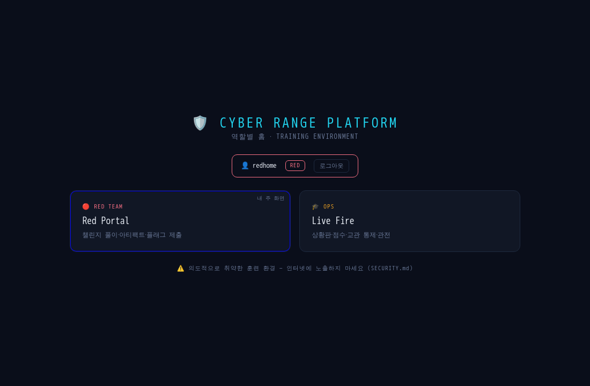<br/>
<em>역할별 홈 — red 로그인 시 허용 앱(Red Portal·Live Fire)만 노출. 실 gateway+로그인으로 검증
(instructor 6장 / red 2장 / blue 4장).</em></p>

> 프로덕션 프로파일은 토큰 미설정 시 **부팅 실패**(fail-fast)하고 `OBSERVER_READ_ENFORCE=true`로
> read 접근까지 인증을 강제합니다. 실측: `https://host/red/` 가 gateway `/api/portal` 프록시로
> 챌린지를 렌더(연결에러 0), http→https 301 리다이렉트, 스모크 35/35 유지.

#### 🛠️ 개발 — vite dev 서버 (핫리로드)
개발 시에는 각 앱을 dev 서버로 띄웁니다(포트 EDR 5173 / LiveFire 5174 / SIEM 5175 / Red 5176 / Blue 5177):
```bash
cd dashboards/redportal && npm install && npm run dev    # 나머지 앱도 동일(각 디렉터리)
```
> 원격 접속(WSL2/Tailscale): dev 서버·백엔드는 `host:true`(0.0.0.0) 바인딩, 프론트는
> `window.location.hostname` 기준으로 백엔드에 연결. `localhost` 가 안 열리면 실행 시 출력되는
> `Network:` 주소(WSL/Tailscale IP)를 쓰세요. 데이터는 `docker compose up -d`로 코어를 먼저 띄워야 채워집니다.

### 3) 챌린지 검증 (예시)
```bash
# 서비스형(docker) — 실제 배포→익스플로잇→채점→teardown
python3 infra/challenge_qa/run_all.py --challenge AI-007

# 아티팩트형 — 생성→solve→채점
python3 infra/challenge_qa/run_all.py --challenge FOR-007
python3 infra/challenge_qa/run_all.py --challenge NET-007
```

> 로컬(WSL 등)에서 8080 포트가 점유돼 있으면 `docker-compose.override.yml` 이 EDR 호스트포트를
> 리맵합니다. GCP/정상 환경에서는 이 파일을 지우면 8080으로 뜹니다.

---

## 검증 · 품질 게이트

이 프로젝트의 원칙은 **"코드가 아니라 실제로 통과한 결과를 보여준다"** 입니다.

- **유닛 테스트 235개** (`python -m pytest tests/`) — 계약 검증 + 지금까지 잡은 버그의 회귀 테스트.
- **통합 스모크 36/36** (`scripts/smoke_test.sh`) — 헬스 → 트윈공격 → SIEM 인제스천 → 점수 →
  시나리오 → EDR 탐지 → AAR/PDF → 네트워크 격리 → **SSE 실시간 푸시**까지 E2E. **실제 docker 스택에서
  통과 확인**(신규 서비스 auth·incident·injects·observability 빌드·기동 포함).
- **C-QA 파이프라인** (`infra/challenge_qa/run_all.py`) — 챌린지 타입별 올바른 게이트로 69종 전부 검증:
  - **서비스형(docker)**: `deploy_up → intended_solve → blank_submit → flag_determinism → teardown`
  - **아티팩트형**: `artifact_solve` (생성 → 시그니처 분기 solve → 채점 + 빈제출 거부)
  - **탐지형(DET)**: `detection_solve` (데이터셋 생성 → **진짜 SIEM DetectionEngine** 채점 + no-op 규칙 거부)
- **GitHub Actions CI** (`.github/workflows/ci.yml`) — 3개 job:
  - `unit`: 유닛/계약 테스트(**235개**).
  - `challenges`: 전체 챌린지 schema + 아티팩트/탐지 게이트 실채점(docker 불필요, `scripts/validate_challenges.sh`).
  - `integration`: 전체 docker 스택 build+up → `SMOKE_RECOVERY=1` 스모크 → teardown.

---

## RBAC (역할 기반 접근제어)

토큰→역할 매핑(`shared/rbac.py`). **P0-2**: `auth` 서비스(8051)가 로그인→JWT(access 15분/refresh 8h,
role·team_id·match_id 클레임, httpOnly 쿠키)를 발급하고 `rbac.py`가 서명을 검증한다(정적 토큰
하위호환). 프로덕션 gateway는 **로그인 게이트**(auth_request)로 무인증 접근을 `/login`으로 돌리고
쿠키→Bearer를 백엔드에 주입한다. 계정은 교관이 `/auth/register`·CSV(`/auth/users/bulk`)로 발급,
부정행위자는 `/auth/revoke`로 즉시 차단. 토큰·JWT 시크릿 미설정 로컬 dev는 관대 통과(하위호환).

| 엔드포인트 | 무토큰 | red | blue | observer | instructor |
|---|---|---|---|---|---|
| config `/instructor/patch/toggle` | 401 | 403 | 403 | 403 | ✅ 200 |
| instructor_api `/scenario/start` | 401 | 403 | 403 | 403 | ✅ 200 |
| edr `/isolate` · `/kill` (방어) | 401 | 403 | ✅ 200 | 403 | ✅ 200 |
| scoring `/score/adjust` (수동 가감점) | 401 | 403 | 403 | 403 | ✅ 200 |
| **read**: scoring `/scores`, edr `/edr/hosts`·`/edr/alerts` | 401\* | ✅ | ✅ | ✅ | ✅ |

> \* **관전자 read 게이트**: `OBSERVER_READ_ENFORCE=true` 일 때만 read 엔드포인트가 "인증된
> 아무 역할(관전자 이상)"을 요구합니다. 기본(off)은 대시보드 편의를 위해 공개이며, 이 플래그로
> 대회 운영 시 관전 접근을 통제할 수 있습니다.

---

## 실시간 푸시 (P0-4 — 폴링 제거)

상황판이 3~5초 폴링으로 서버를 두드리던 것을, 서버가 밀어주는 **SSE 단일 허브**로 바꿨다.
`event_collector`의 **`GET /stream`** 하나로 모든 토픽을 구독한다(`shared/sse_bus.py`).

- **토픽**: `events` / `detections` / `scores` / `safety` / `phase_clock` (`?topics=` 로 선택).
- **역할·매치 필터**: JWT 클레임으로 red/blue는 자기 매치만, **관전자는 30초 지연**(`visible_to`).
- **리플레이**: 재연결 시 `Last-Event-ID` 이후 놓친 이벤트만 링버퍼에서 재전송(EventSource 자동).
- **S2S 발행**: `POST /internal/publish` 로 range_control·scenario가 `safety`/`phase_clock` 주입.
- 대시보드는 `useSSE()`(EventSource + 지수 백오프)로 구독 — Live Fire 리더보드가 push 로 갱신.

**실측**(`loadtest/sse_loadtest.py`, WSL2 dev, uvicorn 단일 워커):

```
$ python3 loadtest/sse_loadtest.py --observers 100 --teams 8 --rate 15 --duration 8
구독자        : 팀 8 + 관전자 100 = 108 동시연결
수신 샘플(팀) : 960
반영 지연 p50 : 54.9 ms
반영 지연 p95 : 77.4 ms   (목표 < 1000 ms)
반영 지연 p99 : 101.7 ms
판정          : PASS ✅
```

> 관전자 100명이 동시에 붙어도 상황판 반영 지연 **p95 77ms**(목표 1s 대비 여유). SSE 팬아웃은
> 서브밀리초 수준이다. 단, **이벤트 수집(ingest) 처리량은 이 dev 구성에서 ~23/s가 상한**이다
> — 단일 워커 + 요청마다 fsync 하는 sqlite(같은 디스크 standalone ~100/s) 때문으로, SSE 층과
> 무관한 영속화 계층 제약이다. 프롬프트가 제시한 1000/s 는 배치 쓰기·큐잉·다중 워커(샤딩된 허브)
> 재설계가 필요하며, 이는 별도 과제로 남긴다(정직한 측정치).

---

## 통합 관리 콘솔 — Control Tower (단일 화면 운영)

교관이 **한 화면에서 플랫폼 전체를 관리**하는 단일 페이지 콘솔(`dashboards/control-tower/index.html`,
빌드 불필요한 self-contained HTML). gateway에서 `/control/`로 접속(랜딩 카드), dev에서는 직접 포트로.

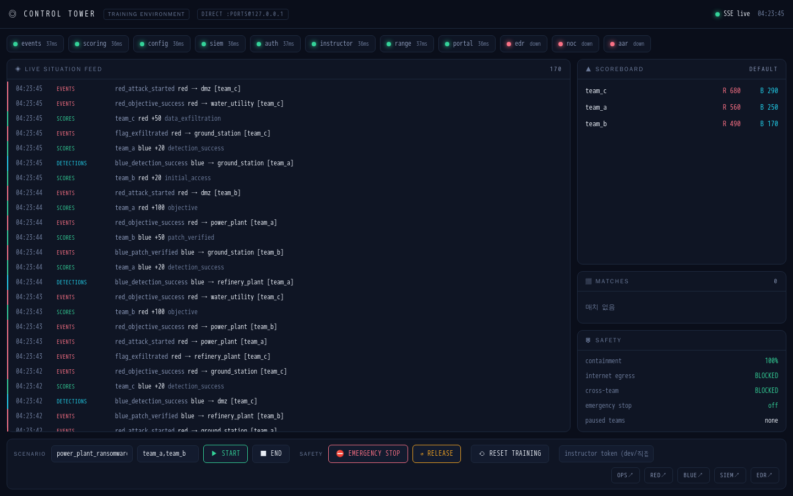

한 화면에서:
- **서비스 헬스**: 11개 서비스 도달성·지연(events/scoring/config/siem/auth/instructor/range/portal/edr/noc/aar).
- **실시간 상황 피드**: SSE `/stream` 구독(P0-4) — events/detections/scores/safety/phase_clock 토픽 색상 구분.
- **라이브 스코어보드 · 매치 · 인시던트 · 안전 상태**(SLA 위반 인시던트 강조·격리 점수·긴급정지).
- **ICS 자산 상태판**: SSE 이벤트만으로 9개 ICS 트윈의 상태(공격 중·파괴/침해·방어됨·복구됨)를
  MITRE 기법과 함께 색상 추적 — SCADA 상황 인식(백엔드 추가 없이 이벤트 스트림 파생).
- **컨트롤 액션**: 시나리오 Start/End, 긴급정지 발동/해제, 훈련 초기화 — 각 사유는 감사 로그에 기록.
- gateway/dev **모드 자동 감지**(`/api/*` 프록시 생존 여부로 판별), 역할 대시보드로 바로가기.
- **워룸 모드(P2-2)**: 헤더 `▣ WARROOM` 버튼(또는 키보드 `W`)으로 프로젝터/대형 화면용 고대비·
  대형 레이아웃 토글 — 조작 바를 숨긴 **읽기전용 상황판**. 선택은 localStorage 로 유지.
- **반응형(P2-3)**: 태블릿(≤900px)·모바일(≤600px)에서 세로 스택(flex-column)으로 재배치 —
  라이브 피드 우선, 헬스 칩 가로 스크롤, 조작 바는 하단, 터치 타깃 확대. 가로 스크롤 없음.

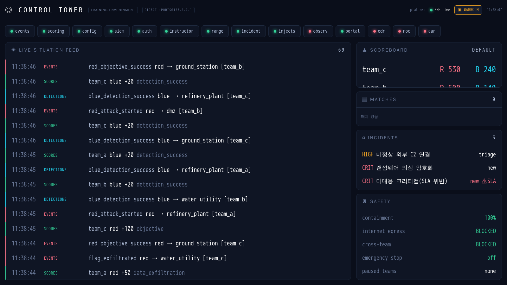
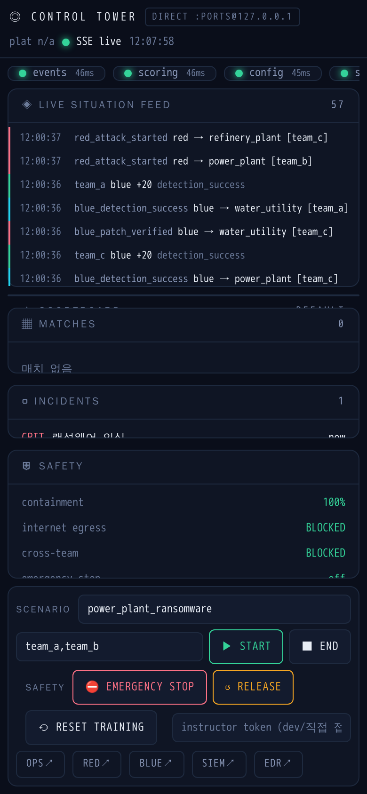

> 위 스크린샷은 **실제 실행 캡처**다(Playwright, 4서비스 라이브 + 이벤트·인시던트 주입). 검증: SSE
> 피드 실시간 수신, 헬스 9/12 green, 스코어 실시간 갱신, **인시던트 4건(SLA 위반 1건 ⚠ 강조)**,
> 그리고 초기화 액션이 실제로 `event(120)·scoring(성취+팀점수)`를 비우고 긴급정지가 200을 반환하는
> 것까지 확인했다.

---

## 실전 운영 (다중 팀 · 초기화 · 안전 통제)

실전 대회 운영을 위한 P1 운영 기능. **`range_control` 서비스(8055)** 가 오케스트레이션하며, 교관
콘솔(Live Fire INSTRUCTOR)에 UI로 노출됩니다. 상세: [docs/MULTI-TENANT.md](docs/MULTI-TENANT.md) ·
[services/range_control/README.md](services/range_control/README.md).

### #9 다중 팀 테넌트 격리 — Range → Match → Team → Twin Set
```
Range ─ Match A ─ {Red A, Blue A, Twin Set A}   (scenario_id=match_a)
      └ Match B ─ {Red B, Blue B, Twin Set B}   (scenario_id=match_b)
```
모든 데이터에 `range_id·match_id·team_id`. **Match 레지스트리**(`/matches`)가 SoT.

| 격리 축 | 구현 | 실측 |
|---|---|---|
| 이벤트/점수 | `scenario_id` 파티션 (`/replay/events?scenario_id=` · `/scores?scenario_id=`) | 매치별 분리 ✓ |
| 플래그 | 팀별 HMAC + **매치별 회전**(포털 `match_id`→복합키 `match::team`) | 매치마다 다름·cross-match 거부 ✓ |
| 네트워크(물리) | **매치별 트윈 셋**: 별도 compose 프로젝트로 11섹터 트윈 인스턴스 복제 | cross-match `gaierror`·egress `OSError` 차단 ✓ |
| 포트/도메인 | 동적 포트(base+1~+11) + **vhost**(`match_proxy` 8088, `<match>.<sector>.range.local`) | 11섹터 라우팅 ✓ |
| 관전자 | 공개정보 **지연 큐**(`/events/delayed`, Live Fire observer 30s) | 실시간 이벤트 숨김 ✓ |

```bash
# 매치별 물리 트윈 셋 배포(교관, 호스트에서 — 서비스는 docker 소켓 미노출)
scripts/deploy_match.sh match_a 8300   # 11섹터 8301~8311, scenario=match_a
scripts/deploy_match.sh match_b 8400   # 8401~8411, scenario=match_b
scripts/teardown_match.sh match_a
```

### #10 재현 가능 초기화 (Snapshot · Reset · Rollback)
`Baseline Snapshot → 훈련 → Reset → Verify-Baseline` 사이클. 각 스테이트풀 서비스의
`/admin/reset`(instructor)을 오케스트레이션(이벤트·점수·solve·패치 초기화).

| 엔드포인트 | 설명 |
|---|---|
| `POST /ranges/{id}/snapshot` | 현재 상태를 baseline으로 저장 |
| `POST /ranges/{id}/reset` | 이벤트·점수·solve·패치 초기화 |
| `GET /ranges/{id}/drift` | baseline 대비 변화량 |
| `POST /ranges/{id}/verify-baseline` | 전 서비스 health + safe_probe 전수 VULNERABLE + 이벤트 클린 → 통과해야 다음 훈련 시작 |

### #11 교관 안전 통제 (Safety Control)
`GET /safety/status` — 격리/안전 상태를 교관 대시보드에 표시:

```
Safety Status                          containment 100%
├─ Internet egress:      BLOCKED       (11 트윈 internal 네트워크)
├─ Cross-team traffic:   BLOCKED       (per-twin/매치 네트워크 격리)
├─ Docker socket:        NONE          (compose 미마운트)
├─ Active emergency stop: false
└─ Unauthorized dst:     0
```
`POST /safety/emergency-stop [/release]` 전역 긴급정지(killswitch) · `POST /safety/team-pause` 특정 팀 정지.

---

## 경쟁 무결성 · SOC 케이스 운영

### #12 공정성 · 안티치트 (P1-5)
대회 무결성을 위해 플래그 제출 경로(`challenge_portal`)에 통제를 얹었다(`anticheat.py`).

| 통제 | 동작 | 기본값(env) |
|---|---|---|
| **rate-limit** | (팀,챌린지) 슬라이딩 윈도 초과 제출 → **429** | `PORTAL_MAX_ATTEMPTS=10` / `PORTAL_WINDOW_SEC=60` |
| **lockout** | 연속 오답 임계 초과 → 일시 잠금(정답 시 리셋) | `PORTAL_LOCK_FAILS=6` / `PORTAL_LOCK_SEC=120` |
| **제출 감사** | 모든 시도 기록(팀·매치·챌린지·정답여부·**플래그 해시**) — 원문 미저장 | `/portal/anticheat/audit` |
| **플래그 공유 탐지** | 같은 챌린지에 동일 플래그 해시를 낸 팀 ≥2 → 담합 신호 | `/portal/anticheat/flagged` |

담합 의심 시 `unmatched_detection` 이벤트가 발행돼 교관 감사 피드에 뜬다(점수 미적립).

```text
# 실측(PORTAL_MAX_ATTEMPTS=4, LOCK_FAILS=3): 오답 반복 → 4번째부터 차단
attempt 1 → HTTP 200   attempt 4 → HTTP 429
attempt 2 → HTTP 200   attempt 5 → HTTP 429
attempt 3 → HTTP 200   attempt 6 → HTTP 429
# /portal/anticheat/flagged (team_a·team_b 가 동일 플래그 제출)
{"flagged":[{"cid":"AI-005","teams":2,"team_list":"team_a,team_b", ...}]}
```

### #13 인시던트 케이스 관리 (Incident Case Management, P1)
탐지에서 끝나지 않고 **SOC 케이스 운영**까지: SIEM/EDR 알림을 인시던트로 승격해 라이프사이클로
추적한다(`services/incident`, 8095). Control Tower·Blue 팀 워크플로에 연동.

| 기능 | 설명 |
|---|---|
| **알림→승격** | `POST /incidents/from-alert` — `alert_id` 중복 승격 방지, 승격 시 `blue_detection_success` 이벤트 |
| **라이프사이클** | `new → triage → contained → eradicated → recovered → closed` — 역행·건너뛰기·재개 거부(409) |
| **타임라인** | 모든 전이·노트·배정이 시각·행위자와 함께 기록 → 감사·AAR 근거 |
| **SLA** | 심각도별 응답/해결 시한(critical 15/240분 … low 240/4320분), 위반 리포트 `GET /incidents/sla` |
| **AAR 연동** | `GET /incidents/{id}/aar` — 전체 타임라인 + **MTTA/MTTR** + SLA 결과 |

```text
# 실측: 알림 승격 → 라이프사이클 → AAR
promote SIEM-4412(critical) → INC-…  |  dup 승격 → 409  |  new→recovered(건너뛰기) → 409
new→triage→contained→eradicated→recovered→closed → 전부 200
AAR: status=closed, mtta/mttr 계산, timeline 6건, SLA 위반 없음
/incidents/sla → {"open":4,"breached_count":1}   # 미대응 critical 1건 SLA 위반 탐지
```

### #14 비기술 인젝트 (Crisis Comms Injects, P1-4)
훈련은 기술 공방만이 아니다. 침해 중 **언론이 전화하고 경영진이 답을 요구하고 규제기관이 시한을
건다**. `services/injects`(8096)가 이런 비기술 상황을 팀 인박스로 배달하고, 마감 준수와 응답 품질
(교관 루브릭)을 채점한다.

| 요소 | 설명 |
|---|---|
| **내장 라이브러리** | 언론(15분)·경영 브리핑(10분)·규제 72시간 신고·법무 증거보전 — 마감·루브릭 포함 |
| **디스패치→인박스** | 교관이 팀에 발송 → 팀 인박스에 도착(`seconds_left`·마감상태 표시) |
| **정시/지각 판정** | `POST /injects/{id}/respond` 시 마감 대비 자동 판정 |
| **루브릭 채점** | 교관이 항목별 채점(상한 clamp) → **지각 시 감점**(기본 0.5×) → 최종 점수, 이벤트 발행 |
| **성과 스코어보드** | 팀별 대응률·정시율·점수% (`GET /injects/scoreboard`) |

```text
# 실측
dispatch media-press-call → blue_alpha,blue_bravo (deadline 15m)
inbox: subject="…15분 내 입장?" state=pending seconds_left>0
respond(blue_alpha) → on_time  |  dup respond → 409
score rubric{9,8,5} → 22/25    |  scoreboard: blue_alpha score_pct=88, on_time_rate=100
지각 케이스: raw 20 → late 0.5× → 최종 10 (late_penalty_applied=true)
```

---

## 플랫폼 관측성 · 시나리오 저작

### #15 플랫폼 관측성 (Observability, P2-5)
서비스가 18개+로 늘면서 "지금 뭐가 살아있고 얼마나 느린가"를 한곳에서 봐야 한다.
`services/observability`(8097)가 전 서비스 `/health` 를 **비동기 스크레이프**해 표준 지표로
노출한다 — 각 서비스에 계측 코드를 심지 않는 **최소 침습** 방식.

| 노출 | 내용 |
|---|---|
| `GET /metrics` | **Prometheus 노출형식** — `cr_service_up`·`cr_service_scrape_ms`·health 숫자필드 게이지·`cr_platform_services_up` |
| `GET /observability/summary` | JSON 요약(up/down/total + 서비스별 지연) — Control Tower 헤더 `plat N/M up` |
| gateway | `/metrics`(Prometheus 스크레이프용 비인증) · `/api/observability`(대시보드용 인증) |

```text
# 실측(docker 서비스 스크레이프)
cr_service_up{service="event_collector"} 1
cr_service_scrape_ms{service="challenge_portal"} 23.59
cr_service_challenges{service="challenge_portal"} 56      # /health payload 카운터 자동 노출
cr_service_up{service="dead_svc"} 0                        # 다운 서비스 → 0
cr_platform_services_up 5
```

> Prometheus/Grafana 는 `observability:8097/metrics`(또는 gateway `/metrics`)를 스크레이프 타깃으로
> 등록하면 된다. 배포 시 `/metrics` 는 내부 ops 네트워크로 제한 권장.

### #16 시나리오 저작 지원 (Authoring, P1-3)
교관이 시나리오 YAML 을 **저장·실행 전에 검증**한다. 스키마(형식) 너머의 **의미**를 잡고,
실행 없이 타임라인을 투영하며(dry-run), 경과 시간→예상 단계(phase clock)를 계산한다
(`services/scenario_engine/authoring.py`).

| 엔드포인트 | 설명 |
|---|---|
| `POST /scenario/validate` | YAML 텍스트 → **lint + dry-run**(errors/warnings·타임라인·총점). 저작 UI 핵심 |
| `GET /scenario/lint-all` | 저장된 전 시나리오 린트(**CI 게이트**용, error 있으면 ok=false) |
| `GET /scenario/{id}/phase-clock?elapsed_sec=` | 현재 예상 stage·잔여(교관 페이싱) |

린트 규칙: 중복 stage·`requires_stage` 참조/전방참조·`vuln_id`가 initial_state에 있는지·최종 stage·
blue 목표 유무·points≤0. 단일 + **크로스오버(`phase_*.stages` 수집)** 모두 지원.

```text
# 실측
GET /scenario/lint-all → {"ok":true,"scenarios":14,"total_errors":0}   # 저장 시나리오 전수 통과
POST /scenario/validate (중복 stage + 없는 vuln + points -5):
  → ok=false, errors=1, codes=[duplicate_stage, unknown_vuln, nonpositive_points, no_final_stage, ...]
GET /scenario/AIRPORT-DISRUPT-01/phase-clock?elapsed_sec=700 (1800s/3stage):
  → current_stage=2, remaining=1100, stage_remaining=500
```

---

## ICS·OT 프로토콜 리얼리즘 · 종합 리포트

### #17 트윈 프로토콜 리얼리즘 — 실제 Modbus/TCP (P1-1)
지금까지 트윈의 "Modbus"는 HTTP 목(`/api/modbus/...`)이었다. 이제 **power_plant 트윈이 502에서
진짜 Modbus/TCP 를 말한다**(`shared/ics/modbus.py`) — `mbpoll`·`pymodbus`·`metasploit` 의
modbus 모듈 같은 **실제 공격 도구가 그대로 붙는다**.

> 📖 **엔드투엔드 아키텍처 + 실 Modbus 실습 가이드**: [docs/ICS-KILLCHAIN.md](docs/ICS-KILLCHAIN.md)
> (공격→물리→탐지→방어→시나리오 다이어그램, 로우소켓 공격 코드, 관측 실측치).

- 지원 FC: 1(코일 읽기)·3/4(레지스터 읽기)·5(코일 쓰기)·6(단일 쓰기)·16(다중 쓰기) + 예외 응답.
- 레지스터 맵: 홀딩 `0=TURBINE_RPM`·`1=COOLANT_FLOW`, 코일 `0=SAFETY_INTERLOCK`.
- Modbus 는 설계상 **무인증**(ICS insecure-by-design) → 미인가 쓰기는 **PP-006 이벤트**로 발행돼
  scoring·SIEM·상황판에 연동. HTTP `/api/plc/read` 와 상태가 일관된다.
- 격리 모델 유지: 502 는 컨테이너 내부(트윈 네트워크)에서만 노출 — Red 컨테이너가 `pp_twin:502` 로 공격.

```text
# 실측: 실제 Modbus 클라이언트로 발전소 공격
FC3 read [TURBINE_RPM, COOLANT_FLOW] = (3000, 100)
FC6 write TURBINE_RPM=6000 (과속) ; FC5 SAFETY_INTERLOCK=OFF
→ HTTP /api/plc/read = {"TURBINE_RPM":6000,"COOLANT_FLOW":100,"SAFETY_INTERLOCK":false}
→ 이벤트: PP-006 TURBINE_RPM [6000], PP-006 SAFETY_INTERLOCK [False]  (protocol=modbus)
FC 99(illegal) → 예외 응답 code 1
```

> 이 패턴(`shared/ics/modbus.py` 재사용)으로 나머지 ICS 트윈에도 실제 Modbus 를 확장한다.
> **현재 power_plant + water_utility 두 트윈이 실제 Modbus/TCP 를 말한다**(재사용성 실증):
>
> | 트윈 | 홀딩 레지스터 | 인터록 해제 시 임팩트 |
> |---|---|---|
> | power_plant | TURBINE_RPM(≤4500) | 터빈 과속 파괴 |
> | water_utility | CHLORINE_PPM(≤4) | 염소 과투입(공중보건) |
> | refinery_plant | COLUMN_PRESSURE(≤8bar) | 증류탑 과압 폭발 |
> | lng_terminal | TANK_PRESSURE(≤200) | LNG 탱크 파열·증기운 |
> | smart_factory | ROBOT_SPEED(≤100) | 로봇 충돌·부상 |
> | railway_signaling | TRAIN_SPEED(≤120) | 탈선·충돌 |
> | airport_ot | FUEL_PRESSURE(≤50) | 급유 과압·화재 |
> | datacenter_bms | RACK_TEMP(≤35℃) | 열 폭주 |
> | hospital_ot | INFUSION_RATE(≤200) | 약물 과다투여 |
>
> **9개 ICS 섹터 트윈이 실 Modbus/502 로 대칭**: 연속물리(HR2 실측 텔레메트리)·SIS 트립·지속손상→파국·
> Blue 인터록 재무장 방어(blue_block_success)·MITRE ICS 탐지(SIEM 규칙 9종) 완비. 신규 트윈은
> **재사용 헬퍼**(`shared/ics/twin_modbus.py`, `attach_modbus_ics(app, cfg)` 한 줄, ~15줄)로 확장.

**물리 안전 결과(SIS 시뮬, `shared/ics/safety.py`)** — Modbus 쓰기가 만든 상태가 위험한지 판정한다.
안전 인터록이 걸려 있으면 트립으로 **억제**, 공격자가 인터록을 해제하면 **억제 실패 = 물리 임팩트**:

```text
FC6 TURBINE_RPM=6000 (인터록 ON)  → red_attack_started(PP-006)만  [억제됨]
FC5 SAFETY_INTERLOCK=OFF          → asset_compromised {safety_impact:"over_max", severity:"critical"}
```

> 즉 공격자는 과속만으론 부족하고 **안전계장(SIS)을 먼저 무력화**해야 실제 임팩트가 난다 —
> 실제 ICS 사보타주(예: Triton/TRISIS)의 핵심 패턴을 훈련에 반영. asset_compromised 는 scoring·
> 시나리오 안전임팩트 목표에 연동된다.

**연속 물리 시뮬(`shared/ics/process_sim.py`)** — 레지스터가 순간값이 아니라 **동역학적으로 반응**한다.
터빈 RPM 은 명령값으로 slew-rate(400rpm/s) 제한을 받으며 상승하고, 냉각수 온도는 RPM 발열·유량
냉각으로 변한다. 읽기전용 텔레메트리(HR2=ACTUAL_RPM, HR3=COOLANT_TEMP)를 Modbus 로 읽는다:

```text
# 실측: 6000 명령 + 냉각수 차단 후 Modbus 읽기(시간 경과)
t0 [cmd,flow,ACTUAL,TEMP] = 3000,100,3000,40
t1 = 6000,0,3400,46   t2 = 6000,0,3800,60   t3 = 6000,0,4200,82
```

> 공격자는 값을 '쓰면 즉시'가 아니라 **프로세스 응답을 읽고 추론**해야 하고, 방어자는 위험으로
> 향하는 **추세를 보고 대응할 시간**을 얻는다(실제 SCADA 계측처럼).

**물리 손상 · SIS 트립** — 안전 인터록이 걸려 있으면 redline(4500)에서 **자동 트립(RPM 캡)**,
해제되면 지속 과속/과열이 **누적 손상(HR4=DAMAGE)** 으로 쌓여 임계 도달 시 **물리적 파괴**한다:

```text
# 실측
인터록 ON  + 명령 9000        → ACTUAL 4500 캡(트립), DAMAGE 0          [SIS 억제]
인터록 OFF + 명령 9000 + 냉각0 → ACTUAL 4900→6900, TEMP 76→376,
                                DAMAGE 3→42→100 → asset_compromised(catastrophic_failure)
```

> 실제 ICS 파괴(예: Aurora/과속 파괴)처럼 공격자는 **SIS 를 무력화하고 그 상태를 '지속'** 해야
> 자산이 파괴된다. 방어자가 인터록을 재무장하면 트립이 걸려 파괴를 막는다.

**Blue 방어 채점(대칭 루프)** — 위험 상태에서 Blue 가 **안전 인터록을 재무장**(Modbus coil0→ON)하면
`blue_block_success` 로 **방어 점수**를 얻고, 다음 tick 부터 트립이 걸려 파국을 막는다:

```text
# 실측: Red 공격 → Blue 방어
Red: 인터록 OFF + 과속 → DAMAGE 상승(10...)
Blue: 인터록 재무장(coil ON) → blue_block_success(safety_interlock_rearmed) + DAMAGE 플래토(파국 없음)
```

> Red 의 `T0878`(SIS 무력화)과 Blue 의 SIS 재무장이 **대칭 점수 루프**를 이룬다 — 공격도 방어도
> 실제 Modbus 조작으로 수행하고, 각각 scoring 에 연동된다.

**ICS 이상탐지(red→blue, `shared/ics/anomaly.py`)** — Red 의 실제 Modbus 공격을 Blue/SIEM 이
탐지·분류할 수 있게, 각 Modbus 쓰기를 **MITRE ATT&CK for ICS** 기법으로 분류해 이벤트 metadata
(`ics_technique`/`ics_severity`/`ics_reason`)에 실어 발행한다:

| 공격 | 분류(MITRE ICS) | 심각도 |
|---|---|---|
| 보호 레지스터 무인증 쓰기(밴드 내) | T0855 Unauthorized Command Message | medium |
| 프로세스 값 운전 밴드 이탈 | T0836 Modify Parameter | high~critical |
| 안전 인터록/알람 비활성화 | T0878 Suppression of Alarms | critical |

> Blue 는 이 신호로 ICS 공격을 탐지하고, AAR 의 `ics_protocol_attacks` 섹션과 SIEM 헌팅에 연동된다.

**red→blue 폐루프(탐지→채점)** — ICS 트윈은 Modbus 활동을 **SIEM access 로그로 발행**하고,
SIEM 탐지 규칙(`services/siem/detection/rules/ics_layer.yaml`)이 매칭하면 기존 파이프라인이
`blue_detection_success` 를 발행해 **Blue 점수 + dwell-time 보너스**로 이어진다:

```text
트윈 Modbus 쓰기 → SIEM 로그(vuln_id=PP-006, ics_technique=T0878)
  → 규칙 ICS-SAFETY-INTERLOCK-SUPPRESS(raw.ics_technique ~T0878) 매칭
  → 알림 → blue_detection_success(matched_event_id=trace_id) → scoring dwell 보너스
```

> 규칙: `ICS-MODBUS-WRITE-PP/WU`(미인가 쓰기, T0836/T0855) · `ICS-SAFETY-INTERLOCK-SUPPRESS`
> (인터록 무력화, T0878). 실제 SIEM DetectionEngine + 트윈 파서를 통과하는 테스트로 고정.

**엔터프라이즈 프로토콜 — 실제 SMTP 오픈 릴레이(P1-2 슬라이스, `shared/net/smtp_server.py`)**:
`defense_network` 트윈이 25번 포트에서 **진짜 SMTP** 를 말한다(`smtplib`·`swaks`·`telnet` 대응).
취약점 **DN-004 오픈 릴레이** — 인증 없이 외부 도메인으로 메일을 릴레이(스팸/피싱 발판),
패치되면 550 거부. 릴레이 발생 시 DN-004 이벤트 + SIEM 로그(기존 규칙이 Blue 탐지로 연결).

```text
# 실측(stdlib smtplib)
MAIL FROM:<spammer@evil.com> ; RCPT TO:<victim@external.org>  → 250 (오픈 릴레이 성공)
  → DN-004 이벤트(vector=open_relay) + SIEM 로그(/smtp/relay)
패치 시: RCPT 외부 → 550 5.7.1 Relaying denied
```

### #18 AAR 종합 리포트 확장 (P2-4)
사후검토(`/report/aar`)가 기존 이벤트·점수·탐지(MTTD/heatmap)에 더해 **이번 세션의 하위시스템을
종합**한다(`services/aar_report/integrations.py`). 각 서비스는 best-effort 수집(없으면 빈 섹션).

| 섹션 | 내용 |
|---|---|
| `incident_management` | 인시던트 총/오픈/SLA위반·평균 **MTTA/MTTR**·심각도별(P1 Incident) |
| `crisis_comms` | 인젝트 대응률·정시율·평균 점수%(P1-4 Injects) |
| `integrity` | 플래그 공유(담합) 케이스(P1-5 Anti-cheat), clean 여부 |
| `ics_protocol_attacks` | 실제 프로토콜(Modbus 등) 공격 총계·프로토콜별·레지스터별(P1-1) |
| `ics_lifecycle` | ICS 자산별 공방 라이프사이클 — 공격·침해·방어·복구 횟수·**MTTR**·MITRE 기법 + 총계(침해/복구 자산 수·평균 MTTR) |

```text
# 실측(/report/aar)
incident_management : {total:1, open:0, breached:0, avg_mtta_sec:.., avg_mttr_sec:.., by_severity:{critical:1}}
crisis_comms        : {teams:1, avg_response_rate:100, avg_on_time_rate:100, avg_score_pct:88}
integrity           : {flagged_count:0, clean:true}
ics_protocol_attacks: {total:1, by_protocol:{modbus:1}, by_register:{TURBINE_RPM:1}}
# /report/aar/pdf 무회귀(200, application/pdf)
```

---

## 저장소 구조

```
cyber-range-platform/
├── services/            # 17개 마이크로서비스(트윈3 + 코어 + EDR/SIEM/AAR/센서)
│   ├── ground_station/ power_plant/ defense_network/   # 디지털 트윈
│   ├── edr/ (+ console/)   siem/   scenario_engine/   scoring_engine/
│   ├── event_collector/ config_service/ instructor_api/ noc_monitor/ aar_report/
│   └── core/            # 복구 판정(recovery_watcher) 등 공용 코어
├── dashboards/          # livefire/ · siem/ (Vite+React)
├── challenges/          # web/ forensics/ network/ reversing/ detection/ ai/ ics/ (59종)
├── infra/challenge_qa/  # C-QA 파이프라인(run_all + 게이트들)
├── scenarios/           # 코드로 정의된 킬체인 시나리오
├── scripts/smoke_test.sh
├── shared/              # rbac.py, event_schema.py 등 공용 모듈
├── tests/               # unit/ + 계약 테스트 (pytest)
├── docs/                # 설계/구현 문서 + images/
├── CONTRACTS.md         # 공통 계약(스키마/인터페이스) 단일 진실원
└── docker-compose.yml
```

---

## 라이선스 · 주의

훈련·교육용 플랫폼입니다. **모든 취약점·플래그·자격증명은 합성 더미값**이며 실제 시스템·실데이터를
포함하지 않습니다. 챌린지 컨테이너는 `read_only`/`cap_drop`/`mem_limit` 등으로 하드닝되어 있고,
트윈은 네트워크 격리되어 egress·lateral 이동이 차단됩니다. 승인된 훈련 환경에서만 사용하세요.
</content>
