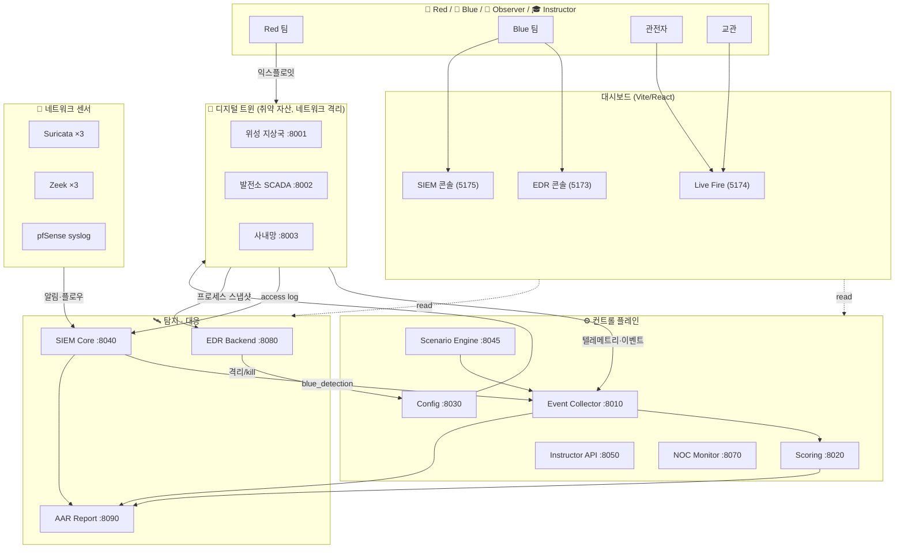

# 🛡️ Cyber Range Platform — 공방(攻防) 통합 훈련 플랫폼

> **위성 지상국 · 전력망(SCADA) · 사내망 + 정유/석유화학 · 스마트팩토리 · 수도 · LNG · 철도 · 공항 ·
> 데이터센터 · 병원** 등 **11개 ICS/OT 섹터**를 모사한 디지털 트윈 위에서
> Red(공격) · Blue(방어) · 관전자 · 교관이 함께 훈련하는 **풀스택 사이버 레인지**입니다.
> 취약 서비스 트윈(**44종**), EDR, SIEM, 시나리오 엔진, 실시간 대시보드, 자동 채점(AAR),
> 그리고 7개 분야 **61개 CTF 챌린지**를 하나의 `docker compose`로 기동합니다.

<p align="center">
  
  <br/>
  <em>Live Fire Range — 네트워크 토폴로지 · 팀별 실시간 점수 · 공격/방어 이벤트 피드 · 플래그 트래커</em>
</p>

---

## 목차
- [무엇을 하는 플랫폼인가](#무엇을-하는-플랫폼인가)
- [아키텍처](#아키텍처)
- [주요 화면 (스크린샷)](#주요-화면-스크린샷)
- [핵심 기능](#핵심-기능)
- [트윈 취약 서비스 (44종)](#트윈-취약-서비스-44종)
- [챌린지 카탈로그 (61종)](#챌린지-카탈로그-61종)
- [빠른 시작](#빠른-시작)
- [검증 · 품질 게이트](#검증--품질-게이트)
- [RBAC (역할 기반 접근제어)](#rbac-역할-기반-접근제어)
- [저장소 구조](#저장소-구조)

---

## 무엇을 하는 플랫폼인가

실제 인프라를 공격할 수 없으니, **핵심기반시설을 모사한 디지털 트윈**을 안전한 컨테이너 안에
띄우고 그 위에서 공방 훈련을 진행합니다.

- **Red(공격팀)** 은 취약한 트윈 서비스와 CTF 챌린지를 익스플로잇해 플래그를 획득합니다.
- **Blue(방어팀)** 은 EDR로 침해를 탐지·격리·차단하고, SIEM 탐지 규칙을 작성하며, 서비스를 패치·복구합니다.
- **교관(Instructor)** 은 시나리오를 주입·제어하고 점수를 조정합니다.
- **관전자(Observer)** 는 읽기 전용으로 전 과정을 모니터링합니다.
- 종료 후에는 **AAR(After-Action Report)** 가 MTTD/MTTR·탐지율·ATT&CK 히트맵·PDF 리포트를 자동 생성합니다.

전 과정이 **MITRE ATT&CK / ATT&CK for ICS** 기법으로 태깅되어, 공격과 탐지가 같은 언어로 상관됩니다.

---

## 아키텍처



**포트 요약**: 트윈 8001–8003(nginx 게이트웨이 경유) · Event 8010 · Scoring 8020 · Config 8030 ·
SIEM 8040 · Scenario 8045 · Instructor 8050 · NOC 8070 · EDR 8080 · AAR 8090 · 대시보드 5173–5175.

---

## 주요 화면 (스크린샷)

### 🔥 Live Fire Range — 통합 상황판
네트워크 토폴로지, 팀별 Red/Blue 실시간 점수와 누적 추이, 패치 상태, 플래그 트래커,
그리고 공격·탐지·단계완료가 흐르는 라이브 이벤트 피드.


### 🏭 Process Impact — ICS 사보타주 물리 임팩트
추상적 자산 상태(compromised/recovered)를 **각 OT 섹터의 실제 물리 결과**로 번역합니다 —
"계통 주파수 붕괴 57.2Hz / SIS 인터록 해제 · 반응기 과압 / CRAC 냉방 오버라이드 · 흡기 41℃"처럼.
심각도(정상·교란·사보타주·복구중)를 색상 게이지와 계기값으로 표시해, 사보타주가 물리 세계에
무엇을 의미하는지 직관적으로 전달합니다. 기존 이벤트 스트림만으로 동작(추가 백엔드 없음).

<p align="center">
  
  <br/><em>Process Impact — 전력망 트립 · 정유 SIS 해제 · 데이터센터 냉방 오버라이드가 사보타주로,
  철도는 블루팀 복구중으로 표시된 예시</em>
</p>

### 🖥️ EDR 콘솔 — 침해 대응
호스트 인벤토리(온라인 상태), 프로세스 트리 탐색, 실시간 탐지 알림(리버스쉘/웹서버-셸 생성),
그리고 **호스트 격리(Isolate) / 프로세스 종료(Kill)** 원클릭 대응.

| 개요 (호스트 · 탐지) | 호스트 선택 (프로세스 탐색 · 격리) |
|---|---|
|  |  |

### 🔎 SIEM 콘솔 — 탐지 · 헌팅
전문(full-text) 로그 검색(Discover), 실시간 탐지 알림(Alerts), MITRE ATT&CK 커버리지(Coverage),
그리고 Suricata/Zeek/트윈/pfSense 소스 헬스.

| Discover (로그 검색) | Alerts (탐지) | Coverage (ATT&CK) |
|---|---|---|
|  |  |  |

---

## 핵심 기능

| 영역 | 내용 |
|---|---|
| **디지털 트윈** | **11개 ICS/OT 섹터**(위성·전력·사내망 + 정유·스마트팩토리·수도·LNG·철도·공항·데이터센터·병원)에 **취약 서비스 44종**(SQLi/IDOR/RCE/명령주입/SSRF/XXE/LDAP + OPC UA·Modbus·HART·SIS·ESD·Profinet 등 OT 프로토콜)을 내장하고 텔레메트리·access log를 발생. **11개 섹터 전부 per-twin 네트워크 격리**(nginx 게이트웨이 + internal 네트워크)로 lateral·egress 차단. |
| **EDR** | 프로세스 스냅샷 수집 → 리버스쉘·웹서버발 셸 생성 등 행위 탐지 → 호스트 격리/프로세스 kill(감사 로그). |
| **SIEM** | 인제스천(11개 트윈 로그·Suricata·Zeek·pfSense syslog) → 정규화 → 규칙(match/threshold/sequence/periodicity, **ICS/OT 섹터 규칙 19종**: match 16 + 섹터 킬체인 sequence 2 + OT 다중취약점 threshold 1) 탐지 → Live Fire 점수 연동. ATT&CK 커버리지 매핑. |
| **시나리오 엔진** | 코드로 정의된 킬체인 시나리오(순서 강제, chain bonus). **14개 시나리오** 로드 — **11개 섹터 전부 전용 킬체인** + 크로스오버 3(**IT→OT 피벗** 포함: 사내망 발판→자격증명 탈취→정유 OPC UA 정찰→SIS 사보타주로 Purdue 경계를 넘는 멀티에셋 킬체인). |
| **점수/AAR** | 이벤트 → 자동 채점(Red 목표 / Blue 탐지·복구). MTTD/MTTR·탐지율·오탐률·ATT&CK 히트맵·**PDF 리포트** 자동 생성. |
| **복구 판정** | NOC Monitor가 트윈 헬스를 폴링, 침해→패치→복구를 판정해 MTTR 산출·Blue 가점. |
| **RBAC** | instructor/red/blue/observer 역할별 토큰. 방어 액션은 instructor·blue, 조작은 instructor, **관전자는 읽기 전용**. |
| **61 챌린지** | 7개 분야 × easy~insane. 팀별 동적 플래그(HMAC)로 답 공유 방지. 전부 자동 QA 통과. |

---

## 트윈 취약 서비스 (44종)

11개 ICS/OT 섹터 트윈에 내장된 취약 서비스 목록입니다. 각 취약점은 `PATCH_<ID>=true` 환경변수 또는
교관 콘솔의 무중단 패치 토글로 개별 비활성화되며, `python3 shared/safe_probe.py` 로 44종 전부의
patched/vulnerable 상태를 한 번에 판정합니다.

> **섹터별 blue 자동 패치검증**: `--asset <섹터>` 로 특정 섹터만 재검증(blue 팀이 자기 담당 섹터만),
> `--summary`/`--json` 으로 섹터별 패치율 집계, `--no-emit` 으로 발행 없는 dry-run. 패치가 실제로
> 닫혔는지 엔드포인트를 능동 probe해 확인된 것만 `blue_patch_verified`(+50) 를 발행합니다(플래그
> 신뢰가 아닌 실측 기반). 분류·필터·발행억제 로직은 유닛 테스트로 검증.
> ```bash
> python3 shared/safe_probe.py --asset refinery_plant --summary   # 정유 섹터만 재검증
> python3 shared/safe_probe.py --json --no-emit                    # 전체 dry-run(자동화/대시보드용)
> ```

<p align="center">
  
  <br/><em>EDR 콘솔 — 11개 ICS/OT 섹터 자산이 온라인으로 관측되는 모습</em>
</p>

### 11개 ICS/OT 섹터
| # | 섹터 | 자산 키 | 주요 서브시스템 / 프로토콜 | 상태 |
|---|---|---|---|---|
| 1 | 전력망 SCADA | `power_plant` | 발전소·EMS·RTU/IED / IEC 104·DNP3·Modbus·IEC 61850 | 기존 |
| 2 | 위성 지상국 | `ground_station` | TT&C·안테나제어·RF·GPS·Mission Control | 기존 |
| 3 | 사내망 | `defense_network` | AD·SMB·파일서버·메일 | 기존 |
| 4 | 정유·석유화학 | `refinery_plant` | DCS·SIS·Tank Farm / OPC UA·Modbus·HART | **신규** |
| 5 | 스마트팩토리 | `smart_factory` | PLC·Robot·MES·Conveyor / Profinet·S7 | **신규** |
| 6 | 수도 시설 | `water_utility` | 정수장·펌프·염소투입 / SCADA·Modbus | **신규** |
| 7 | LNG 터미널 | `lng_terminal` | Storage·BOG·Cryogenic·F&G·ESD | **신규** |
| 8 | 철도 신호 | `railway_signaling` | 신호·ATS·ATP·CTC·전력공급 | **신규** |
| 9 | 공항 OT | `airport_ot` | BHS·활주로조명·Fuel Farm·ATC | **신규** |
| 10 | 데이터센터 | `datacenter_bms` | UPS·CRAC·Generator·BMS·DCIM | **신규** |
| 11 | 병원 OT | `hospital_ot` | PACS·HIS·의료기기 VLAN·BMS | **신규** |

> 신규 8개 섹터는 공통 **ICS 트윈 팩토리**(`shared/ics_twin.py`)로 구축되어 EDR 에이전트 / SIEM
> access log / Config 무중단 패치 / 격리·킬스위치 / 이벤트 발행 계약을 그대로 상속합니다.
> **11개 섹터 모두 per-twin nginx 게이트웨이 + `internal` 네트워크로 격리**되어(로드맵 F 패리티),
> 컨테이너 실측 기준 섹터간 lateral·인터넷 egress가 차단되고 트윈→코어 통신만 허용됩니다.

### 핵심 3종

#### 🛰️ 위성 지상국 (`ground_station`) — 7종
| ID | 취약점 | CWE | ATT&CK | 엔드포인트 |
|---|---|---|---|---|
| GS-001 | Telemetry API SQL Injection | CWE-89 | T1190 | `GET /api/telemetry?sensor_id=` |
| GS-002 | Hardcoded Admin Credentials / Weak JWT | CWE-798 | T1078,T1552.001 | `POST /api/login` |
| GS-003 | Mission Plan IDOR | CWE-639 | T1213 | `GET /api/mission-plan/{id}` |
| GS-004 | File Download Path Traversal | CWE-22 | T1005 | `GET /api/download?file=` |
| GS-005 | Debug Endpoint Config Exposure | CWE-215 | T1592 | `GET /api/debug/config` |
| **GS-006** | **TLE Import SSRF** | CWE-918 | T1090 | `POST /api/tle/import` |
| **GS-007** | **Config XML XXE** | CWE-611 | T1005 | `POST /api/config/xml-import` |

#### ⚡ 발전소 · SCADA (`power_plant`) — 7종
| ID | 취약점 | CWE | ATT&CK | 엔드포인트 |
|---|---|---|---|---|
| PP-001 | Unauthenticated PLC Register Write | CWE-306 | T0836 | `POST /api/plc/write` |
| PP-002 | Default HMI Credentials | CWE-521 | T1078.001 | `POST /api/hmi/login` |
| PP-003 | Diagnostics Command Injection | CWE-78 | T1059 | `POST /api/diagnostics/ping` |
| PP-004 | Historian Insecure Deserialization | CWE-502 | T1059.006 | `POST /api/historian/export` |
| PP-005 | Safety Monitor Bypass | CWE-284 | T0800 | `POST /api/safety/override` |
| **PP-006** | **Unauthorized Modbus Register Write (ICS)** | CWE-306 | T0836,T0855 | `POST /api/modbus/write-register` |
| **PP-007** | **Unsigned Firmware Update (ICS)** | CWE-345 | T0857 | `POST /api/plc/firmware-update` |

#### 🏢 사내망 (`defense_network`) — 6종
| ID | 취약점 | CWE | ATT&CK | 엔드포인트 |
|---|---|---|---|---|
| DN-001 | SMB Anonymous Share Access | CWE-284 | T1039 | `GET /api/smb/shares` |
| DN-002 | Kerberoastable Service Account | CWE-521 | T1558.003 | `GET /api/ad/service-accounts` |
| DN-003 | Exposed Backup Config (Plaintext Creds) | CWE-256 | T1552.001 | `GET /api/fileserver/backup-config` |
| DN-004 | Open Mail Relay | CWE-284 | T1583.007 | `POST /api/mail/relay` |
| **DN-005** | **Directory LDAP Injection** | CWE-90 | T1087 | `GET /api/directory/search` |
| **DN-006** | **URL Preview SSRF** | CWE-918 | T1090 | `POST /api/webhook/preview` |

> GS-006/007, PP-006/007, DN-005/006 은 SSRF/XXE/ICS/LDAP 확장 서비스입니다.

### 확장 ICS/OT 섹터 8종 (24 서비스)

#### ⛽ 정유·석유화학 플랜트 (`refinery_plant`) — DCS·SIS·Tank Farm / OPC UA·Modbus·HART
| ID | 취약점 | CWE | ATT&CK | 엔드포인트 |
|---|---|---|---|---|
| REF-001 | OPC UA Anonymous Read | CWE-306 | T0886 | `GET /api/opcua/read` |
| REF-002 | SIS Safety Bypass | CWE-284 | T0858,T0800 | `POST /api/sis/bypass` |
| REF-003 | HART Tank Gauge Spoof | CWE-306 | T0836 | `POST /api/tankfarm/gauge` |

#### 🏭 스마트팩토리 (`smart_factory`) — PLC·Robot·MES / Profinet·S7·OPC UA
| ID | 취약점 | CWE | ATT&CK | 엔드포인트 |
|---|---|---|---|---|
| FAC-001 | PLC Program Download | CWE-306 | T0843 | `POST /api/plc/program-download` |
| FAC-002 | Robot Command Injection | CWE-77 | T0807 | `POST /api/robot/exec` |
| FAC-003 | MES Work-Order SQLi | CWE-89 | T1190 | `GET /api/mes/workorder` |

#### 🚰 수도 시설 (`water_utility`) — 정수장·펌프·염소투입 / SCADA·Modbus
| ID | 취약점 | CWE | ATT&CK | 엔드포인트 |
|---|---|---|---|---|
| WTR-001 | Chlorine Dosing Tamper | CWE-306 | T0836 | `POST /api/dosing/chlorine` |
| WTR-002 | Pump Control Unauth | CWE-306 | T0855 | `POST /api/pump/control` |
| WTR-003 | SCADA HMI Default Creds | CWE-521 | T0812 | `POST /api/hmi/login` |

#### ❄️ LNG 터미널 (`lng_terminal`) — Storage·BOG·Cryogenic·F&G·ESD
| ID | 취약점 | CWE | ATT&CK | 엔드포인트 |
|---|---|---|---|---|
| LNG-001 | ESD Trigger/Bypass | CWE-284 | T0858 | `POST /api/esd/trigger` |
| LNG-002 | BOG Compressor Setpoint | CWE-306 | T0836 | `POST /api/bog/compressor` |
| LNG-003 | Fire&Gas Alarm Suppress | CWE-284 | T0878 | `POST /api/firegas/suppress` |

#### 🚈 철도 신호 (`railway_signaling`) — 신호·ATS·ATP·CTC
| ID | 취약점 | CWE | ATT&CK | 엔드포인트 |
|---|---|---|---|---|
| RWY-001 | Signal Aspect Override | CWE-306 | T0855 | `POST /api/signal/set` |
| RWY-002 | Interlocking Bypass | CWE-284 | T0858 | `POST /api/interlocking/override` |
| RWY-003 | ATS Command Injection | CWE-77 | T0807 | `POST /api/ats/command` |

#### ✈️ 공항 OT (`airport_ot`) — BHS·활주로조명·Fuel Farm·ATC
| ID | 취약점 | CWE | ATT&CK | 엔드포인트 |
|---|---|---|---|---|
| AIR-001 | Runway Lighting Control | CWE-306 | T0855 | `POST /api/runway/lighting` |
| AIR-002 | BHS Route SQLi | CWE-89 | T1190 | `GET /api/bhs/route` |
| AIR-003 | Fuel Farm Valve Unauth | CWE-306 | T0836 | `POST /api/fuelfarm/valve` |

#### 🖧 데이터센터 (`datacenter_bms`) — UPS·CRAC·Generator·BMS·DCIM
| ID | 취약점 | CWE | ATT&CK | 엔드포인트 |
|---|---|---|---|---|
| DCX-001 | CRAC Setpoint Tamper | CWE-306 | T0836 | `POST /api/crac/setpoint` |
| DCX-002 | UPS Shutdown Unauth | CWE-306 | T0816 | `POST /api/ups/command` |
| DCX-003 | DCIM SSRF | CWE-918 | T1090 | `POST /api/dcim/fetch` |

#### 🏥 병원 OT (`hospital_ot`) — PACS·HIS·의료기기 VLAN·BMS
| ID | 취약점 | CWE | ATT&CK | 엔드포인트 |
|---|---|---|---|---|
| HSP-001 | PACS Study IDOR | CWE-639 | T1213 | `GET /api/pacs/study` |
| HSP-002 | HIS Patient SQLi | CWE-89 | T1190 | `GET /api/his/patient` |
| HSP-003 | Infusion Pump Unauth | CWE-306 | T0855 | `POST /api/device/infusion` |

> 신규 24종은 모두 팀별 무중단 패치 토글 + Safe Probe 판정을 지원하며, 실제 docker 기동 후
> `python3 shared/safe_probe.py` 에서 **44종 전부 VULNERABLE** 로 확인됩니다.

---

## 챌린지 카탈로그 (61종)

web·forensics·network·reversing·detection·ai 6개 분야가 모두 **easy → medium → hard → insane** 난이도 곡선을 갖추고 있습니다.
표기: `점수(Red/Blue)`. 팀마다 플래그·정답이 HMAC으로 달라 답 공유가 불가능합니다.

<details open>
<summary><b>🌐 Web (8)</b></summary>

| ID | 제목 | 난이도 | ATT&CK | 점수 |
|---|---|---|---|---|
| WEB-000 | 노출된 디버그 설정 | easy | T1592 | 50/50 |
| WEB-001 | 네트워크 진단 명령 주입 | medium | T1059 | 150/60 |
| WEB-002 | 위조된 지휘권 — JWT Forgery | medium | T1078,T1552.001 | 150/150 |
| WEB-003 | 열람 권한 없음 — Mission Plan IDOR | medium | T1083,T1213 | 120/120 |
| WEB-004 | 파일 다운로드 경로 순회 | medium | T1083 | 120/50 |
| WEB-007 | 그림인 척 — Upload Filter Bypass | medium | T1190,T1505.003 | 150/150 |
| WEB-005 | 복원의 대가 — Historian 역직렬화 RCE | hard | T1059,T1203 | 250/250 |
| WEB-009 | WAF 우회 + 블라인드 SQL 인젝션 | insane | T1190 | 300/150 |
</details>

<details>
<summary><b>🔬 Forensics (9)</b></summary>

| ID | 제목 | 난이도 | ATT&CK | 점수 |
|---|---|---|---|---|
| FOR-000 | 평문 자격증명 카빙 | easy | T1552.001 | 50/30 |
| FOR-001 | 명령 이력 포렌식 — 데이터 유출 추적 | easy | T1048 | 50/30 |
| FOR-004 | 이메일 헤더 포렌식 — 피싱 발신지 추적 | easy | T1566 | 50/30 |
| FOR-005 | 메모리 덤프 문자열 분석 — 자격증명 복구 | easy | T1003 | 50/30 |
| FOR-006 | 지속성 흔적 분석 — 악성 스케줄 작업 | easy | T1053 | 50/35 |
| FOR-002 | 침묵하는 지상국 — 침해 재구성 | medium | T1190,T1046,T1041 | 200/0 |
| FOR-003 | 세션 하이재킹 흔적 — 접근 로그 조사 | medium | T1539 | 55/35 |
| **FOR-007** | **인메모리 인젝션 탐지 — 프로세스 할로잉** | **hard** | T1055.012 | 180/0 |
| FOR-009 | 안티포렌식 다단계(타임스톰프→은닉채널→복호) | insane | T1070.006,T1564.004,T1027 | 300/0 |
</details>

<details>
<summary><b>🌐 Network (9)</b></summary>

| ID | 제목 | 난이도 | ATT&CK | 점수 |
|---|---|---|---|---|
| NET-000 | 평문 프로토콜 스니핑 | easy | T1040 | 50/30 |
| NET-004 | ARP 스푸핑 탐지 — 중간자 공격 추적 | easy | T1557 | 50/40 |
| NET-001 | DNS 터널링 분석 — 은닉 채널 유출 복원 | medium | T1071.004 | 60/40 |
| NET-002 | 경계를 넘어 — Lateral Pivot | medium | T1021,T1090 | 150/100 |
| NET-003 | C2 비콘 간격 분석 | medium | T1071 | 55/40 |
| NET-005 | 포트 노킹 시퀀스 복원 | medium | T1205 | 50/35 |
| NET-006 | TCP 세그먼트 재조립 — 분할 유출 복원 | medium | T1041 | 50/35 |
| **NET-007** | **다중 홉 피벗 체인 상관 추적** | **hard** | T1090.003 | 180/0 |
| NET-009 | OT 사보타주 트레이스 재구성(Modbus) | insane | T0836,T0855,T0831 | 300/0 |
</details>

<details>
<summary><b>🔩 Reversing (8)</b></summary>

| ID | 제목 | 난이도 | ATT&CK | 점수 |
|---|---|---|---|---|
| REV-000 | 가려진 신호 — XOR Decode | easy | T1027 | 100/50 |
| REV-001 | 난독화된 라이선스 체크 | medium | T1027 | 150/0 |
| REV-002 | 반복키 XOR 복원 | medium | T1027 | 120/0 |
| REV-003 | 다단계 인코딩 복원 | medium | T1140 | 130/0 |
| REV-006 | 비트 회전 사이퍼 복호화 | medium | T1027 | 130/0 |
| REV-004 | 스택 VM 리버싱 | hard | T1027 | 140/0 |
| REV-005 | LCG 스트림 사이퍼 복호화 | hard | T1027 | 130/0 |
| REV-009 | 커스텀 VM 난독화(핸들러 테이블) | insane | T1027.007 | 300/0 |
</details>

<details>
<summary><b>🕵️ Detection (8) — Blue 전용, 진짜 SIEM 엔진이 채점</b></summary>

| ID | 제목 | 난이도 | ATT&CK | 점수 |
|---|---|---|---|---|
| DET-000 | 첫 브루트포스 룰 | easy | T1110 | 0/60 |
| DET-002 | 웹 로그에서 SQL 인젝션 탐지 | easy | T1190 | 0/80 |
| DET-001 | 잡음 속의 스캔 — Threshold Tuning | medium | T1046 | 0/100 |
| DET-003 | 웹쉘 킬체인 탐지 — 업로드 후 실행 시퀀스 | medium | T1505.003 | 0/90 |
| DET-005 | Log4Shell(JNDI) 인젝션 탐지 | medium | T1190 | 0/80 |
| DET-006 | DNS DGA 탐지 — 대량 도메인 조회 | medium | T1568.002 | 0/90 |
| DET-004 | C2 비콘 주기성 탐지 | hard | T1071 | 0/90 |
| DET-009 | APT Low-and-Slow 비콘 헌팅(노이즈 90%) | insane | T1071.004,T1029 | 0/200 |
</details>

<details>
<summary><b>🤖 AI Security (9)</b></summary>

| ID | 제목 | 난이도 | ATT&CK | 점수 |
|---|---|---|---|---|
| AI-000 | 특징공간 회피 — Feature-Space Evasion | easy | T1027 | 60/40 |
| AI-002 | 프롬프트 인젝션 흔적 분석 | easy | T1059 | 60/40 |
| AI-005 | 모델 추출 API 남용 탐지 | easy | T1595 | 50/40 |
| AI-001 | 그림자 모델 — Model Extraction | medium | T1587.001 | 150/100 |
| AI-003 | 데이터 포이즈닝 흔적 분석 — 백도어 트리거 | medium | T1195 | 55/40 |
| AI-004 | RAG 간접 프롬프트 인젝션 흔적 | medium | T1059 | 55/40 |
| AI-006 | 훈련 데이터 memorization 유출 | medium | T1552 | 55/40 |
| **AI-007** | **예산 제약 적대적 회피 — PGD Evasion (실 ML)** | **hard** | T1027 | 220/100 |
| AI-009 | 적대적 회피 인시던트 재구성(전이공격) | insane | T1027,T1551 | 300/0 |
</details>

> **AI-007** 은 numpy로 직접 학습한 비선형 MLP를 docker로 서빙하고, 화이트박스 **PGD(적대적 예제)**
> 로 L∞ 예산 안에서 오분류를 유도하는 실제 ML 보안 챌린지입니다.

<details>
<summary><b>🏭 ICS/OT (10) — OT 프로토콜 기반 (서비스형 2 + 트래픽분석형 8)</b></summary>

| ID | 제목 | 난이도 | ATT&CK | 게이트 | 점수 |
|---|---|---|---|---|---|
| ICS-001 | OPC UA 익명 태그 열람 | easy | T0886 | full docker | 70/40 |
| ICS-000 | 안전 인터록 우회 — Modbus Safety Interlock | medium | T0836,T0858 | full docker | 120/60 |
| ICS-002 | Modbus 사보타주 분석 — 안전 레지스터 무단 쓰기 | medium | T0836,T0855 | artifact | 120/0 |
| ICS-003 | DNP3 무단 제어 명령 탐지 | medium | T0855 | artifact | 120/0 |
| ICS-004 | IEC 104 ASDU 조작 추적 | medium | T0855 | artifact | 120/0 |
| ICS-005 | Profinet DCP 스푸핑 분석 — Station Identity Spoof | medium | T0842,T0830 | artifact | 120/0 |
| ICS-007 | HART 명령 주입 분석 — Transmitter Range Tamper | medium | T0836,T0855 | artifact | 120/0 |
| ICS-008 | BACnet 무단 WriteProperty 분석 — Priority Override | medium | T0855,T0836 | artifact | 120/0 |
| ICS-006 | IEC 61850 GOOSE 위조 분석 — Spoofed Trip | hard | T0832,T0855 | artifact | 130/0 |
| ICS-009 | Foundation Fieldbus 블록 MODE 조작 — PID OOS Sabotage | hard | T0836,T0855,T0831 | artifact | 140/0 |

> **서비스형**(ICS-000/001): Modbus/OPC UA를 흉내낸 서비스를 docker로 배포하고 실제 익스플로잇으로
> 플래그 획득. **트래픽분석형**(ICS-002~009): 합성 Modbus/DNP3/IEC 104/Profinet/IEC 61850/HART/BACnet/
> Foundation Fieldbus 로그에서 안전계통에 대한 무단 제어·신원 스푸핑·블록 정지(사보타주)를 상관
> 분석으로 찾아 공격자 식별 + 은닉 토큰 복호. **9대 OT 프로토콜 커버**. 전부 팀별 HMAC 동적 플래그.
</details>

---

## 빠른 시작

### 요구사항
- Docker + Docker Compose v2
- (대시보드 개발서버 실행 시) Node.js 20+

### 1) 플랫폼 기동
```bash
cd cyber-range-platform
docker compose up -d --build

# 통합 E2E 스모크 (기본 35/35 PASS)
bash scripts/smoke_test.sh
```

### 2) 대시보드 실행
```bash
# EDR 콘솔
cd services/edr/console && npm install && npm run dev      # http://localhost:5173
# Live Fire
cd dashboards/livefire   && npm install && npm run dev      # http://localhost:5174
# SIEM 콘솔
cd dashboards/siem       && npm install && npm run dev      # http://localhost:5175
```

### 3) 챌린지 검증 (예시)
```bash
# 서비스형(docker) — 실제 배포→익스플로잇→채점→teardown
python3 infra/challenge_qa/run_all.py --challenge AI-007

# 아티팩트형 — 생성→solve→채점
python3 infra/challenge_qa/run_all.py --challenge FOR-007
python3 infra/challenge_qa/run_all.py --challenge NET-007
```

> 로컬(WSL 등)에서 8080 포트가 점유돼 있으면 `docker-compose.override.yml` 이 EDR 호스트포트를
> 리맵합니다. GCP/정상 환경에서는 이 파일을 지우면 8080으로 뜹니다.

---

## 검증 · 품질 게이트

이 프로젝트의 원칙은 **"코드가 아니라 실제로 통과한 결과를 보여준다"** 입니다.

- **유닛 테스트 72개** (`python -m pytest tests/`) — 계약 검증 + 지금까지 잡은 버그의 회귀 테스트.
- **통합 스모크 35/35** (`scripts/smoke_test.sh`) — 헬스 → 트윈공격 → SIEM 인제스천 → 점수 →
  시나리오 → EDR 탐지 → AAR/PDF → 네트워크 격리까지 E2E.
- **C-QA 파이프라인** (`infra/challenge_qa/run_all.py`) — 챌린지 타입별 올바른 게이트로 61종 전부 검증:
  - **서비스형(docker)**: `deploy_up → intended_solve → blank_submit → flag_determinism → teardown`
  - **아티팩트형**: `artifact_solve` (생성 → 시그니처 분기 solve → 채점 + 빈제출 거부)
  - **탐지형(DET)**: `detection_solve` (데이터셋 생성 → **진짜 SIEM DetectionEngine** 채점 + no-op 규칙 거부)
- **GitHub Actions CI** (`.github/workflows/ci.yml`) — 3개 job:
  - `unit`: 유닛/계약 테스트(**72개**).
  - `challenges`: 전체 챌린지 schema + 아티팩트/탐지 게이트 실채점(docker 불필요, `scripts/validate_challenges.sh`).
  - `integration`: 전체 docker 스택 build+up → `SMOKE_RECOVERY=1` 스모크 → teardown.

---

## RBAC (역할 기반 접근제어)

토큰→역할 매핑(`shared/rbac.py`). 토큰 미설정 로컬 dev는 관대 통과(하위호환).

| 엔드포인트 | 무토큰 | red | blue | observer | instructor |
|---|---|---|---|---|---|
| config `/instructor/patch/toggle` | 401 | 403 | 403 | 403 | ✅ 200 |
| instructor_api `/scenario/start` | 401 | 403 | 403 | 403 | ✅ 200 |
| edr `/isolate` · `/kill` (방어) | 401 | 403 | ✅ 200 | 403 | ✅ 200 |
| scoring `/score/adjust` (수동 가감점) | 401 | 403 | 403 | 403 | ✅ 200 |
| **read**: scoring `/scores`, edr `/edr/hosts`·`/edr/alerts` | 401\* | ✅ | ✅ | ✅ | ✅ |

> \* **관전자 read 게이트**: `OBSERVER_READ_ENFORCE=true` 일 때만 read 엔드포인트가 "인증된
> 아무 역할(관전자 이상)"을 요구합니다. 기본(off)은 대시보드 편의를 위해 공개이며, 이 플래그로
> 대회 운영 시 관전 접근을 통제할 수 있습니다.

---

## 저장소 구조

```
cyber-range-platform/
├── services/            # 17개 마이크로서비스(트윈3 + 코어 + EDR/SIEM/AAR/센서)
│   ├── ground_station/ power_plant/ defense_network/   # 디지털 트윈
│   ├── edr/ (+ console/)   siem/   scenario_engine/   scoring_engine/
│   ├── event_collector/ config_service/ instructor_api/ noc_monitor/ aar_report/
│   └── core/            # 복구 판정(recovery_watcher) 등 공용 코어
├── dashboards/          # livefire/ · siem/ (Vite+React)
├── challenges/          # web/ forensics/ network/ reversing/ detection/ ai/ ics/ (59종)
├── infra/challenge_qa/  # C-QA 파이프라인(run_all + 게이트들)
├── scenarios/           # 코드로 정의된 킬체인 시나리오
├── scripts/smoke_test.sh
├── shared/              # rbac.py, event_schema.py 등 공용 모듈
├── tests/               # unit/ + 계약 테스트 (pytest)
├── docs/                # 설계/구현 문서 + images/
├── CONTRACTS.md         # 공통 계약(스키마/인터페이스) 단일 진실원
└── docker-compose.yml
```

---

## 라이선스 · 주의

훈련·교육용 플랫폼입니다. **모든 취약점·플래그·자격증명은 합성 더미값**이며 실제 시스템·실데이터를
포함하지 않습니다. 챌린지 컨테이너는 `read_only`/`cap_drop`/`mem_limit` 등으로 하드닝되어 있고,
트윈은 네트워크 격리되어 egress·lateral 이동이 차단됩니다. 승인된 훈련 환경에서만 사용하세요.
</content>
