# A축 감사 — 시나리오·콘텐츠 설계

- 감사일: 2026-08-14
- 대상: `/home/mintkangaroo/Project/Cyber_offensive_Defense_Project/cyber-range-platform`
- 방법: 정적 분석 전용(도커/Make 미실행). 모든 판정은 코드·YAML 근거를 동반한다.
- 기준선: CCE, Locked Shields, DEF CON CTF A/D, NIST SP 800-84.

---

## 0. 요약 판정 테이블

| # | 항목 | 판정 | 근거 (path:line) | 실전 영향 |
|---|---|---|---|---|
| A1 | 크로스오버 시나리오 완주 가능성 | **미구현** | `services/scenario_engine/runner.py:195` (`submit_objective` 호출자 0), `services/scenario_engine/api.py:123-258` (제출 엔드포인트 없음) | 크로스오버 3종 전부 phase 1~2에서 영구 정지. 훈련 후반부 전체 소실 |
| A2 | 크로스오버 `objective`/`points`/`is_final` 단일목표 phase 채점 | **미구현** | `services/scenario_engine/loader.py:52-55` (필드 파싱만), `runner.py` 전체(참조 0) | `XOVER-REV-PWN-NET-01` phase_2_pwn(150점)·`XOVER-WEB-FOR-DET-01` phase_3_detection(150점) 채점 불가 |
| A3 | 크로스오버 정답 키 기계 판독 가능성 | **미구현** | `services/scenario_engine/loader.py:33-38` (`CrossoverObjective`에 expected 필드 없음), `scenarios/crossover/XOVER-IT-OT-PIVOT-01.yaml:64-73` (정답이 주석) | 채점기가 정답을 모른다. 교관 수기 채점 외 경로 없음 |
| A4 | ATT&CK technique ID → 채점/탐지 연결 | **부분구현** | `services/aar_report/attack_heatmap.py:31-39` vs 전 서비스에서 `metadata.mitre` 발행 0건 | AAR ATT&CK 히트맵의 "발생(occurred)" 축이 상시 공백. 갭 분석 무의미 |
| A5 | ICS Impact 전술(물리 파괴/안전 손실) 커버리지 | **미구현** | `T0879/T0880/T0826/T0837/T0813/T0815` 저장소 전체 0건; `scenarios/single/POWERPLANT-MODBUS-SABOTAGE-01.yaml:36` (터빈 파괴 stage에 T0836 태깅) | 국가기반시설 훈련의 최종 목적(물리 피해)이 프레임워크상 미표현 |
| A6 | Enterprise Lateral Movement 커버리지 | **부분구현** | `challenges/network/NET-002/challenge.yaml:8` (T1021 — 전 저장소 유일) | IT→OT 피벗을 표방하나 횡적이동 문제 1개. Locked Shields 대비 결정적 결손 |
| A7 | 난이도 곡선 설계 | **부분구현** | 분포 medium 36/69(52%), `docs/18_difficulty_curve_easy_insane.md:182-195` (ICS 분야 부재) | 최대 카테고리 ICS(13문제)가 곡선 설계 대상 밖. easy 1 / insane 0 |
| A8 | 난이도-배점 정합성 | **부분구현** | medium 배점 50~200 (4배 산포), easy 최고 100(REV-000) > medium 최저 50 | 난이도 티어가 점수 신호를 주지 못함. 팀 전략 왜곡 |
| A9 | ICS 챌린지 다양성(정답 경로) | **부분구현** | `challenges/ics/ICS-002~012/solution/exploit.py` 11개 전부 동일 템플릿(`grep -l '_xor(base64.b64decode'`) | 1문제 풀면 나머지 10문제는 프로토콜명만 바꾼 반복. 학습 곡선 없음 |
| A10 | 힌트 체계 | **미구현** | `shared/challenge_schema.py:37,47` (모델만), `services/challenge_portal/main.py:161-166` `_public()`에 hints 제외, 힌트 엔드포인트 0 | 25개 힌트(비용 5~70)가 참가자에게 전달되지 않고 비용도 차감되지 않음 |
| A11 | 부분점수 반영 | **미구현** | `services/challenge_portal/main.py:315` (`points_awarded = e["points_red"]`, grader `got` 무시) | 필드 1개만 맞춰도 만점. 18개 그레이더가 `score > 0`로 통과 판정 |
| A12 | 배점 상한 정합성 | **부분구현** | FOR-003(`challenge.yaml:6` 55 vs grader 50), ICS-006(130 vs 120), NET-001(60 vs 50), NET-003(55 vs 50) | 광고 배점 도달 불가. 스코어보드 만점선이 허구 |
| A13 | Blue 채점 도달 가능성 | **부분구현** | `services/challenge_portal/main.py:428` (blue 카탈로그 = blue_grader + generate_datasets 동시 필요) | 선언 blue 3280점 중 DET 1200점만 채점 가능. WEB blue 980점 포함 2080점 미도달 |
| A14 | 시나리오 실패 시 우회 경로(교관 개입) | **미구현** | `services/scenario_engine/api.py` 전체(force-unlock/skip 엔드포인트 없음) | 한 stage에서 막히면 해당 팀 훈련 종료. 재개 수단 없음 |
| A15 | 단일 시나리오 stage 순서 강제 | **구현** | `services/scenario_engine/runner.py:70-71`, `180` | 정상 동작(양호) |
| A16 | `blue_objectives.match_alert` ↔ SIEM 규칙 ID 정합성 | **구현** | 시나리오 16종 전체 match_alert가 `services/siem/detection/rules/*.yaml` 52개 규칙 ID에 100% 일치 | 정상 동작(양호) |
| A17 | 플래그 형식 일관성 | **부분구현** | 그레이더 38종 전부 `flag{...}`; 단 `challenges/reversing/REV-001/challenge.yaml` flag_format이 시리얼 문자열 | 제출 형식 혼선 1건 |
| A18 | 시나리오 난이도 분포 | **부분구현** | 단일 13종 중 12종 `difficulty: hard`, 1종 medium, easy 0 | 초보자 진입 시나리오 없음 |
| A19 | 정답 자료 격리 | **미구현** | `services/challenge_portal/Dockerfile:8` (`COPY challenges/`) — solution/exploit.py·writeup.md 동봉 | 참가자 접점 컨테이너에 전 문제 정답 동봉 |
| A20 | 팀별 아티팩트 격리 | **부분구현** | `services/challenge_portal/main.py:237-252` (팀별 생성물이 공용 `deploy/` 경로에 덮어쓰기) | 동시 요청 시 타팀 아티팩트 배포 → 오답 또는 담합 오탐 |
| A21 | 시나리오↔챌린지 콘텐츠 통합 | **부분구현** | 챌린지 69개 중 시나리오가 참조하는 것은 `WEB-002` 1건뿐(`scenarios/crossover/XOVER-WEB-FOR-DET-01.yaml:32,42,94`) | 두 콘텐츠 체계가 사실상 분리 운영. 통합 킬체인 서사 부재 |
| A22 | `scoring.red_verify`/`blue_verify` 선언의 구속력 | **미구현** | `shared/challenge_schema.py:57-58` (모델만), `services/challenge_portal/main.py:266-290` (무조건 `grade_red` 호출) | 선언된 검증 방식(detector_query, surrogate_agreement_check 등)이 강제되지 않는 장식 필드 |
| A23 | 챌린지 mitre ID 유효성 | **UNVERIFIED** | `challenges/ai/AI-009/challenge.yaml:7` (`T1551`) | ATT&CK 미할당 ID로 보인다. 확인 방법 8절 |

---

## 1. MITRE ATT&CK / ATT&CK for ICS 커버리지

### 1.1 추출 결과

`challenges/ scenarios/ services/ shared/` 범위에서 전수 추출한 결과 **고유 technique ID 73개**(Enterprise 51, ICS 22)가 참조된다. 참조 빈도 상위는 다음과 같다.

| 순위 | ID | 건수 | 비고 |
|---|---|---|---|
| 1 | T0855 (Unauthorized Command Message) | 97 | ICS 전 영역 |
| 2 | T0836 (Modify Parameter) | 97 | ICS 전 영역 |
| 3 | T1190 (Exploit Public-Facing App) | 49 | |
| 4 | T1059 (Command and Scripting Interpreter) | 35 | |
| 5 | T0878 (Alarm Suppression) | 32 | |
| 6 | T1027 (Obfuscated Files) | 29 | REV 전체 |

상위 2개(T0855·T0836)가 전체 참조의 큰 비중을 차지한다. 즉 ICS 콘텐츠는 **Impair Process Control 단일 전술에 집중**되어 있다.

### 1.2 "장식용 ID" 판별

ID가 실제 채점·탐지에 연결되는 경로는 셋뿐이다.

1. `services/siem/detection/rules/*.yaml`의 `mitre:` → `services/siem/api/main.py:333-335` `/detection/attack-coverage`로 집계, `services/siem/detection/engine.py:217` 알림에 부착 → AAR 히트맵의 `detected` 축.
2. `services/aar_report/attack_heatmap.py:52-56` — 이벤트의 `metadata.mitre`로 `occurred` 축.
3. `services/challenge_portal/main.py:148,448` — 목록 응답에 문자열 노출(표시 전용).

문제는 (2)다. **어떤 서비스도 이벤트에 `mitre`를 넣어 발행하지 않는다.** `services/` 하위에서 `"mitre"` 키를 이벤트 메타데이터로 채우는 코드는 존재하지 않으며(aar_report·siem·challenge_portal 제외 시 0건), 트윈 서비스는 주석으로만 기술을 표기한다.

> `services/power_plant/main.py:501`
> ```
>     # 취약 지점: 서명 검증 없이 임의 펌웨어 설치 -> 악성 펌웨어 주입 가능(ICS T0857)
> ```
> 바로 다음 줄 `emit_event(...)`(502)에는 mitre가 없다.

결과적으로 `build_heatmap`의 `occurred`는 항상 False가 되고, `uncovered_techniques()`(`attack_heatmap.py:70-72`)는 `occurred and not detected` 조건이므로 **항상 빈 리스트를 반환한다**. AAR의 ATT&CK 갭 분석은 구조적으로 아무것도 보고할 수 없다.

같은 성격으로 **`shared/vuln_catalog.json`의 60개 취약점에 붙은 `mitre_attack` 배열은 어떤 코드도 읽지 않는다**(`git grep mitre_attack -- services shared` 결과가 vuln_catalog.json 자기 자신뿐). 오직 카탈로그에만 존재하는 기술은 T0801, T0838, T0856, T0868, T0873, T0883, T1087, T1499이며, 이들은 훈련 중 어떤 형태로도 관측·채점되지 않는다.

`services/scenario_engine/loader.py:31`의 `Stage.mitre`도 마찬가지다. 파싱은 되지만 `runner.py`에는 `mitre` 문자열이 한 번도 등장하지 않는다. 즉 시나리오 stage의 ATT&CK 태그는 **YAML 주석과 동등한 지위**다.

`challenge.yaml`의 `mitre`는 포털 목록 응답에 실려 화면에 표시되지만(`main.py:165`), 채점에는 관여하지 않는다.

**판정: technique ID 73개 중 실제 채점/탐지에 연결된 것은 SIEM 규칙에 태깅된 29개뿐이다. 나머지 44개는 장식용이다.**

SIEM 규칙에 실제로 태깅된 29개:
`T0800 T0807 T0816 T0836 T0842 T0846 T0855 T0858 T0878 T0886 T1005 T1018 T1041 T1046 T1059 T1059.006 T1071 T1071.004 T1078.001 T1090 T1190 T1213 T1552.001 T1552.005 T1583.007 T1592 T1595 T1609 T1610`
(근거: `services/siem/detection/rules/*.yaml`, 총 52개 규칙)

### 1.3 전술별 커버리지 매트릭스 — ATT&CK for ICS

| 전술 | 존재 여부 | 참조 기술 | 근거 | 비고 |
|---|---|---|---|---|
| Initial Access | 부분 | T0886, T0883 | `challenges/ics/ICS-001/challenge.yaml:7`; T0883은 `shared/vuln_catalog.json`만 | 실채점 연결은 T0886 1건 |
| Execution | 존재 | T0807 | `scenarios/single/FACTORY-SABOTAGE-01.yaml`, `RAIL-SIGNAL-SABOTAGE-01.yaml` | |
| Persistence | **공백** | T0873, T0857 | 각각 카탈로그 전용 / `services/power_plant/main.py:501` 주석 | ICS 지속성 훈련 없음 |
| Privilege Escalation | **공백** | — | 0건 | |
| Evasion | 부분 | T0858, T0856 | `challenges/ics/ICS-000/challenge.yaml:7`; T0856 카탈로그 전용 | |
| Discovery | 부분 | T0842, T0846 | `challenges/ics/ICS-005/challenge.yaml:7`; `services/siem/detection/rules/app_layer.yaml` | |
| Lateral Movement | 부분 | T0812, T0843 | `scenarios/single/POWERPLANT-MODBUS-SABOTAGE-01.yaml:26`; `FACTORY-SABOTAGE-01.yaml` | Purdue 계층 이동 자체는 미모델링 |
| Collection | 부분 | T0830, T0801, T0868 | `challenges/ics/ICS-005/challenge.yaml:7`; 나머지 카탈로그 전용 | |
| Command and Control | **공백** | — | 0건 | OT 내부 C2 개념 부재 |
| Inhibit Response Function | 존재 | T0878, T0816, T0800, T0838 | `scenarios/single/LNG-ESD-SABOTAGE-01.yaml`, `DATACENTER-BLACKOUT-01.yaml` | 가장 잘 갖춰진 축 |
| Impair Process Control | **과대표집** | T0836, T0855, T0831 | 참조 215건 | 전체 ICS 참조의 대부분 |
| Impact | **공백** | T0832(Manipulation of View) 1건 | `challenges/ics/ICS-006/challenge.yaml` | T0879 Damage to Property, T0880 Loss of Safety, T0826 Loss of Availability, T0837 Loss of Protection, T0813 Denial of Control, T0815 Denial of View **전부 0건** |

Impact 공백이 가장 심각하다. `scenarios/single/POWERPLANT-MODBUS-SABOTAGE-01.yaml:32-38`의 stage 3은

```
      name: "물리 파괴 - 지속 과속으로 터빈 catastrophic failure"
      objective_event: asset_compromised
      mitre: [T0836]            # Modify Parameter (over-speed)
```

으로, **물리 파괴 자체를 Impair Process Control로 태깅**한다. 파괴 결과(T0879/T0880)를 표현하는 기술 태그가 저장소 전체에 없다. 국가기반시설 훈련에서 "무슨 피해가 났는가"를 프레임워크 언어로 보고할 수 없다는 뜻이며, AAR의 경영진 보고 가치를 직접 훼손한다.

### 1.4 전술별 커버리지 매트릭스 — ATT&CK Enterprise

| 전술 | 존재 여부 | 참조 기술 | 근거 |
|---|---|---|---|
| Reconnaissance | 존재 | T1592, T1595 | `challenges/web/WEB-000`, `challenges/ai/AI-005/challenge.yaml` |
| Resource Development | 존재 | T1583.007, T1587.001 | `challenges/ai/AI-001/challenge.yaml:7` |
| Initial Access | 과대표집 | T1190(49), T1078, T1566, T1195 | `challenges/web/WEB-007`, `challenges/forensics/FOR-004` |
| Execution | 존재 | T1059, T1059.006, T1203, T1609, T1610 | `services/siem/detection/rules/cloud_layer.yaml:15,23` |
| Persistence | 존재 | T1505.003, T1053, T1205 | `challenges/detection/DET-003`, `challenges/forensics/FOR-006` |
| Privilege Escalation | 얕음 | T1055.012 | `challenges/forensics/FOR-007/challenge.yaml:7` — 사실상 1문제 |
| Defense Evasion | 존재 | T1027(29), T1027.007, T1140, T1070.006, T1564.004 | `challenges/reversing/*`, `challenges/forensics/FOR-009/challenge.yaml:7` |
| Credential Access | 존재 | T1110, T1003, T1552(.001/.005), T1539, T1557, T1558.003, T1040 | `challenges/detection/DET-000`, `challenges/forensics/FOR-005` |
| Discovery | 존재 | T1046, T1018, T1083, T1087 | `challenges/detection/DET-001`, `challenges/web/WEB-003` |
| **Lateral Movement** | **거의 공백** | T1021 | `challenges/network/NET-002/challenge.yaml:8` — **저장소 유일** |
| Collection | 존재 | T1005, T1039, T1213 | `services/siem/detection/rules/app_layer.yaml:16,80` |
| Command and Control | 존재 | T1071(.004), T1090(.003), T1568.002 | `challenges/detection/DET-004`, `DET-006` |
| Exfiltration | 존재 | T1041, T1048, T1029 | `challenges/forensics/FOR-001`, `challenges/detection/DET-009/challenge.yaml:7` |
| **Impact** | **공백** | T1499 (카탈로그 전용) | `shared/vuln_catalog.json:96` — 챌린지·시나리오 참조 0 |

Lateral Movement와 Impact 두 전술이 비어 있다. 지시받은 대로 Initial Access 이후를 집중 확인한 결과:

- **Initial Access(T1190) 49건 → Lateral Movement(T1021) 3건 → Impact 0건.** 킬체인이 초기 침투에 극단적으로 편중돼 있다.
- 플래그십인 `XOVER-IT-OT-PIVOT-01`(IT→OT 피벗)조차 **technique ID를 단 하나도 포함하지 않는다**. 크로스오버 3종 전부 ATT&CK 태그 0건이다(scenarios/crossover/*.yaml 전수 확인). 즉 가장 정교한 콘텐츠가 커버리지 매트릭스에 기여하지 못한다.
- 횡적이동을 실제로 수행하는 stage(`XOVER-REV-PWN-NET-01.yaml:53-58` "OT 세그먼트 피벗", `match: { phase: "lateral_movement" }`)는 존재하지만 태그도 없고, 후술하듯 도달 자체가 불가능하다.

---

## 2. 난이도 곡선

### 2.1 실제 분포 (challenges/*/*/challenge.yaml 전수 69개)

| 카테고리 | easy | medium | hard | insane | 합계 |
|---|---|---|---|---|---|
| ai | 3 | 4 | 1 | 1 | 9 |
| detection | 2 | 8 | 2 | 1 | 13 |
| forensics | 5 | 2 | 1 | 1 | 9 |
| **ics** | **1** | **8** | **4** | **0** | **13** |
| network | 2 | 5 | 1 | 1 | 9 |
| reversing | 1 | 4 | 2 | 1 | 8 |
| web | 1 | 5 | 1 | 1 | 8 |
| **합계** | **15** | **36** | **12** | **6** | **69** |

medium이 52%다. 정규분포에 가깝지만 **곡선이 아니라 봉우리**다. easy 15개 중 5개가 forensics에 몰려 있고 web·reversing·ics는 easy가 각 1개뿐이다. 신규 참가자가 web/ics로 진입할 경로가 사실상 1문제씩이다.

### 2.2 배점 산포 (red)

| 난이도 | red 배점 분포 |
|---|---|
| easy | 0×2(DET), 50×9, 60×2, 70, **100** |
| medium | 0×8(DET), 50×2, 55×5, 60, 120×11, 130×2, 150×6, **200** |
| hard | 0×2(DET), 130×2, 140×4, 180×2, 220, 250 |
| insane | 0×1(DET), 300×5 |

**티어 간 배점 구간이 겹친다.** easy 최고 100(`challenges/reversing/REV-000`)이 medium 최저 50(`challenges/network/NET-005`, `NET-006`)의 두 배다. medium 내부만 50~200으로 4배 산포한다. 난이도 라벨이 점수 신호와 무관하므로, 팀은 "라벨"이 아니라 "점수"를 보고 문제를 고르게 되고 결과적으로 난이도 곡선은 훈련 진행에 영향을 주지 못한다.

### 2.3 설계 문서와의 대조

`docs/18_difficulty_curve_easy_insane.md`는 2026-07-14 자 추가 섹션(182-243행)에서 스스로 배점을 하향 조정해 기록했다. 초기 설계와 최종 구현의 차이는 다음과 같다.

| ID | 문서 초안 배점 | 문서 최종표 | 실제 challenge.yaml | 일치 |
|---|---|---|---|---|
| WEB-009 | 400/350 (`docs/18:22`) | 300/150 (`docs/18:207`) | 300/150 | 최종표와 일치 |
| FOR-009 | 400/200 (`docs/18:52`) | 300/0 | 300/0 | 일치 |
| DET-009 | 0/400 (`docs/18:81`) | 0/200 | 0/200 | 일치 |
| AI-009 | 400/400 (`docs/18:107`) | 300/0 | 300/0 | 일치 |

배점 자체는 문서가 사후 갱신되어 정합하다. 그러나 **설계 의도의 실질적 훼손이 두 군데 있다.**

1. **insane 티어의 Blue가 소멸했다.** 초안은 insane 6종 모두에 blue 200~400점을 배정했다(`docs/18:27-31,57,86-90,113-118`). 실제로는 REV-009·FOR-009·NET-009·AI-009 blue가 0점이고 그레이더도 없다(`challenges/reversing/REV-009/` 등 blue_grader.py 부재). 최고난도 구간이 **Red 전용 CTF**가 되어 A/D 훈련의 정점이 없다. Locked Shields·CCE 기준으로 최상위 난이도에서 방어 훈련이 빠지는 것은 설계 목적의 역전이다.
2. **ICS 분야가 곡선 설계 대상에 없다.** `docs/18:182-195` 완성 현황표의 행은 Web/Forensics/Detection/AI/Reversing/Network 6개뿐이다. ICS는 13문제로 최대 카테고리인데 easy 1·insane 0으로 방치돼 있다. ICS가 이 플랫폼의 차별점임을 감안하면 곡선 부재는 우연이 아니라 설계 누락이다.

### 2.4 판정

**난이도는 부분적으로만 설계되었다.** 6개 분야에 대해서는 easy/insane 앵커가 의도적으로 배치되었으나(양호), ICS는 곡선 설계에서 제외되었고 티어-배점 대응은 임의적이다. medium 36문제의 내부 서열은 존재하지 않는다.

---

## 3. 정답 경로가 하나뿐인 문제 / 힌트 체계

### 3.1 ICS 11문제 — 동일 템플릿 반복 (최우선 콘텐츠 결함)

`challenges/ics/ICS-002 ~ ICS-012` 11문제의 `solution/exploit.py`는 **전부 동일한 3줄 구조**다.

> `challenges/ics/ICS-004/solution/exploit.py:22-28` (IEC 104)
> ```python
>     rows = [json.loads(l) for l in open(artifact_path) if l.strip()]
>     rogue = next((r for r in rows if r.get("asdu_type") in CONTROL_TYPES
>                   and r.get("ioa") == CB_IOA and r.get("src") != LEGIT_MASTER), None)
>     attacker = rogue["src"]
>     flag = _xor(base64.b64decode(rogue["note"]), attacker.encode()).decode()
> ```

> `challenges/ics/ICS-006/solution/exploit.py:22-28` (IEC 61850 GOOSE)
> ```python
>     rogue = next((r for r in rows if r.get("gocbRef") == TRIP_GCB
>                   and "true" in str(r.get("dataset", "")).lower()
>                   and r.get("src_mac") != LEGIT_IED_MAC), None)
>     mac = rogue["src_mac"]
>     flag = _xor(base64.b64decode(rogue["note"]), mac.encode()).decode()
> ```

> `challenges/ics/ICS-009/solution/exploit.py:23-30` (Foundation Fieldbus H1) — 동일

`grep -l '_xor(base64.b64decode' challenges/*/*/solution/exploit.py` 결과 ICS-002·003·004·005·006·007·008·009·010·011·012 정확히 11개가 일치한다. 과제는 항상 "JSONL에서 정상 출발지가 아닌 레코드 1건을 찾고 그 식별자를 키로 note를 XOR 복호"다.

영향:
- 난이도 라벨이 medium(8) / hard(4)로 나뉘어 있으나 **인지 부하는 동일**하다. 첫 문제를 푼 팀은 나머지 10문제를 스크립트 재사용으로 몇 분 안에 처리한다. 점수 1,440점(11문제 합)이 한 번의 통찰에 걸린다.
- 프로토콜(DNP3·IEC 104·IEC 61850·PROFINET·S7comm·HART·EtherNet/IP·FF H1·MQTT Sparkplug·BACnet)이 다르지만, 참가자는 프로토콜을 학습하지 않는다. JSON 필드명만 다르다.
- 실 프로토콜 상호작용이 없다. `challenges/ics/*/deploy/`를 보면 ICS-000·ICS-001만 Dockerfile+main.py(서비스형)이고 ICS-002~012는 `generate_artifact.py`만 있는 **정적 아티팩트형**이다. 즉 13개 ICS 문제 중 11개가 live-fire가 아니라 로그 파일 분석이다.

### 3.2 단일 하드코딩 정답 — 형식 취약성

`field_match` 계열 그레이더는 정규화 없이 문자열 완전일치를 요구한다.

> `challenges/forensics/FOR-004/grader/red_grader.py:16-17,33-41`
> ```python
> ORIGIN_IP = "198.51.100.77"
> SPOOFED_FROM = "ceo@bigcorp.example"
> ...
>     if ip == ORIGIN_IP:
> ```
> `.strip()` 외 정규화 없음. 대소문자·꺾쇠 포함(`<ceo@bigcorp.example>`) 제출은 전부 오답.

> `challenges/ics/ICS-005/grader/red_grader.py:22-24`
> ```python
> def attacker_mac(team):
>     h = _hmac("ICS-005-mac", team, 6)
>     return "de:ad:" + ":".join(h[i:i+2] for i in range(0, 8, 2))
> ```
> 콜론 구분 소문자 MAC만 정답. 하이픈 표기·대문자는 오답.

이 자체는 흔한 설계지만, **`services/challenge_portal/anticheat.py:58-77`의 lockout(연속 오답 시 `lock_sec` 기본 120초 잠금)과 결합하면** 형식 실수 몇 번으로 참가자가 잠긴다. 문제 설명에 표기 규약이 없다(`challenges/ics/ICS-005/challenge.yaml` 확인). guessy는 아니지만 **format-guessy**다.

### 3.3 부분점수가 만점으로 지급되는 결함

18개 red 그레이더가 `GradeResult(score > 0, ...)`로 통과를 판정한다:
`FOR-000 FOR-001 FOR-002 FOR-003 FOR-004 FOR-005 FOR-006 NET-000 NET-001 NET-003 NET-004 NET-005 NET-006 AI-002 AI-003 AI-004 AI-005 AI-006`

포털은 그레이더의 부분점수를 버린다.

> `services/challenge_portal/main.py:309,315`
> ```python
>         _SOLVES.setdefault(eff_team, {})[cid] = {"points": e["points_red"], "at": time.time()}
> ...
>         "points_awarded": e["points_red"] if (passed and not already) else 0,
> ```

결과: FOR-004에서 `spoofed_from` 한 필드(그레이더 10점)만 맞춘 팀이 **광고 배점 50점 전액**을 받는다. `challenges/forensics/FOR-002/challenge.yaml`의 `flag_format: "필드별 부분점수(50점×4)"`라는 선언은 실행되지 않는다. `grader_points` 필드는 응답에 실려 나가지만(`main.py:316`) 점수에 반영되지 않는다.

이는 부분점수 설계 전체를 무효화하고, 추측성 1필드 제출을 지배 전략으로 만든다.

### 3.4 배점 상한 불일치

`challenge.yaml`의 red 배점과 그레이더의 `score +=` 총합이 어긋나는 문제가 4건이다.

| ID | challenge.yaml | 그레이더 총합 | 근거 |
|---|---|---|---|
| FOR-003 | 55 | 50 (15+25+10) | `challenges/forensics/FOR-003/challenge.yaml:6`, `grader/red_grader.py` |
| ICS-006 | 130 | 120 (40+80) | `challenges/ics/ICS-006/challenge.yaml:6` |
| NET-001 | 60 | 50 (15+25+10) | `challenges/network/NET-001/challenge.yaml:6` |
| NET-003 | 55 | 50 (15+10+25) | `challenges/network/NET-003/challenge.yaml:6` |

3.3의 결함 때문에 실제 지급액은 yaml 값이라 참가자 체감 피해는 없으나, **문서·그레이더·포털 세 곳의 점수 정의가 서로 다르다**는 사실 자체가 채점 신뢰성 문제다.

### 3.5 힌트 체계 — 미구현

`challenge.yaml`에 정의된 힌트는 14개 문제, 25개다(AI-000 1, AI-007 2, ICS-000 1, ICS-001 1, REV-000 2, REV-001 1, WEB-000 1, WEB-001 1, WEB-002 3, WEB-003 3, WEB-004 1, WEB-005 3, WEB-007 3, WEB-009 2). **나머지 55문제에는 힌트가 없다.**

그리고 정의된 25개도 전달되지 않는다:
- 스키마에 모델만 존재: `shared/challenge_schema.py:37`(`class Hint`), `:47`(`hints: list[Hint]`).
- 포털 공개 필드에서 제외: `services/challenge_portal/main.py:161-166` `_public()`이 반환하는 키 목록에 `hints` 없음.
- 힌트 조회/구매 엔드포인트 없음: `main.py`의 엔드포인트 16개 중 힌트 관련 0개.
- 비용 차감 로직 없음: `cost` 필드를 읽는 코드가 저장소에 없다.

**판정: 힌트 체계는 YAML 데이터로만 존재하며 런타임에는 부재한다.** 막힌 팀이 자력으로 나아갈 수단이 없고, 힌트 비용을 통한 난이도 조절이라는 설계 레버가 작동하지 않는다.

추가로, 힌트 내용 자체가 완전한 해법인 경우가 있다.
> `challenges/web/WEB-005/challenge.yaml:22`
> ```
>       - { cost: 50, text: "플래그는 서버의 /tmp/flag.txt 에 있다. check_output(['cat','/tmp/flag.txt'])를 반환하는 __reduce__를 만들어라." }
> ```
비용 차감이 구현되지 않은 상태에서 이 힌트가 노출되면 문제가 무력화된다. 구현 시 반드시 차감을 함께 넣어야 한다.

### 3.6 정답 자료 격리 실패

`services/challenge_portal/Dockerfile:8`
```
COPY challenges/ challenges/
```
`challenges/` 트리에는 문제별 `solution/exploit.py`(56개)와 `writeup.md`가 들어 있다. 참가자가 접속하는 포털 컨테이너 이미지에 **전 문제의 의도된 해법이 동봉**된다. 이미지 pull 권한 또는 컨테이너 내 파일 읽기가 가능한 임의의 경로가 열리면 훈련 전체가 무효화된다. 추가로 `docs/writeups/ANSWER-KEY.md`(254행, 69문제 전량)가 저장소에 평문으로 있다.

---

## 4. 시나리오 의존성 그래프

### 4.1 실제 로드되는 시나리오는 16개다 (15가 아니다)

`scenarios/single/SCADA-and-DEFENSE.yaml`은 `---`로 구분된 **2개 문서**를 담고 있다(`:1 SCADA-SABOTAGE-01`, `:63 DEFENSE-EXFIL-01`). `services/scenario_engine/loader.py:150-159`의 `load_all_scenarios`는 `load_scenario_file_all`을 쓰므로 두 개 모두 로드한다. 따라서 파일 15개 / 시나리오 16개(단일 13, 크로스오버 3)다.

다만 `loader.py:116-123`의 `load_scenario_file`은 **첫 문서만 반환**한다. 이 함수를 쓰는 경로(교관 콘솔에서 파일 단위로 시나리오를 여는 흐름 등)에서는 `DEFENSE-EXFIL-01`이 조용히 사라진다. 동일 파일에 두 시나리오를 넣은 것은 운영상 함정이다.

### 4.2 단일 시나리오 — 전부 동일한 선형 3-stage

| 시나리오 | 난이도 | 시간 | stage | 구조 | blue_obj |
|---|---|---|---|---|---|
| AIRPORT-DISRUPT-01 | hard | 1800 | 3 | 1→2→3 선형 | 2 |
| DATACENTER-BLACKOUT-01 | hard | 1800 | 3 | 선형 | 2 |
| FACTORY-SABOTAGE-01 | hard | 1800 | 3 | 선형 | 2 |
| HOSPITAL-PHI-EXFIL-01 | hard | 1800 | 3 | 선형 | 2 |
| LNG-ESD-SABOTAGE-01 | hard | 1800 | 3 | 선형 | 2 |
| POWERPLANT-MODBUS-SABOTAGE-01 | hard | 1800 | 3 | 선형 | 2 |
| RAIL-SIGNAL-SABOTAGE-01 | hard | 1800 | 3 | 선형 | 2 |
| RAILWAY-MODBUS-SABOTAGE-01 | hard | 1800 | 3 | 선형 | 3 |
| REFINERY-SABOTAGE-01 | hard | 1800 | 3 | 선형 | 2 |
| SAT-KILLCHAIN-01 | medium | 1800 | 4 | 선형 | 2 |
| SCADA-SABOTAGE-01 | hard | — | 3 | 선형 | 3 |
| DEFENSE-EXFIL-01 | hard | — | 4 | 선형 | 2 |
| WATER-POISON-01 | hard | 1800 | 3 | 선형 | 2 |

**13개 중 12개가 `difficulty: hard`, 1개가 medium, easy·insane은 0개다.** 분기·선택지·대안 경로가 있는 시나리오는 하나도 없다. 전부 `requires_stage: n-1`로 직렬 연결된 3~4단 체인이다.

### 4.3 의존성 그래프

```mermaid
graph TD
  subgraph single["단일 시나리오 13종 — 전부 선형, 상호 의존 없음"]
    S1["stage 1<br/>(초기 접근)"] --> S2["stage 2<br/>(제어 조작)"] --> S3["stage 3 is_final<br/>(사보타주/유출)"]
    S3 -.chain_bonus.-> SB(("보너스"))
  end

  subgraph x1["XOVER-IT-OT-PIVOT-01 (insane, 5400s)"]
    P1["phase_1_network (red)<br/>stage 1→2→3→4 is_final<br/>DN-001→DN-003→REF-001→REF-002"]
    P2["phase_2_forensics (blue)<br/>objectives ×3"]
    P1 -->|locked_until: phase_1_network.completed| P2
    P2 -.->|full_chain_bonus 100| XB1(("보너스"))
  end

  subgraph x2["XOVER-WEB-FOR-DET-01 (hard, 5400s)"]
    Q1["phase_1_web (red)<br/>stages ×3, is_final"]
    Q2["phase_2_forensics (blue)<br/>objectives ×4"]
    Q3["phase_3_detection (blue)<br/>stages 0 / objectives 0"]
    Q1 -->|locked_until| Q2 -->|locked_until| Q3
  end

  subgraph x3["XOVER-REV-PWN-NET-01 (insane, 7200s)"]
    R1["phase_1_reversing (red)<br/>objectives ×2"]
    R2["phase_2_pwn (red)<br/>stages 0 / objectives 0"]
    R3["phase_3_network (red)<br/>stages ×2, is_final"]
    R1 -->|locked_until| R2 -->|locked_until| R3
  end

  classDef dead fill:#8b1a1a,color:#fff,stroke:#5a0f0f;
  classDef blocked fill:#7a4a00,color:#fff,stroke:#4a2c00;
  class Q3,R2 dead;
  class P2,Q2,R1,R3 blocked;
```



- 붉은 노드: 완료 판정 수단이 구조적으로 없는 phase.
- 주황 노드: 완료 판정 API가 없어 도달 불가한 phase.

### 4.4 단일 실패 지점 — 크로스오버 3종 전부 완주 불가

**(A) `submit_objective`에 호출자가 없다.**

조사형(objectives) phase를 완료시키는 유일한 함수:
> `services/scenario_engine/runner.py:195-215`
> ```python
>     async def submit_objective(self, team_id: str, phase_name: str, objective_name: str,
>                                submitted_value: str, expected_value: str) -> bool:
> ```
`git grep -rn 'submit_objective' -- services tests` 결과는 이 정의 1줄뿐이다. `services/scenario_engine/api.py`의 엔드포인트 8개(`:123,133,159,174,189,227,242,258`) 중 목표 제출 경로는 없다.

또한 함수는 `expected_value`를 인자로 받는데, `CrossoverObjective` 스키마(`loader.py:33-38`)에는 정답을 담을 필드가 없다. 정답은 YAML **주석**에만 있다:
> `scenarios/crossover/XOVER-IT-OT-PIVOT-01.yaml:64-73`
> ```
>       - name: "IT 진입점 특정"
>         submit: "entry_vuln_id"        # 정답: DN-001
> ```

따라서 API를 추가해도 채점기가 참조할 정답 소스가 없다.

**(B) 단일목표(`objective:`) phase는 완료 판정 로직이 없다.**

`loader.py:52-55`는 `objective`, `success_criteria`, `expected_rule_shape`, `points`, `is_final`을 파싱하지만, `runner.py` 전체에서 이 필드들을 읽는 코드는 없다. phase 완료는 `_evaluate_phase_stages`의 `stage.is_final`(`runner.py:191-193`) 또는 `submit_objective`의 전량 제출(`:214-217`) 두 경로뿐이다.

**(C) 그 결과 각 크로스오버가 멈추는 지점:**

| 시나리오 | 정지 지점 | 근거 | 소실 점수 |
|---|---|---|---|
| XOVER-IT-OT-PIVOT-01 | phase_2_forensics 완료 불가 → full_chain_bonus 미지급 | `runner.py:195` 호출자 0 | 150(objectives) + 100(bonus) |
| XOVER-WEB-FOR-DET-01 | phase_2 완료 불가 → phase_3 영구 잠금. phase_3 자체도 stages/objectives 0 | `XOVER-WEB-FOR-DET-01.yaml:79-101`(단일 `objective:`+`is_final: true`), `runner.py` 미참조 | 200+150+100 = 450 / 총 560 |
| XOVER-REV-PWN-NET-01 | **phase_1에서 정지.** phase_1은 objectives 전량 제출이 필요하나 API 부재 → phase_2·3 영구 잠금. 설령 열려도 phase_2는 stages/objectives 0으로 완료 불가 | `XOVER-REV-PWN-NET-01.yaml:20-33`(objectives), `:35-48`(phase_2에 `objective:`만) | red 640 전액 + blue 420 전액 |

`XOVER-REV-PWN-NET-01`은 **첫 phase도 완료할 수 없다.** 7200초(120분) 편성된 최고난도 시나리오가 시작 직후 정지한다. 이것이 지시받은 "한 문제가 막히면 훈련 전체가 멈추는 단일 실패 지점"의 실체이며, 원인은 참가자의 실력이 아니라 채점 배관의 부재다.

**(D) `blue_parallel`은 전부 미채점.**

`loader.py:40-42`에 `CrossoverBlueParallel(goal, points)` 모델이 있고 3개 시나리오에 총 420+ 점이 선언돼 있으나(`XOVER-REV-PWN-NET-01.yaml:31-33,46-48,63-65`), `runner.py`에는 `blue_parallel` 참조가 0건이다. 크로스오버의 Blue 훈련은 전부 미구현이다.

**(E) 교관 우회 수단이 없다.**

`services/scenario_engine/api.py`에 stage 강제 완료·phase 강제 해제 엔드포인트가 없다(`grep force_unlock|skip_stage` 결과 0). 팀이 막히면 시나리오를 재시작하는 것 외 방법이 없고, 재시작해도 같은 지점에서 다시 막힌다.

**(F) 린터가 이 결함을 잡지 못한다.**

`services/scenario_engine/authoring.py:17-26`의 `collect_stages()`는 모든 phase의 stage를 하나로 합쳐 검사한다. 따라서 "stage가 0개인 phase"는 다른 phase에 stage가 있으면 경고조차 나지 않는다. `lint_scenario`의 error 규칙 5종(`:33,36,45,53,56`)에 "완료 불가능한 phase" 검사가 없다. `/scenario/lint-all`(`api.py:242`)은 이 세 시나리오를 통과시킨다.

### 4.5 크로스오버가 single 시나리오 성공을 전제하는가

**전제하지 않는다.** 크로스오버 3종의 `locked_until`은 모두 자기 시나리오 내부 phase만 참조한다(`XOVER-*.yaml`의 locked_until 값 3건 전부 `phase_N_*.completed` 형태). 시나리오 간 선후 관계를 표현하는 필드는 스키마에 없다(`loader.py:79-101` `CrossoverScenario`에 prerequisite 계열 필드 없음).

대신 크로스오버는 **챌린지**를 `linked_challenge`로 참조한다(WEB-002, REV-004, REV-003, NET-003). 그러나 `linked_challenge`도 `runner.py`에서 읽히지 않는 장식 필드다. 실제 이벤트 매칭은 `match: { vuln_id: ... }`로 이루어지고, 챌린지 해결 여부와는 무관하다. 유일하게 챌린지 이벤트가 시나리오에 연결되는 지점은 다음이다.

> `services/ground_station/main.py:228`
> ```python
>             challenge_id="WEB-002",   # crossover 시나리오/레퍼런스 문제 연동
> ```
> 그리고 이를 매칭하는 `scenarios/crossover/XOVER-WEB-FOR-DET-01.yaml:42`
> ```
>         match: { vuln_id: "GS-002", challenge_id: "WEB-002" }
> ```

**챌린지 69개 중 시나리오와 연결된 것은 WEB-002 단 1개다.** 나머지 68개는 시나리오와 무관한 별도 CTF 트랙으로 존재한다. 즉 이 플랫폼에는 서로 만나지 않는 두 개의 콘텐츠 체계가 있다: (1) `shared/vuln_catalog.json`의 60개 취약점 + 트윈 서비스 + 시나리오, (2) `challenges/`의 69문제 + 포털. `docs/18`이 "GS-005 그대로 활용"이라 적은 WEB-000 등은 개념만 복제했을 뿐 런타임 연결이 없다.

### 4.6 정상 동작 확인 (양호)

- 단일 시나리오 stage 순서 강제는 정상이다(`runner.py:70-71`).
- 시나리오 16종의 `blue_objectives.match_alert` 값 전부가 SIEM 규칙 52개의 ID와 일치한다(불일치 0건). ID 오타로 방어 점수가 사라지는 흔한 결함은 없다.

---

## 5. 플래그 형식·제출 경로 일관성

### 5.1 형식

플래그를 생성하는 그레이더 38종의 접두는 전부 `flag{...}`이며 본문은 `flag{<주제>_<HMAC 12자>}` 규약을 따른다(예: `flag{{modbus_interlock_bypass_{sig}}}`, `flag{{profinet_dcp_spoof_{_hmac...}}`). **형식 일관성은 양호하다.**

예외 1건:
> `challenges/reversing/REV-001/challenge.yaml`
> `flag_format: "시리얼 형식 'XXXX-XXXX-XXXX-XXXX' 그 자체가 flag"`

`flag{}` 규약을 따르지 않는 유일한 문제다. 자동 제출 스크립트를 쓰는 팀에게 오답을 유발한다.

flag 이외의 제출 필드도 형식이 제각각이다: `KEY-<sig>`(AI-002), `tgz<sig>`(AI-003), `Db!<sig>`(FOR-005), `sess_<sig>`(FOR-003), `ADM-<sig>`(AI-004), `SEC-<sig>`(NET-006), `10.60.0.<n>`(ICS-007 등 IP), `de:ad:xx:xx:xx:xx`(ICS-005 MAC). 3.2에서 지적한 대로 표기 규약이 문제 설명에 명시돼 있지 않다.

### 5.2 메타데이터 선언 누락

- `flag_format` 미선언: 69문제 중 56문제.
- `submit_fields` 미선언: 28문제. 포털은 `main.py:150`에서 `["flag"]`로 기본값을 채운다. DET 13문제는 blue 전용이므로 무관하고, WEB 8문제·ICS-000/001·REV-000/001·AI-000/007은 실제로 flag 단일 필드라 동작에는 문제가 없다. 다만 **명세와 런타임 기본값이 다른 곳에 있어** 문제 작성자가 필드를 추가할 때 조용히 누락되는 구조다.

### 5.3 제출 경로

두 개의 비대칭 경로가 있다.

| 경로 | 대상 | 입력 | 근거 |
|---|---|---|---|
| `POST /portal/challenges/{cid}/submit` | red 69문제 | `fields: dict` → `grade_red(submission, context)` | `main.py:260-320` |
| `POST /portal/blue/challenges/{cid}/submit` | blue **13문제만** | `rule_yaml: str` → `grade_blue(context)` | `main.py:510-575` |

blue 카탈로그 진입 조건이 문제다.
> `services/challenge_portal/main.py:428-430`
> ```python
>         if not (ymlp.exists() and grader.exists() and gen.exists()):
>             continue
> ```
`grader/blue_grader.py`와 `deploy/generate_datasets.py`를 **동시에** 요구한다. 실제 보유 현황:

| 문제군 | blue_grader.py | generate_datasets.py | blue 카탈로그 등재 |
|---|---|---|---|
| DET-000~012 (13) | 있음 | 있음 | **등재** |
| WEB-000~009 (8) | 있음 | **없음** | **누락** |
| 그 외 48문제 | 없음 | 없음 | 누락 |

**WEB blue 8문제(합계 980점)가 blue 포털에 나타나지 않는다.** 설령 등재되더라도 호출 규약이 어긋난다. 포털은 context에 `{challenge_dir, submitted_rule_path}`만 전달하는데(`main.py:545`), WEB blue 그레이더는 다른 것을 기대한다:
> `challenges/web/WEB-002/grader/blue_grader.py:18-30`
> ```python
>     base_url = context.get("base_url", "http://localhost:8100")
>     ...
>     siem = context.get("siem_client")
> ```
`base_url`이 없으면 컨테이너 내부 localhost로 요청이 나가 예외 → `HTTPException(400, "채점 오류")`. `siem_client`도 없어 alert 점수는 항상 0. **WEB blue는 어떤 경로로도 채점될 수 없다.**

선언된 blue 총점 3,280점 중 채점 가능한 것은 DET 1,200점뿐이다. 나머지 2,080점은 `blue_verify: manual_review`(AI·FOR·NET·ICS-000/001)이거나 위 이유로 도달 불가다. `manual_review`를 위한 교관 채점 UI/엔드포인트도 존재하지 않는다(`red_verify`/`blue_verify` 문자열을 읽는 런타임 코드 0건, `shared/challenge_schema.py:57-58`이 유일한 등장).

### 5.4 팀별 아티팩트 격리 결함

> `services/challenge_portal/main.py:237-252`
> ```python
>     rc = subprocess.run([sys.executable, str(gen.resolve()), _effective_team(team_id, match_id)],
>                         cwd=str(deploy), capture_output=True, text=True)
>     ...
>     for n in e["artifacts"]:
>         if (deploy / n).exists():
>             art = deploy / n
> ```

생성기는 팀 키를 인자로 받지만 출력은 **공용 `deploy/` 디렉터리의 고정 파일명**이다(예: `challenges/ics/ICS-002/deploy/modbus_traffic.jsonl`). 두 팀이 동시에 같은 문제의 아티팩트를 요청하면, A팀의 `subprocess.run` 종료와 `art.read_bytes()` 사이에 B팀의 생성이 끼어들어 A팀이 B팀 아티팩트를 받는다.

파급이 크다. A팀은 B팀의 동적 플래그를 제출하게 되고, `services/challenge_portal/main.py:301`의 `anticheat.detect_sharing`이 이를 **담합으로 판정**해 교관 콘솔에 알린다(`_emit_collusion`, `main.py:303`). 채점 오류가 부정행위 오탐으로 전환된다.

---

## 6. 결함 목록 (심각도 순)

### CRIT-1. 크로스오버 시나리오 3종 전부 완주 불가

- **근거**: `services/scenario_engine/runner.py:195`(호출자 0), `services/scenario_engine/api.py:123-258`(제출 엔드포인트 없음), `loader.py:33-38`(정답 필드 없음), `loader.py:52-55` 대비 `runner.py`(단일 objective phase 미처리).
- **발생 시나리오**: 훈련 후반 90~120분 세션으로 `XOVER-REV-PWN-NET-01`을 배정한다. Red 팀이 펌웨어에서 하드코딩 자격증명과 취약 함수를 정확히 찾아낸다. 제출할 곳이 없다. 교관이 API 문서를 뒤지지만 `/scenario/*` 어디에도 목표 제출 경로가 없다. phase_1이 completed로 표시되지 않아 phase_2·3이 잠긴 채 남는다. 120분 세션이 첫 15분 만에 진행 불능이 되고, 대시보드에는 팀 점수 0이 표시된다. 교관은 강제 진행 수단이 없어 시나리오를 폐기한다.
- **조치**: `submit_objective`를 노출하는 엔드포인트 신설 + `CrossoverObjective`에 `expected` 필드 추가(현재 주석에 있는 정답을 필드로 승격) + 단일 `objective:` phase의 완료 판정 로직 구현. 린터에 "완료 경로 없는 phase" error 규칙 추가.

### CRIT-2. AAR ATT&CK 히트맵의 공격 축이 상시 공백

- **근거**: `services/aar_report/attack_heatmap.py:31-39,52-56,70-72`; 전 서비스에서 이벤트 `metadata.mitre` 발행 0건; `shared/vuln_catalog.json`의 `mitre_attack`을 읽는 코드 0건.
- **발생 시나리오**: 훈련 종료 후 AAR를 생성해 지휘부에 보고한다. "이번 훈련에서 사용된 기술" 목록에는 SIEM이 발화한 알림의 기술만 나타나고, **탐지되지 못한 공격 기술은 하나도 표시되지 않는다.** `uncovered_techniques()`는 정의상 빈 리스트를 반환하므로 갭 분석 섹션이 "탐지 공백 없음"으로 출력된다. Blue가 놓친 공격이 곧 보고서에서 사라지는, 최악의 방향으로 틀린 보고다.
- **조치**: `emit_event` 경로에서 `vuln_id → vuln_catalog.mitre_attack` 조인을 수행해 `metadata.mitre`를 채운다. 조인 지점은 `shared/event_client.py:34-48` 또는 `services/event_collector/main.py:139-146`.

### CRIT-3. Blue 채점 도달 범위가 선언의 37%

- **근거**: `services/challenge_portal/main.py:428-430`(카탈로그 조건), WEB 8문제 `generate_datasets.py` 부재, `challenges/web/WEB-002/grader/blue_grader.py:18,27`(context 규약 불일치), `main.py:545`(전달 context).
- **발생 시나리오**: A/D 훈련 첫날, Blue 팀이 포털에 접속해 방어 과제를 찾는다. 목록에 탐지 규칙 작성(DET) 13문제만 보인다. 문제 설명서에는 WEB-005 방어 250점, WEB-002 방어 150점이 적혀 있는데 제출할 화면이 없다. Blue 팀 점수 상한이 Red의 절반 이하로 고정되고, 공수 균형을 전제한 스코어링이 무너진다.
- **조치**: blue 카탈로그 조건에서 `generate_datasets.py` 필수 요건 제거(서비스형 blue를 별도 분기) + blue submit이 `base_url`·`team_id`·`siem_client`를 context에 주입하도록 수정.

### HIGH-4. ICS 11문제가 동일 템플릿 — ICS 트랙 학습가치 붕괴

- **근거**: `challenges/ics/ICS-002~012/solution/exploit.py` 11개 동일 구조, `challenges/ics/*/deploy/`(ICS-000/001만 서비스형).
- **발생 시나리오**: ICS 트랙 4시간 세션. 팀이 ICS-002(Modbus)를 40분에 푼다. 해법 스크립트의 필드명만 바꿔 ICS-003~012를 30분 만에 전부 처리한다. 1,440점이 한 시간에 소진되고 남은 3시간이 비며, 팀은 DNP3·IEC 61850·S7comm에 대해 아무것도 배우지 못한 채 "ICS 전문가" 점수를 얻는다. 실전 대응력 평가로서 무효다.
- **조치**: 최소 3~4문제는 실제 프로토콜 스택과 상호작용하는 서비스형으로 전환(`shared/ics/modbus.py`가 이미 실구현이므로 선례가 있다). 나머지도 "이상 레코드 1건 탐색" 외의 과제 유형(시퀀스 재구성, 타이밍 분석, 상태 추론)을 섞는다.

### HIGH-5. 부분점수 무효화 — 1필드 정답이 만점

- **근거**: `services/challenge_portal/main.py:309,315`; `score > 0` 판정 그레이더 18종.
- **발생 시나리오**: 팀이 FOR-004에서 스푸핑된 From 주소 하나만 찾아 제출한다(그레이더 10/50점). 포털이 50점 전액을 지급하고 solved로 기록한다. 다음 팀이 이를 관찰하고 "필드 하나만 찍어서 제출"을 전 문제에 적용한다. 부분점수형 18문제에서 최소 노력 최대 점수가 성립하고, 정밀 분석을 한 팀이 상대적으로 손해를 본다.
- **조치**: `points_awarded`를 `min(got, e["points_red"])`로 변경하고, 재제출 시 증분 지급을 허용하거나 `passed` 기준을 "만점 달성"으로 강화한다. 동시에 배점 상한 불일치 4건(FOR-003·ICS-006·NET-001·NET-003)을 정정한다.

### HIGH-6. ATT&CK Impact / Lateral Movement 전술 공백

- **근거**: T0879·T0880·T0826·T0837·T0813·T0815 저장소 0건; Enterprise Impact는 T1499가 `shared/vuln_catalog.json:96`에만; Lateral Movement는 `challenges/network/NET-002/challenge.yaml:8`의 T1021 단 1건; 크로스오버 3종 technique ID 0건.
- **발생 시나리오**: 훈련 후 기관 보고서에 ATT&CK 커버리지 매트릭스를 첨부한다. Impair Process Control 열은 가득 차 있고 Impact 열은 비어 있다. 검토자가 "그래서 물리 피해 시나리오는 훈련했는가"를 묻는다. 실제로 터빈 파괴·급수 오염 시나리오를 수행했음에도 프레임워크상 증빙이 없다. 동시에 Lateral Movement 공백 때문에 "IT 침해가 OT로 번지는 과정"의 훈련 근거를 제시하지 못한다 — 이는 이 플랫폼의 핵심 판매 논리다.
- **조치**: 물리 피해 stage에 T0879/T0880/T0826을 추가 태깅하고, 크로스오버 3종 전체에 stage 단위 mitre를 부여한다. Lateral Movement는 최소 T1210·T1550·T0812/T0866 계열로 2~3문제 신설.

### MED-7. 힌트 체계 부재 + 55문제 힌트 0

- **근거**: `shared/challenge_schema.py:37,47`; `services/challenge_portal/main.py:161-166`; 힌트 엔드포인트 0.
- **발생 시나리오**: 중급 팀이 REV-005(hard)에서 90분간 진전이 없다. 힌트를 구매하려 하지만 UI에 버튼이 없다. 교관에게 구두로 요청하면 비용 차감 없이 무상 제공되어 다른 팀과의 형평이 깨진다. 결국 팀은 문제를 포기하고 잔여 시간을 낭비한다.
- **조치**: `GET /portal/challenges/{cid}/hints?level=n` + 팀 점수 차감을 구현. 힌트 미보유 55문제에 최소 1개씩 보강. WEB-005 3단계 힌트처럼 해법을 그대로 노출하는 힌트는 재작성.

### MED-8. 시나리오 난이도 균일 — 초보자 진입로 없음

- **근거**: 단일 13종 중 12종 `difficulty: hard`, easy 0, 전부 1800초 3-stage 선형.
- **발생 시나리오**: 신규 인력 대상 첫 훈련일. 배정 가능한 시나리오가 전부 hard다. 팀이 stage 1(HMI 기본 자격증명)에서 막히면 stage 2·3이 잠겨 30분 내내 아무 이벤트도 발생하지 않는다. `requires_stage`가 엄격하고 교관 강제 진행 수단이 없어(`api.py`에 force-unlock 없음) 세션 전체가 무득점으로 끝난다.
- **조치**: easy 티어 시나리오 2~3종 신설(2-stage, 힌트 이벤트 포함) + 교관용 stage 강제 완료 엔드포인트 추가.

### MED-9. 팀별 아티팩트 경쟁 조건 → 담합 오탐

- **근거**: `services/challenge_portal/main.py:237-252`(공용 출력 경로), `:301-303`(`detect_sharing` → `_emit_collusion`).
- **발생 시나리오**: 동시 참가 8팀이 ICS-004 아티팩트를 같은 시각에 내려받는다. 3팀이 다른 팀의 파일을 받는다. 그 중 한 팀이 받은 대로 풀어 제출하면 플래그 해시가 앞선 팀과 일치해 담합 경보가 교관 콘솔에 뜬다. 교관이 무고한 팀을 조사하는 동안 훈련이 중단된다.
- **조치**: 생성 출력 경로를 `deploy/_gen/<team_key>/`로 분리하거나, 생성기가 stdout으로 산출물을 반환하도록 계약을 변경한다.

### MED-10. 정답 자료가 참가자 접점 이미지에 포함

- **근거**: `services/challenge_portal/Dockerfile:8`(`COPY challenges/`), 각 문제 `solution/exploit.py`·`writeup.md`, `docs/writeups/ANSWER-KEY.md`(254행).
- **발생 시나리오**: 포털 컨테이너에서 임의 파일 읽기가 가능한 결함(경로 조작, 디버그 라우트, 그레이더 동적 로드 남용)이 하나라도 열리면 69문제 전량의 해법이 유출된다. 이미지 레지스트리 접근 권한만으로도 동일하다.
- **조치**: 빌드 시 `solution/`·`writeup.md`·`QA_PASSED`를 제외하는 `.dockerignore` 적용. 그레이더는 필요하나 해법은 불필요하다.

### LOW-11. `red_verify`/`blue_verify`가 구속력 없는 장식 필드

- **근거**: `shared/challenge_schema.py:57-58`이 유일한 등장; `services/challenge_portal/main.py:266-290`은 선언과 무관하게 `grade_red`를 호출.
- **발생 시나리오**: 문제 작성자가 `red_verify: detector_query`로 선언하고 그레이더는 단순 문자열 비교로 구현한다(REV-001이 실제 사례). QA가 선언만 보고 통과시키면 의도한 검증이 빠진 채 배포된다.
- **조치**: 포털이 `red_verify` 값에 따라 검증기를 디스패치하거나, 최소한 `infra/challenge_qa/schema_validate.py`가 선언-구현 일치를 검사하도록 한다.

### LOW-12. 시나리오 파일 1개에 2개 시나리오 — 조용한 유실

- **근거**: `scenarios/single/SCADA-and-DEFENSE.yaml:1,63`(2 문서), `services/scenario_engine/loader.py:116-123`(`load_scenario_file`은 첫 문서만).
- **발생 시나리오**: 교관이 파일 단위로 시나리오를 여는 도구를 쓰면 `DEFENSE-EXFIL-01`이 목록에서 사라지고, 준비했다고 믿은 시나리오가 배정되지 않는다.
- **조치**: 파일을 분리한다.

### LOW-13. 플래그 형식 예외 1건

- **근거**: `challenges/reversing/REV-001/challenge.yaml`의 `flag_format`.
- **조치**: `flag{...}`로 감싸거나, 문제 설명에 예외임을 명시한다.

---

## 7. 정상 확인 항목 (한 줄)

- 단일 시나리오 stage 순서 강제(`runner.py:70-71`)와 시나리오 16종 `match_alert`↔SIEM 규칙 ID 정합성(불일치 0건)은 정상 동작한다.

---

## 8. UNVERIFIED 목록과 확인 방법

| # | 항목 | 왜 확인 못 했나 | 확인 방법 |
|---|---|---|---|
| U1 | `T1551`(`challenges/ai/AI-009/challenge.yaml:7`)의 ATT&CK 유효성 | 오프라인. ATT&CK 카탈로그 미보유 | MITRE ATT&CK Enterprise STIX 번들을 받아 ID 대조. 무효 시 T1562(Impair Defenses) 계열로 교체 |
| U2 | 저장소 전체 technique ID 73개의 전술 귀속 정확성 | ATT&CK 매트릭스 원본 미보유. 본 보고서의 전술 매핑은 감사자 지식 기반 | ATT&CK STIX에서 각 ID의 `kill_chain_phases`를 조인해 3~4절 매트릭스를 자동 재생성 |
| U3 | ICS-002~012 아티팩트의 실제 결정론·유니크성 | 생성기 실행 불가(도커/실행 금지) | `python challenges/ics/ICS-004/deploy/generate_artifact.py teamA` 두 번 실행 후 해시 비교, teamB와 상이 확인 |
| U4 | `infra/challenge_qa/run_all.py`가 CRIT-3(blue 미등재)을 걸러내는지 | QA 파이프라인 미실행 | `python infra/challenge_qa/run_all.py --challenge WEB-002`로 blue_verify 단계 통과 여부 확인 |
| U5 | 크로스오버 phase 정지가 런타임에서도 재현되는지 | 시나리오 엔진 미기동 | `pytest tests/unit/test_scenario_authoring.py` 후, `XOVER-REV-PWN-NET-01`을 로드해 `CrossoverTracker.get_progress_summary()`가 phase_1 completed=False로 고정되는지 단위 테스트로 확인 |
| U6 | 아티팩트 경쟁 조건(MED-9)의 실제 발생 빈도 | 동시 부하 재현 불가 | `loadtest/`로 동일 cid에 동시 8팀 요청 후 응답 본문 해시가 팀별로 다른지 확인 |
| U7 | `manual_review` blue 과제의 교관 채점 경로 존재 여부 | 교관 콘솔 UI(`docs/ui`, `dashboards/`) 정적 확인만으로는 단정 불가 | `services/instructor_console` 계열의 blue 수기 채점 엔드포인트 유무를 코드에서 재확인하고, 없으면 MED 등급 결함으로 승격 |
| U8 | `challenges/*/QA_PASSED` 마커의 신뢰성 | 마커 생성 시점·조건 미확인 | `infra/challenge_qa/run_all.py`에서 마커 기록 조건을 확인하고, 본 보고서가 지적한 배점 불일치 4건이 QA를 통과한 이유를 규명 |

---

## 9. 우선 조치 순서 (권고)

1. CRIT-1 — 크로스오버 목표 제출 API + 정답 필드. 이것 없이는 훈련 후반부가 존재하지 않는다.
2. CRIT-3 — blue 채점 도달 범위 복구. A/D 훈련의 정의상 필수.
3. CRIT-2 — 이벤트에 mitre 조인. AAR 보고 신뢰성 회복.
4. HIGH-5 — 부분점수 반영. 채점 공정성.
5. HIGH-4 / HIGH-6 — ICS 콘텐츠 다양화와 Impact·Lateral Movement 보강. 콘텐츠 재작성이 필요하므로 리드타임이 길다. 지금 착수해야 한다.
