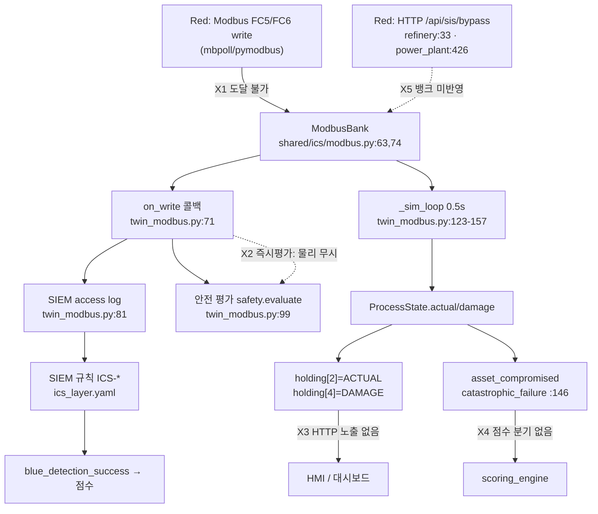

# 감사 리포트 02 — B축: 디지털 트윈 현실성

감사 기준선: CCE, Locked Shields, DEF CON CTF A/D, NIST SP 800-84.
방식: **정적 분석 전용**(도커 미기동). 모든 판정에 `경로:라인` 근거를 붙였다.
대상 커밋: 작업트리 현재 상태(`cyber-range-platform/`).

---

## 0. 한 줄 총평

실 프로토콜은 **Modbus/TCP 1종과 SMTP 1종뿐**이고, 그 Modbus 는 **배포상 도달 불가**하며, 물리 파국 이벤트(`asset_compromised`)는 **점수 엔진에 소비 지점이 없다**. 나머지 11개 프로토콜 표기(OPC UA·HART·DNP3·IEC 61850·S7·Profinet·SMB·LDAP·Kerberos·Docker API·kubelet)는 전부 JSON 문자열 매칭 스텁이다. 잘된 부분 한 줄: `shared/ics/modbus.py`의 MBAP 프레이밍·PDU 처리·예외응답은 외부 라이브러리 없이 정확하게 구현돼 있다.

---

## 1. 요약 판정 테이블

실체 등급: **A=실프로토콜 리스너**, **B=HTTP 모사(REST가 프로토콜 흉내)**, **C=합성 로그/문자열 스텁**.

| 트윈 | 표기 프로토콜 | 실제 리스너 | 실체 등급 | 연속 물리 | 폐루프 | 근거 |
|---|---|---|---|---|---|---|
| power_plant | Modbus, (HTTP HMI) | **Modbus/TCP 502** | **A** | 있음(2변수: RPM+온도) | **부분 단절** | `services/power_plant/main.py:96,116,276` / 물리 `:125-145` / 단절 `:442` |
| water_utility | Modbus | **Modbus/TCP 502** | **A** | 있음(1변수: 농도) | **부분 단절** | `services/water_utility/main.py:87,103,164` / 물리 `:176-215` |
| refinery_plant | OPC UA·Modbus·HART | Modbus/TCP 502만 | A(Modbus) / **C**(OPC UA·HART) | 있음(1변수, 퇴화) | **단절** | `services/refinery_plant/main.py:87-100` / OPC UA 스텁 `:24-30` / HART 스텁 `:41-46` |
| lng_terminal | ESD·BOG | Modbus/TCP 502만 | A(Modbus) / B(나머지) | 있음(1변수, 퇴화) | **단절** | `services/lng_terminal/main.py:81-93` |
| smart_factory | Profinet·S7·OPC UA | Modbus/TCP 502만 | A(Modbus) / **C** | 있음(1변수, 퇴화) | **단절** | `services/smart_factory/main.py:87-95`, 헤더 주석 `:4` |
| railway_signaling | ATS/연동 | Modbus/TCP 502만 | A(Modbus) / B | 있음(1변수, 퇴화) | **단절** | `services/railway_signaling/main.py:81-89` |
| airport_ot | BHS·급유 | Modbus/TCP 502만 | A(Modbus) / B | 있음(1변수, 퇴화) | **단절** | `services/airport_ot/main.py:86-94` |
| datacenter_bms | BMS·UPS·DCIM | Modbus/TCP 502만 | A(Modbus) / B | 있음(1변수, 퇴화) | **단절** | `services/datacenter_bms/main.py:90-98` |
| hospital_ot | DICOM·HL7·주입펌프 | Modbus/TCP 502만 | A(Modbus) / **C**(DICOM) | 있음(1변수, 퇴화) | **단절** | `services/hospital_ot/main.py:87-95` |
| ground_station | TT&C·CCSDS·안테나 | **없음**(HTTP 8001만) | **C** | **없음** | 해당 없음 | `services/ground_station/main.py:400` 전체 |
| defense_network | SMB·Kerberos·LDAP·SMTP | **SMTP 25만** | A(SMTP) / **C**(SMB·Kerberos·LDAP) | 없음 | 해당 없음 | `services/defense_network/main.py:86,133` / SMB 스텁 `:170-183` |
| cloud_native | Docker API·kubelet·IMDS | 없음(HTTP 8209) | **C** | 없음 | 해당 없음 | `services/cloud_native/main.py:22-68` |

저장소 전체 실 TCP 리스너는 **3개뿐**이다: Modbus(`shared/ics/modbus.py:115`), SMTP(`shared/net/smtp_server.py:137`), syslog(`services/siem/ingestion/syslog_server.py:129`). `asyncio.start_server|create_server|socket.bind` 전수 검색 결과 그 외 없음.

---

## 2. 프로토콜별 구현 깊이 등급표

| 프로토콜 | 포트 | 상태 | 깊이 | 근거 / 결손 |
|---|---|---|---|---|
| **Modbus/TCP** | 502 | 구현 | **중상** | FC1/2/3/4/5/6/16 + MBAP + 예외 01/02/03. `shared/ics/modbus.py:37-91`. **결손**: unit_id 무시(`:98` uid를 응답 에코만, 멀티슬레이브 없음), FC4=FC3 별칭이라 입력레지스터 분리 없음(`:43`), FC2=FC1 별칭(`:49`), FC8(진단)·FC43(장치식별) 미구현 → `plcscan`류 지문채취 불가, FC17 없음 |
| **SMTP** | 25 | 구현 | 중 | `shared/net/smtp_server.py:134` 오픈릴레이 판정 포함 |
| **OPC UA** | 4840 | **없음** | **없음(C)** | 리스너 0건. `services/refinery_plant/main.py:24-30`은 `TAGS` dict 조회 후 JSON 반환. 챌린지 ICS-001도 HTTP(`challenges/ics/ICS-001/deploy/main.py:16`) |
| **DNP3** | 20000 | **없음** | **없음(C)** | `challenges/ics/ICS-003/deploy/generate_artifact.py`가 만드는 합성 JSONL 로그뿐 |
| **IEC 61850 GOOSE** | L2 | **없음** | **없음(C)** | `challenges/ics/ICS-006/deploy/generate_artifact.py` 합성 JSONL. pcap 아님 |
| **IEC 60870-5-104** | 2404 | **없음** | 없음 | 저장소 전체 문자열 0건 |
| **S7comm** | 102 | **없음** | 없음 | `services/smart_factory/main.py:4` 주석에만 존재 |
| **HART** | — | **없음** | **없음(C)** | `services/refinery_plant/main.py:41-46` — 입력값을 그대로 되돌려주는 함수 |
| **CCSDS / TT&C** | — | **없음** | **없음** | 저장소 전체 "CCSDS" 0건. 지상국에 프레이밍·안테나 제어 코드 없음 |
| **SMB** | 445 | **없음** | **없음(C)** | `services/defense_network/main.py:170-183` — `SHARES` dict를 JSON 반환 |
| **Kerberos** | 88 | **없음** | **없음(C)** | `:186-` 서비스계정 목록 JSON. **TGS-REP 해시가 없어 Kerberoasting 실습 불가** |
| **LDAP** | 389 | **없음** | 없음(C) | DN-005는 HTTP 쿼리파라미터 필터 흉내 |
| **Docker API / kubelet** | 2375/10250 | **없음** | 없음(C) | `services/cloud_native/main.py:35-49` — 고정 문자열 `uid=0(root)` 반환 |

---

## 3. 위성 지상국 판정 (엔드포인트별)

`services/ground_station/main.py` 400 LOC 전수 확인. **TT&C 링크·CCSDS 프레이밍·안테나 제어 로직은 단 한 줄도 없다.** 위성 도메인 요소는 변수명(`SOL-PANEL-1`, `GYRO-X`, `mission_plans`)과 문자열 `"1 25544U ... (external)"`(TLE 흉내, `:352`)이 전부다.

| 엔드포인트 | 라인 | 실제 동작 | 판정 |
|---|---|---|---|
| `/api/telemetry` | `:172-198` | sqlite 문자열결합 쿼리. **진짜 SQLi**(실행됨 `:184`) | **실체 있음**(웹 취약점) |
| `/api/login` | `:204-233` | sqlite 조회 + PyJWT 서명. 시크릿 `supersecret123`(`:72`) | 실체 있음 |
| `/api/mission-plan/{id}` | `:239-267` | 소유권 검증 생략 IDOR | 실체 있음 |
| `/api/download` | `:273-295` | `FILES_DIR / file` 결합 후 실제 read | 실체 있음 |
| `/api/debug/config` | `:301-317` | `dict(os.environ)` 전체 반환 | 실체 있음 |
| `/api/tle/import` (SSRF) | `:345-366` | **네트워크 요청을 하지 않는다.** `_is_internal_target()`의 문자열 매칭으로 사전 정의 dict `_INTERNAL_RESOURCES`(`:339`)를 반환 | **가짜(C)** — `requests`/`httpx` 호출 없음. `169.254.169.254` 문자열만 넣으면 성공 |
| `/api/config/xml-import` (XXE) | `:376-395` | **XML 파서를 호출하지 않는다.** `"<!DOCTYPE" in body and "SYSTEM" in body and "file://" in body`(`:385`) 3중 문자열 검사 후 고정 문자열 반환 | **가짜(C)** — 엔티티 확장 없음. 정상 XXE 페이로드가 아니어도 세 토큰만 있으면 통과 |

부가: `import pickle`(`:23`)은 어디서도 사용되지 않는 사문(死文)이다. 지상국에 역직렬화 취약점은 없다(PP-004 historian 쪽과 혼동 주의).

### SAT-KILLCHAIN-01 대조

`scenarios/single/SAT-KILLCHAIN-01.yaml`은 GS-005→GS-002→GS-001→GS-003의 4단계만 전제한다. 즉 **시나리오 자체가 위성 도메인을 요구하지 않는다** — 임의의 취약 웹앱으로 치환 가능하다. "위성 지상국"은 서사(narrative) 레이어일 뿐 기술 레이어가 아니다. 추가로 이 시나리오는 `noise: {enabled: true, normal_traffic_eps: 5}`(`:65-67`)를 선언하는데, 이 필드는 **파싱만 되고 소비되지 않는다**(§6 참조).

---

## 4. 폐루프 데이터 경로 추적

### 4.1 설계상 의도된 경로 vs 실제

### 4.2 끊긴 지점 5곳 (근거)

**X1 — Modbus 502 는 훈련생이 도달할 수 없다.**
- 트윈 컨테이너는 호스트 포트를 노출하지 않는다: `docker-compose.yml:572-584`(power_plant, `ports:` 없음), 동일 패턴이 12개 트윈 전부.
- 트윈 네트워크는 `internal: true`: `docker-compose.yml:1043-1052`.
- 유일한 인그레스는 nginx 게이트웨이인데 **HTTP 전용**이다: `infra/twin_gateway/pp.conf:3` `listen 8002;` + `proxy_pass http://$twin:8002`. `stream{}` 블록이 11개 conf 어디에도 없다.
- twin_* 네트워크에 붙은 컨테이너는 코어 3종(event_collector `:32`, config_service `:64`, edr_backend `:83`)과 게이트웨이뿐. **공격자/Kali 컨테이너가 없다**(`docker-compose.yml`에 `kali|attacker|red_workstation` 0건).
- `Makefile`·`scripts/`·`training`에 Modbus 진입점 0건.
→ 결과: `docs/ICS-KILLCHAIN.md:3-4`("mbpoll·pymodbus·metasploit 가 그대로 붙는다")와 `README.md:1492`("Red 컨테이너가 `pp_twin:502` 로 공격")는 **존재하지 않는 Red 컨테이너를 전제한다**. 현 배포에서 실행 가능한 유일한 경로는 교관이 코어 컨테이너에 `docker exec` 하는 것뿐이며 문서화돼 있지 않다.

**X2 — 안전 판정이 물리값이 아니라 명령값을 본다.**
9개 트윈 전부 `SafetyProfile.limits` 키가 **cmd_reg(HR0)** 이다(예: `refinery_plant/main.py:91,93` — `cmd_reg=0`, `limits={0: ...}`). `_safety_eval`은 쓰기 콜백 시점에 `bank.holding`을 그대로 읽는다(`twin_modbus.py:99`). 따라서 공격자가 FC6으로 HR0=999를 쓰는 **그 순간** `asset_compromised(over_max)`가 발행된다 — ACTUAL(HR2)이 slew로 아직 정상 범위에 있어도 그렇다. 연속 물리 시뮬은 즉시 임팩트 판정을 **우회당한다**. `process_sim.py`의 관성 모델은 파국(`catastrophic_failure`) 경로에만 관여한다.

**X3 — 물리 상태가 HMI/대시보드에 도달하지 않는다.**
- ACTUAL/DAMAGE는 `bank.holding[2]/[4]`에만 기록된다(`twin_modbus.py:130-131`). 이를 읽는 유일한 방법은 Modbus FC3인데 X1로 막혀 있다.
- 7개 헬퍼 트윈은 `shared/ics_twin.py:55-114`의 팩토리로 만들어져 `/health`와 취약점 라우트 외에 **상태 조회 엔드포인트가 없다**.
- power_plant의 `/api/plc/read`(`:334-336`)는 `plc_registers` 3개 키만 반환한다. sim 루프는 `plc_registers`에 ACTUAL/TEMP/DAMAGE를 되쓰지 않는다(`:143-145`는 `_modbus_bank.holding`에만 기록). → **HMI에서 터빈이 파괴되는 과정을 볼 수 없다.**
- water_utility도 동일(`:196-197`).
→ 훈련생 입장에서 "물리가 반응한다"는 관측 수단이 사실상 없다.

**X4 — 파국 이벤트가 점수화되지 않는다.**
`services/scoring_engine/main.py:150-200`의 이벤트 분기에 `asset_compromised`가 **없다**. 처리되는 것은 `red_attack_started`(phase별)·`flag_exfiltrated`·`red_objective_success`·`blue_patch_verified`·`blue_detection_success`·`blue_block_success`·`asset_recovered`·`stage_completed`뿐이다. `asset_compromised` 소비처는 `services/aar_report/integrations.py:95`(사후 통계), `services/noc_monitor/api/main.py:59`(화면 표시), `services/core/recovery_watcher.py:45`(복구 판정) 세 곳 — **전부 점수와 무관**.
→ 20분간 SIS를 무력화해 LNG 탱크를 파열시킨 Red 팀의 보상은 **0점**이다. 반면 `/api/sis/bypass`에 POST 한 번 하면 `red_objective_success`로 즉시 득점한다(`refinery_plant/main.py:69`). **인센티브가 실제 물리 공격을 억제하는 방향으로 걸려 있다.**

**X5 — HTTP 안전 우회와 Modbus 인터록이 서로 다른 세계다.**
- 7개 헬퍼 트윈: `attach_modbus_ics(app, cfg)`의 반환값을 **아무도 받지 않는다**(`refinery_plant/main.py:87`, `smart_factory/main.py:87`, `railway_signaling/main.py:81`, `airport_ot/main.py:86`, `datacenter_bms/main.py:90`, `hospital_ot/main.py:87`, `lng_terminal/main.py:81` — 전부 `attach_modbus_ics(app, ModbusIcsConfig(...))` 단독 호출). 따라서 HTTP 핸들러가 `bank`에 접근할 수 있는 경로가 코드상 존재하지 않는다. `FAC-004 로봇 E-stop 오버라이드`를 성공시켜도 Modbus coil0(E-STOP)은 True로 남는다.
- power_plant는 부분적으로 연결돼 있으나 **하필 안전 계통이 빠졌다**: `/api/plc/write`는 `_sync_bank_from_registers()`를 호출하지만(`:330`), 플래그십 SIS 우회인 `/api/safety/override`(PP-005)는 `plc_registers["SAFETY_INTERLOCK"] = not req.override`(`:442`)만 하고 **sync 를 호출하지 않는다**. HTTP로 SIS를 껐다고 응답받아도 물리 인터록은 살아 있어 트립이 걸린다.
- 추가로 power_plant에는 실 뱅크와 무관한 **유령 레지스터 dict**가 따로 있다: `modbus_registers = {...}`(`:450`)와 `/api/modbus/write-register`(`:460`). 훈련생이 "Modbus 쓰기"라고 배우는 대상이 두 개이며 하나는 물리와 완전히 무관하다.

### 4.3 "연속 물리 있음/없음" 트윈별 분류

| 트윈 | 물리 상태변수 | 판정 |
|---|---|---|
| power_plant | RPM(slew) + 냉각수온(발열·냉각) + damage | **있음 (유일하게 2변수 결합)** — `:125` `k_heat=0.02, k_cool=0.5`, 유량 HR1이 `:139`에서 실제로 입력됨 |
| water_utility | 농도(slew) + damage | 있음(1변수) — `:189-192` `k_heat=0.0`, `_w_step(..., 0.0, ...)`(`:207`) |
| refinery / lng / smart_factory / railway / airport / datacenter_bms / hospital_ot | 단일 스칼라(slew) + damage | **있음이나 퇴화** — 7개 전부 `k_heat=0.0, k_cool=0.0, crit_temp=1e9`. `twin_modbus.py:129`가 `coolant_flow=0.0`을 **하드코딩**하므로 온도항이 완전히 죽어 있고, **HR1(FEED_RATE·BOG_COMPRESSOR·BRAKE_LEVEL·PAYLOAD·DRUG_CONC·CRAC_LOAD·FUEL_FLOW)은 시뮬레이터가 읽지 않는 장식품이다.** 철도 트윈에서 BRAKE_LEVEL을 100으로 써도 열차 속도는 변하지 않는다 |
| ground_station / defense_network / cloud_native | 없음 | **없음** — 상태를 가진 변수 자체가 없다(`shared/ics_twin.py:104` 핸들러는 순수 함수, `TAGS`·`SHARES` dict는 절대 변경되지 않는다) |

물리 모델 자체의 한계(9개 공통): 레지스터가 16비트 정수라 `int()` 절단이 발생한다(`twin_modbus.py:130-131`). 정유 압력은 4~8 bar 범위를 **정수 4단계**로 표현하고, 수처리 염소는 0~4 ppm을 **정수 4단계**로 표현한다(`water_utility/main.py:196`). 스케일링 팩터(실 PLC의 관행)가 없어 계측 해상도가 현실과 동떨어진다.

---

## 5. 안전 계통(SIS)·보호계전기 판정

- **인터록 모델은 존재하고 동작한다.** `shared/ics/process_sim.py:52-53`(트립 = redline 캡), `:63-67`(인터록 해제 시에만 손상 누적, 재무장 시 heal). `shared/ics/safety.py:28`(코일 배열 짧거나 False면 해제로 간주 — 보수적, 타당).
- **보호계전기(protective relay)는 없다.** 저장소에 과전류/거리/차동 계전기 로직, 트립 커브, 재폐로(recloser) 개념이 없다. `power_plant/main.py:450`의 `RELAY_TRIP`은 dict의 bool 키 하나이며 어떤 계산에도 참여하지 않는다.
- **발행은 되지만 소비가 반쪽이다.** 발행: 즉시 임팩트(`twin_modbus.py:101`), 파국(`:146`), 복구(`:135`), Blue 방어(`:114`). 소비: SIEM 규칙은 `ics_layer.yaml`에서 `vuln_id` 매칭으로 잡고 점수화되지만, **`asset_compromised` 자체는 점수 0**(X4).
- **Blue 방어 판정에 상태 경합이 있다.** `twin_modbus.py:112-113`은 `_in_danger(self.state, ...)`를 쓰는데, `_in_danger`는 `damage > 0`도 위험으로 본다(`process_sim.py:78-79`). heal이 진행 중인(damage>0, 인터록 ON) 자산에 Blue가 인터록 ON을 반복 write 하면 `blue_block_success`가 **write 횟수만큼 반복 발행**된다. 점수 milestone이 `event_id`를 포함해 중복 제거되지 않으므로(`scoring_engine/main.py:187`), **코일 ON을 루프로 때리면 Blue 점수가 무한 증식한다.** 파밍 취약점.
- **팀 귀속이 깨져 있다.** `twin_modbus.py:93,116`과 `power_plant/main.py:224`, `water_utility/main.py:137`은 전부 `team_id="default"` 하드코딩이며 `scenario_id`도 넘기지 않는다. `shared/ics_twin.py:89`가 HTTP 경로에서는 `MATCH_SCENARIO_ID`를 실어보내는 것과 대비된다. → **다중 팀 A/D에서 모든 Modbus 공격·방어 점수가 "default" 팀 계정으로 들어간다.**

---

## 6. 배경 노이즈 판정 — 탐지 훈련 성립 여부

`services/siem/detection/noise_generator.py` 72 LOC 전수 확인.

**결론: 현재 구성에서 탐지 훈련은 성립하지 않는다.** 근거 5가지.

1. **기본 비활성.** `docker-compose.yml:99` `SIEM_NOISE_ENABLED=false`. 기동 분기 `services/siem/api/main.py:263-264`.
2. **시나리오의 노이즈 선언이 소비되지 않는다.** `SAT-KILLCHAIN-01.yaml:65-67`의 `noise.enabled: true`는 `services/scenario_engine/loader.py:94`와 `shared/challenge_schema.py:133`에서 dataclass 필드로 파싱만 되고, 이 필드를 읽는 코드가 저장소에 **0건**이다. 시나리오 작성자가 노이즈를 켰다고 믿어도 아무 일도 일어나지 않는다.
3. **노이즈가 SIEM 이벤트만 합성한다. 네트워크·Modbus 계층 배경 트래픽은 0이다.** `_NORMAL_ENDPOINTS`(`:32-36`)는 3종(`ground_station /api/telemetry`, `power_plant /api/plc/read`, `defense_network /health`) HTTP 200뿐. `services/siem/api/main.py:220-224`에서 JSON 한 줄을 만들어 파서에 직접 먹인다 — **트윈 access 로그 파일에도, TCP 소켓에도 흔적이 없다.** 따라서 **정상 Modbus 폴링 트래픽이 전혀 존재하지 않으며, 502로 오는 모든 패킷은 정의상 공격이다.** ICS 이상탐지 훈련의 전제(정상 폴링 베이스라인 학습)가 성립 불가.
4. **노이즈가 오탐을 만들 수 없다.** 모든 탐지 규칙은 `vuln_id` 매칭이다(`rules/app_layer.yaml:4-12`, `rules/ics_layer.yaml` 10종 전부). 노이즈 이벤트에는 `vuln_id`가 없어(`main.py:220-222`) `parse_twin_log_line`이 `signature=None, severity=0`을 만든다(`services/siem/parsers/twin.py:_severity_from_status` 첫 분기). → **어떤 규칙과도 매칭되지 않는다.** 노이즈를 켜도 알람 수는 늘지 않는다. 오탐 트리아지 훈련(문서가 표방한 목적, `noise_generator.py:29` `is_noise` ground-truth 라벨)은 **작동하지 않는다.**
5. **라벨 누출.** `team_id="noise"`(`:59`)가 이벤트에 그대로 실려 SIEM에 들어간다. 노이즈가 켜져도 훈련생은 `team_id != "noise"` 한 줄로 전부 제거할 수 있다.

부수 효과: 규칙이 전부 `vuln_id` 기반이라는 것은 **표적이 자기가 당한 공격을 스스로 라벨링해 SIEM에 알려준다**는 뜻이다(`twin_modbus.py:84` — `vuln_id`를 무조건 찍는다). 따라서 모든 알람은 구조적으로 참탐지이고 Blue의 분석 행위는 필요 없다. Locked Shields/CCE의 탐지 훈련 기준(신호 대 잡음비 하에서의 판별)과 근본적으로 다르다.

---

## 7. defense_network / cloud_native 판정

**defense_network** (`services/defense_network/main.py` 329 LOC)
- **실체 있음**: SMTP 25 오픈릴레이(`:86,120-133`, `shared/net/smtp_server.py`). swaks/smtplib로 진짜 공격 가능 — **단, X1과 동일하게 호스트/게이트웨이 노출이 없어 도달 경로가 없다**(`docker-compose.yml:586-594`, `infra/twin_gateway/dn.conf`는 HTTP 8003 전용).
- **가짜**: DN-001 SMB(`:170-183`)는 `SHARES` dict JSON 반환 — 445 리스너 없음, SMB 세션·NTLM 인증 없음. DN-002 Kerberoast(`:186-`)는 계정 목록과 `password_strength: "weak(8char)"` **문자열**을 준다 — TGS-REP 해시가 없어 hashcat/john 실습이 불가능하고, 훈련생이 배우는 것은 "JSON을 읽으면 취약하다"이다. DN-005 LDAP 인젝션도 실 LDAP 없음.
- AD 도메인·GPO·티켓·SPN 등 AD 공격면의 실체는 0이다.

**cloud_native** (`services/cloud_native/main.py` 88 LOC)
- 5개 취약점 전부 문자열 매칭 스텁이며 **상태가 없다**. CLD-005 SSTI는 `"{{" in tpl`이면 고정 문자열 `"uid=0(root) gid=0(root)"`와 `rce: True`를 반환한다(`:62-67`) — 실제 템플릿 엔진이 없으므로 **페이로드 작성 능력이 아니라 중괄호 두 개를 아는지가 채점된다**. CLD-002/003도 동일 패턴(`:41,:49`).
- 컨테이너 이스케이프·IMDSv2 hop limit·SA 토큰 등 클라우드 훈련의 핵심 개념은 어느 것도 재현되지 않는다.

---

## 8. 결함 목록 (심각도 순)

### D-01 [치명] 실 Modbus 502 에 훈련생이 도달할 수 없다 — 플랫폼 최대 차별점이 배포상 무력
근거: `docker-compose.yml:572-584`(포트 미노출)·`:1043-1052`(internal), `infra/twin_gateway/pp.conf:3-7`(HTTP 전용, `stream{}` 없음), 공격자 컨테이너 부재, `Makefile`에 진입점 0건. 문서는 반대로 서술: `docs/ICS-KILLCHAIN.md:3-4,53`, `README.md:841,1492`.
**발생 시나리오**: 훈련 당일 Red 팀이 `docs/ICS-KILLCHAIN.md`의 예제 코드를 그대로 실행한다 → `socket.create_connection(("pp_twin", 502))`가 호스트에서 DNS 해석 실패 → 컨테이너 IP를 직접 찾아도 `internal: true` 네트워크라 라우팅 불가 → ICS 세션 전체가 HTTP 스텁 두드리기로 전락. 교관이 즉석에서 복구할 방법은 compose 수정 후 재기동뿐이며, 그 시점에 격리 설계(F ★★★)를 훼손하게 된다.

### D-02 [치명] 물리 파국이 점수화되지 않아 인센티브가 역방향이다
근거: `services/scoring_engine/main.py:150-200`에 `asset_compromised` 분기 부재. 소비처는 AAR(`aar_report/integrations.py:95`)·NOC 표시(`noc_monitor/api/main.py:59`)·복구 판정(`core/recovery_watcher.py:45`)뿐.
**발생 시나리오**: Red A팀이 20분에 걸쳐 SIS 무력화→과속 유지→DAMAGE 100 달성(정확히 Aurora/Triton 패턴)해 0점. Red B팀이 `POST /api/sis/bypass` 한 번으로 `red_objective_success` 득점. 스코어보드는 실제 OT 공격 역량과 무관한 순위를 산출하고, AAR에서만 뒤늦게 불일치가 드러난다.

### D-03 [높음] HTTP 취약점과 물리 계통이 완전히 분리돼 있다(트윈당 안전 계통이 두 개)
근거: 헬퍼 7종 전부 `attach_modbus_ics(...)` 반환값 미수신(`refinery_plant/main.py:87` 외 6곳), power_plant `/api/safety/override`가 `_sync_bank_from_registers()` 미호출(`:440-443`), 유령 dict `modbus_registers`(`:450`)+`/api/modbus/write-register`(`:460`).
**발생 시나리오**: Blue가 `/api/sis/bypass`를 탐지해 "SIS가 우회됐다"고 보고하고 대응 절차를 밟는다. 그러나 물리 인터록은 켜져 있어 어떤 물리 지표도 움직이지 않는다. 반대로 Modbus로 진짜 인터록을 끈 공격은 HTTP 상태 조회에서 정상으로 보인다. AAR에서 Blue의 상황인식이 근거 없이 틀렸다고 평가된다.

### D-04 [높음] 배경 노이즈 부재 — 탐지 훈련이 무의미하다
근거: `docker-compose.yml:99` 기본 false, 시나리오 `noise` 필드 미소비(`loader.py:94` 정의만), Modbus/네트워크 계층 노이즈 0(`noise_generator.py:32-36`), 노이즈에 `vuln_id` 없어 규칙 미매칭(`rules/*.yaml` 전부 `vuln_id` 매칭), `team_id="noise"` 라벨 누출(`:59`).
**발생 시나리오**: Blue 팀 SIEM 콘솔에 뜨는 알람은 전부 참탐지다. 훈련생은 "알람이 뜨면 공격"이라는, 실전에서 즉시 무너지는 휴리스틱을 학습하고 나간다. 오탐 처리·트리아지 우선순위·베이스라인 이탈 판단 등 SOC 훈련의 본체가 평가 대상에서 사라진다.

### D-05 [높음] 안전 판정이 명령값 기준이라 연속 물리 모델이 우회된다
근거: 9개 트윈 전부 `limits` 키 == `cmd_reg`(`refinery_plant/main.py:91,93` 등), 즉시 평가(`twin_modbus.py:99`).
**발생 시나리오**: Red가 `FC6 HR0=65535` 한 번으로 즉시 `asset_compromised(over_max, severity=critical)`를 얻는다. `process_sim`의 slew·관성·지속성 요구가 전부 무시되고, "SIS를 먼저 끄고 초과를 지속해야 한다"는 훈련 목표(`docs/ICS-KILLCHAIN.md:76`)가 실제로는 강제되지 않는다.

### D-06 [중] Blue 방어 점수 파밍
근거: `twin_modbus.py:112-113` + `process_sim.py:78-79`(`damage>0`도 위험) + `scoring_engine/main.py:186-188`(milestone에 `event_id` 포함 → 중복 허용).
**발생 시나리오**: Blue가 coil0에 FC5 ON을 초당 50회 반복 → `blue_block_success` 50건/초 × 30점. 스코어보드 붕괴.

### D-07 [중] Modbus 이벤트의 팀/시나리오 귀속 상실
근거: `twin_modbus.py:93,116`, `power_plant/main.py:224`, `water_utility/main.py:137` — `team_id="default"` 하드코딩, `scenario_id` 미전달. Modbus는 팀 식별 수단(헤더)이 없는 프로토콜이라 소스 IP 기반 매핑이 필요하나 구현이 없다.
**발생 시나리오**: 다중 팀 A/D에서 A팀의 ICS 공격 점수가 "default" 팀에 적립되고, 어느 팀도 그 점수를 받지 못한다.

### D-08 [중] 문서-구현 불일치 (문서가 없는 기능을 있다고 서술)
- `docs/ICS-KILLCHAIN.md:3-4` "실제 공격 도구가 그대로 붙는다" → D-01로 불가.
- `README.md:1492` "Red 컨테이너가 `pp_twin:502` 로 공격" → 그 Red 컨테이너가 compose에 없다.
- `services/refinery_plant/main.py:4` "프로토콜: OPC UA / Modbus / HART", `smart_factory/main.py:4` "Profinet / S7 / OPC UA" → Modbus 외 전무.
- `docs/GAP_ANALYSIS.md:15`는 반대로 "전 트윈 HTTP 모사, 502 리스너 없음"이라 서술 — **Modbus 구현 이후 갱신되지 않았다.** 두 문서가 서로를 반박하는 상태이므로 어느 쪽도 인수인계 기준으로 쓸 수 없다.

### D-09 [중] 지상국의 SSRF·XXE가 파서/네트워크를 타지 않는 문자열 매칭
근거: `services/ground_station/main.py:345-366`(HTTP 클라이언트 호출 없음), `:376-395`(XML 파서 호출 없음, 3중 substring 검사 `:385`).
**발생 시나리오**: 훈련생이 `gopher://` 우회, DNS rebinding, 파라미터 엔티티 기반 OOB XXE 등 실제 기법을 시도하면 전부 실패하고, `{"url": "http://169.254.169.254"}`라는 순진한 페이로드만 성공한다. 방어 측 교육(allowlist·`defusedxml`)도 검증 불가 — 패치 분기 역시 문자열 검사다(`:350`, `:381`).

### D-10 [낮음] Modbus 프로토콜 정합성 결손
근거: unit_id 미라우팅(`shared/ics/modbus.py:98,101` — 에코만), FC4≡FC3(`:43`), FC2≡FC1(`:49`), FC8/FC43 미구현(`:89` illegal function), FC16 다중쓰기에서 이상탐지가 `values[0]`만 검사(`shared/ics/anomaly.py:52`).
**발생 시나리오**: Red가 FC16으로 [정상값, 위험값]을 한 번에 쓰면 `classify_write`가 첫 값만 보고 정상 판정 → **탐지 우회**. 또한 `plcscan`류 장치 식별 도구가 아무 정보도 얻지 못해 정찰 단계가 성립하지 않는다.

### D-11 [낮음] 물리량 정수 절단 / HR1 무효
근거: `twin_modbus.py:130-131` `int()`, `:129` `coolant_flow=0.0` 하드코딩. 정유 4~8 bar가 정수 4단계, 수처리 0~4 ppm이 정수 4단계(`water_utility/main.py:196`). HR1은 7개 트윈 전부 시뮬 미입력.
**발생 시나리오**: Blue가 BRAKE_LEVEL·COOLANT/CRAC_LOAD 등 완화 레지스터를 조작해 대응하려 해도 물리적으로 아무 효과가 없다. 방어 행동의 선택지가 "인터록 재무장" 하나로 붕괴한다.

### D-12 [낮음] 사문(死文) 코드
`services/ground_station/main.py:23` `import pickle` 미사용. `process_sim`의 온도·냉각 항이 7개 트윈에서 전부 비활성(`k_heat=0.0`). 유지보수자가 존재하지 않는 기능을 있다고 오인할 소지.

---

## 9. UNVERIFIED (도커 미기동으로 확인 불가)

| # | 항목 | 확인 방법 |
|---|---|---|
| U-01 | 컨테이너가 **502 바인딩에 실제로 성공하는지**. 코드는 `OSError`를 삼키고 조용히 넘어간다(`twin_modbus.py:164-165`, `power_plant/main.py:277-278`). Dockerfile은 `USER` 지시자가 없어 root 실행으로 보이나(`services/power_plant/Dockerfile`) 런타임 cap_drop 여부는 미확인 | 기동 후 `docker exec pp_twin ss -ltnp \| grep 502`. 바인딩 실패 시에도 HTTP는 정상이라 헬스체크로는 절대 드러나지 않는다 |
| U-02 | D-01의 도달 불가 판정을 **실측**으로 확정 | `docker exec event_collector python -c "import socket; socket.create_connection(('pp_twin',502),3)"` (코어 컨테이너는 twin_* 네트워크에 있으므로 성공해야 함) + 호스트에서 `nc -z <ip> 502` (실패해야 함) |
| U-03 | 파국 도달까지의 **실제 소요 시간**. 예: railway `damage_rpm_rate=0.5`, dt=0.5s, 초과분 = (명령-120). 명령 65535 시 1틱에 failure_threshold 초과 → 사실상 즉시. 반면 lng `0.1`은 수십 초. 훈련 페이싱이 트윈마다 3자릿수 차이일 가능성 | `tests/unit/test_process_sim.py` 확장 또는 기동 후 FC3 폴링 |
| U-04 | `blue_block_success` 파밍(D-06)이 scoring_engine의 멱등 로직을 실제로 뚫는지 | 기동 후 coil ON 반복 전송 → `/scores` 증가 관찰 |
| U-05 | SIEM 로그 파일 tail 경로(`SIEM_LOG_DIR=/var/log/siem`, 볼륨 `siem_logs`)로 Modbus 로그가 실제 SIEM에 도달하는지. 정적으로는 경로가 맞으나 `get_siem_logger`의 파일명 규칙과 `TWIN_ASSETS` 목록의 정합은 미검증 | `services/siem/api/main.py`의 `TWIN_ASSETS`와 실제 로그 파일명 대조, 기동 후 `/alerts` 확인 |
| U-06 | nginx `stream{}` 모듈이 다른 경로(예: `nginx.conf` 기본 파일)에 정의됐을 가능성. 확인 범위는 `infra/twin_gateway/*.conf` 11개뿐이며 이미지는 stock `nginx:alpine`이라 `conf.d` 병합은 `http{}` 컨텍스트다 | `docker exec pp_gateway nginx -T` |

---

## 10. 우선 조치 권고 (감사 의견)

1. **D-02 수정 없이는 물리 시뮬 전체가 장식이다.** `scoring_engine`에 `asset_compromised` 분기를 추가하고 `metadata.safety_impact == "catastrophic_failure"`에 최고 배점을 배정하라. 1시간 작업.
2. **D-01**: twin_* 네트워크에 Red 워크스테이션 컨테이너(`pymodbus`·`mbpoll` 포함)를 추가하는 것이 격리 설계를 지키면서 502를 여는 유일한 방법이다. 호스트 포트 노출은 격리 F를 깨므로 권하지 않는다.
3. **D-05**: `SafetyProfile.limits`의 키를 `cmd_reg`에서 `actual_reg`로 옮겨라. 한 줄 변경으로 연속 물리가 즉시 의미를 갖는다.
4. **D-04**: 노이즈를 기본 활성화하는 것만으로는 부족하다(§6-4). 규칙을 `vuln_id` 매칭에서 행위 기반(엔드포인트·빈도·레지스터 밴드)으로 옮기지 않으면 노이즈는 영원히 오탐을 만들지 못한다.
5. **D-08**: `docs/GAP_ANALYSIS.md`와 `docs/ICS-KILLCHAIN.md` 중 하나는 반드시 틀렸다. 인수인계 전 정합화가 필요하다.
