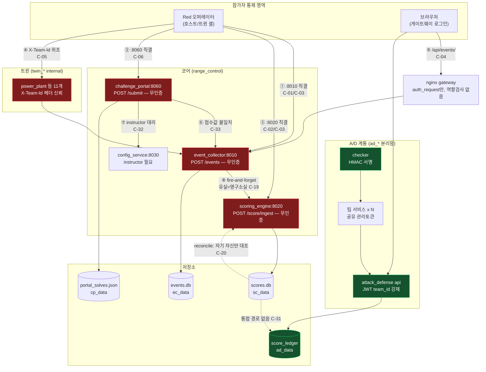

# C축 감사 — 채점 파이프라인 무결성

감사 대상: `cyber-range-platform`
방식: 정적 분석 전용(도커/make 미실행). 모든 주장에 `경로:라인` 근거를 붙였고, 코드로 확인 못 한 것은 `UNVERIFIED`로 분리했다.
기준선: CCE, Locked Shields, DEF CON CTF A/D, NIST SP 800-84.

---

## 0. 최상위 결론

이 저장소에는 **서로 무관한 채점 계통이 3개** 공존한다.

| 계통 | 코드 | 무결성 수준 |
|---|---|---|
| ① 이벤트 기반 (Live Fire) | `services/event_collector/main.py`, `services/scoring_engine/main.py` | **붕괴**. 인증 없음, 팀 귀속이 클라이언트 헤더, 전용 테스트 0개 |
| ② A/D 게임 엔진 | `services/attack_defense/{scoring,flag_service,checker,koth,tournament}.py` | 설계 견고. 대회급에 근접. 잔여 결함은 운영 구성 |
| ③ Jeopardy 포털 | `services/challenge_portal/main.py` | **붕괴**. 제출 무인증, 플래그 시크릿이 저장소에 평문 |

①과 ③은 서로 다른 점수를 서로 다른 저장소에 쓰고, ③은 ①로 이벤트를 밀어넣으면서 **점수 값이 일치하지 않는다**(§3.4). ②는 ①과 완전히 분리되어 있어 통합 리더보드가 존재하지 않는다.

경쟁 결과의 방어 가능성(defensibility) 기준으로는 **①·③ 계통으로 채점된 어떤 훈련 결과도 사후 이의제기를 견딜 수 없다.**

---

## 1. 요약 판정 테이블

| # | 항목 | 판정 | 근거 `path:line` | 실전 영향 | 공수 |
|---|---|---|---|---|---|
| C-01 | 이벤트 수집 API 인증 | **없음** | `services/event_collector/main.py:128-129` — `ingest_event(event: Event)`에 `authorization` 파라미터 자체가 없음 | 참가자가 임의 점수 이벤트 주입 | 1d |
| C-02 | 채점 API 인증 | **없음** | `services/scoring_engine/main.py:142-143` — `score_ingest(event)`에 게이트 없음. 주석 271행이 "내부 S2S라 보호 대상 아님"이라고 명시적으로 포기 | 채점 서버 직접 조작 | 1d |
| C-03 | 채점 서버의 참가자 네트워크 도달성 | **도달 가능(치명)** | `docker-compose.yml:30,32` — `ports: ["8010:8010"]` + 11개 `twin_*` internal 망에 동시 연결. `docker-compose.yml:39` — scoring_engine `ports: ["8020:8020"]` | §4 시나리오 A | 2d |
| C-04 | 게이트웨이 경유 시 역할 검사 | **없음(인증만)** | `infra/gateway/nginx.conf:46-47` — `auth_request /_authcheck`만 통과하면 red/blue/observer 누구나 `/api/events/`·`/api/scoring/`에 POST 가능. location에 역할 조건 없음 | 로그인한 관전자도 점수 조작 | 1d |
| C-05 | 팀 귀속(attribution) 검증 | **없음 — 클라이언트 헤더** | `services/power_plant/main.py:315,343,364,398` — `x_team_id: str = Header(default="default")`. `shared/event_client.py:8` 주석이 설계로 명시 | 타팀 사칭·타팀 프레이밍 | 3d |
| C-06 | Jeopardy 제출 인증 | **없음 — 본문의 team_id 신뢰** | `services/challenge_portal/main.py:186-189`(`SubmitReq.team_id`), `:261` `submit(cid, req)` — 인증 파라미터 없음 | 임의 팀 명의로 제출/점수 적립 | 1d |
| C-07 | Jeopardy 플래그 시크릿 관리 | **저장소에 평문 기본값** | `challenges/*/grader/red_grader.py:14` 등 56개 파일이 `os.environ.get("CHALLENGE_SECRET", "ai000-dev-secret")`. `docker-compose.yml:504-508` challenge_portal env에 `CHALLENGE_SECRET` **부재** → 기본값 강제 사용 | 56개 챌린지 전량 플래그 위조 | 2d |
| C-08 | Jeopardy 팀별 동적 플래그 | **구현됨** | `challenges/ai/AI-002/deploy/generate_artifact.py:16-17` HMAC(secret, "AI-002:team_id"). 42개 artifact 중 41개가 hmac 사용 | (C-07로 무력화) | — |
| C-09 | 제출 rate limit·lockout | **구현됨** | `services/challenge_portal/anticheat.py:51-63`(슬라이딩 윈도 10/60s), `:74-78`(연속 6오답 → 120s 잠금) | 유효. 단 키가 `(team,cid)`라 team_id 위조로 우회 가능(C-06) | — |
| C-10 | 플래그 공유 차단 (Jeopardy) | **차단 없음 — 탐지만** | `services/challenge_portal/anticheat.py:86-91` `detect_sharing`은 목록만 반환. `main.py:301-305`에서 신호만 발행하고 **`passed`를 뒤집지 않음**. `:307-311`에서 그대로 적립 | 담합 팀 전원 득점 | 2d |
| C-11 | 플래그 공유 차단 (A/D) | **부분 차단** | `services/attack_defense/flag_service.py:190` 자기 플래그 거부, `:203-208` (attacker,flag) 중복 거부, `:196-201` 라운드 윈도 만료 | 팀 간 전달은 여전히 성립(A/D 통상 허용 범위) | — |
| C-12 | 방어(SLA) 체커 | **구현됨** | `services/attack_defense/checker.py:183-269` health/protocol/benign_workflow/get_flag 4종, `:260` 순서 랜덤화, `:265-267` 재시도 | 유효 | — |
| C-13 | 체커 자체의 인증·출처 검증 | **HMAC 서명 + nonce 재생방지** | `checker.py:76-92` ManagementSigner, `demo_services/common.py:96`(30초 윈도), `:118-124`(nonce 유일성) | 유효 | — |
| C-14 | 체커 시크릿의 팀별 분리 | **Compose에서 전팀 공유** | `docker-compose.yml:422-423` `&ad-service-env` 앵커를 `:432,441,450,459,...`에서 전 팀 서비스가 재사용 → 단일 토큰. `checker.py:100-108`의 팀별 파생은 `game_runtime == "kubernetes"`에서만 동작 | §4 시나리오 D | 1d |
| C-15 | 점수 조정 감사 로그(누가·왜) | **기록 안 됨** | `services/scoring_engine/main.py:272` `require_role`의 반환 Identity 미사용, `:273-274` `reason` 검증 후 **폐기**, `:280-284` INSERT에 actor·reason 컬럼 없음 | 분쟁 시 조정 이력 입증 불가 | 1d |
| C-16 | `admin_reset` 감사·백업 | **없음** | `services/scoring_engine/main.py:339-352` — DELETE 후 카운트만 반환, 감사 레코드 미생성, 롤백 불가 | 실수/악의 초기화 복구 불가 | 1d |
| C-17 | instructor 토큰 기본값 | **저장소 공개 문자열** | `docker-compose.yml:42` `INSTRUCTOR_TOKEN=${INSTRUCTOR_TOKEN:-dev-instructor-token}` | C-15/C-16 게이트 무력화 | 0.5d |
| C-18 | 미설정 시 fail-open | **인증 전체 우회** | `shared/rbac.py:92-94` — 토큰·JWT 시크릿 모두 없으면 `role="instructor", dev_mode=True`. `:135-136`에서 모든 역할 검사 스킵 | 오배포 1회로 전 통제 소실 | 1d |
| C-19 | 이벤트 유실 시 점수 | **영구 소실, 탐지 불가** | `services/event_collector/main.py:162` fire-and-forget `asyncio.create_task`, `:199-200` 예외 무시. 재전송·백필 경로 없음 | §4 시나리오 C | 3d |
| C-20 | reconcile의 검증 범위 | **누락 이벤트 탐지 불가** | `services/scoring_engine/main.py:297-334` — `achievements` 합계 vs `team_scores`만 비교. `events.db`와 대조하지 않음 | C-19를 "정상"으로 보고 | 2d |
| C-21 | 오탐(false positive) 처리 | **부분** | `services/event_collector/main.py:182-184` 매칭 실패 시 `_unmatched=True` 태깅. 그러나 `scoring_engine/main.py:173-182` `blue_detection_success` 분기는 **`_unmatched`를 읽지 않고 20점 적립** | 오탐도 만점 | 1d |
| C-22 | 중복 채점 방지 | **부분 — 탐지/차단은 무제한** | `scoring_engine/main.py:107` achievement_key 멱등. 그러나 `:181,187` milestone에 `event_id`를 포함 → 매 이벤트마다 신규 키 | §4 시나리오 B | 1d |
| C-23 | 음수 점수 하한 | **없음** | `scoring_engine/main.py:258` `delta: int` 무제한, `:199` `points = int(event.metadata.get("points", 0))` 무검증 | 음수/거대값 주입 | 0.5d |
| C-24 | `_award` 경합 조건 | **트랜잭션 미보호** | `scoring_engine/main.py:108-122` — SELECT(108) 후 INSERT(111)까지 원자성 없음. `get_db()`(:51-54)는 격리수준 미지정 | 동시 요청 시 IntegrityError 500(중복적립은 아님) | 1d |
| C-25 | First Blood 규칙 | **미구현** | 전 저장소 `first_blood` grep 결과 0건 | 문서에 있어도 코드에 없음 | 2d |
| C-26 | 동점 처리(tiebreak) | **① 미구현 / ② 암묵 구현** | `tiebreak`/`tie_break` grep 결과는 `tests/attack_defense/test_tournament.py:197,350`의 문자열 리터럴(운영자 조정 사유)뿐 — 규칙 코드 아님. ②는 `attack_defense/scoring.py:344-346` 정렬키 `(-total,-attack,-availability,slug)`로 결정론적 | ① 계통 동점 시 순위 임의 | 1d |
| C-27 | 시간 가중 | **탐지 dwell만** | `scoring_engine/main.py:126-134` `_dwell_bonus` (30초당 -1, 최대 +20). 공격 측 시간 가중 없음 | — | — |
| C-28 | 영속성 — 이벤트/점수 | **볼륨 있음** | `docker-compose.yml:26-29`(ec_data:/data + DATA_DIR), `:37-38,48`(sc_data), `:501-502,508`(cp_data). `event_collector/main.py:28`·`scoring_engine/main.py:24`가 DATA_DIR 사용 | recreate 시 보존됨 | — |
| C-29 | 영속성 — 포털 solve | **JSON 파일** | `challenge_portal/main.py:68-76` — `portal_solves.json` 전체 덮어쓰기, 원자적 rename 없음, 예외 무시(`:75`) | 쓰기 중 크래시 시 전 팀 solve 소실 | 1d |
| C-30 | 전용 테스트 | **①③ 계통 0개** | `tests/`에 scoring_engine·event_collector·challenge_portal 대상 파일 없음. `tests/unit/test_anticheat.py`만 존재. ② 계통은 `tests/attack_defense/` 15파일 | 회귀 무방비 | 5d |
| C-31 | 이중 채점 계통 통합 | **없음** | ①의 `scores.db`(`scoring_engine/main.py:24`)와 ②의 `score_ledger`(`attack_defense/scoring.py:306`)를 합산하는 코드 없음 | 통합 순위 산출 불가 | 5d |
| C-32 | 패치 토글의 무인증 프록시 | **참가자 → instructor 권한 상승** | `challenge_portal/main.py:629-641` `blue_patch`에 인증 없음. `:632`에서 서버가 보유한 `INSTRUCTOR_TOKEN`을 붙여 config_service로 대리 호출 | 레드가 방어 패치를 임의 on/off | 1d |

---

## 2. 채점 데이터 흐름도



**무결성 취약 지점 요약**: ①②③④⑤는 모두 인증·귀속 검증 부재 지점. ⑧은 유실 시 무성(silent) 손실 지점. ⑥은 두 계통의 점수 값이 갈라지는 지점.

---

## 3. 상세 분석

### 3.1 이벤트 기반 채점의 정확도

**경로**: 트윈 → `event_collector:/events`(`event_collector/main.py:128`) → `events.db` 저장(`:135-150`) → `asyncio.create_task(_forward_to_scoring_engine)`(`:162`) → `scoring_engine:/score/ingest`(`:187`) → `_award`(`scoring_engine/main.py:104`).

**오탐 시**: `event_collector/main.py:178-184`가 `matched_event_id`로 원 공격 이벤트를 조회하고, 없으면 `metadata["_unmatched"] = True`를 붙인다. 그런데 scoring_engine의 `blue_detection_success` 분기(`scoring_engine/main.py:173-182`)는 이 플래그를 **읽지 않는다**. `_dwell_bonus`(`:126-134`)만 `_matched_timestamp` 부재 시 보너스 0을 반환할 뿐, 기본 20점은 그대로 적립된다. 즉 **매칭되는 공격이 존재하지 않는 탐지도 20점을 받는다.**

`unmatched_detection` 이벤트 타입(`scoring_engine/main.py:213-219`)은 0점 처리가 맞지만, 이 타입을 **생성하는 코드는 `challenge_portal/main.py:346-365`의 담합 신호 발행 한 곳뿐**이다. event_collector의 `_unmatched` 태깅이 event_type을 `unmatched_detection`으로 바꾸는 코드는 없다(`event_collector/main.py:175-200` 전체에 event_type 변경 없음). 설계된 오탐 억제 경로가 **연결되어 있지 않다.**

**미탐 시**: 점수 변화 없음(이벤트가 없으므로). 미탐에 대한 감점 로직은 ① 계통에 없다.

**중복 채점**: `_award`(`scoring_engine/main.py:107`)의 `achievement_key = team:scenario:actor:milestone`은 멱등하다. 그러나 milestone 구성이 이벤트 타입마다 다르다.

- 안전(멱등): `:152` `red:{vuln_id}:{phase}`, `:158` `red:{vuln_id}:data_exfiltration`, `:170` `blue:{vuln_id}:patch_verified`, `:193` `blue:{target_asset}:recovered`
- **불안전(무제한 반복)**: `:181` `blue:{vuln_id}:detection:{event_id}`, `:187` `blue:{vuln_id}:block:{event_id}` — `event_id`가 포함되어 매 이벤트마다 새 키가 생성된다. 주석(`:181`)이 "탐지는 반복 인정 가능하도록"이라 의도를 밝히고 있으나, **회당 상한도 라운드당 상한도 없다.**
- **불안전(값 무제한)**: `:199` `points = int(event.metadata.get("points", 0))` — `stage_completed` 이벤트의 점수를 이벤트 본문에서 그대로 받는다. 상·하한 검증 없음.

**음수 점수**: `scoring_engine/main.py:258` `delta: int`에 하한 없음, `:290`의 UPSERT에 `MAX(0, ...)` 없음. `stage_completed`의 `points`도 음수 허용(`:199`). `team_scores.score`는 음수가 될 수 있다.

**경합 조건**: `_award`(`:108-122`)는 SELECT → INSERT를 원자적으로 수행하지 않는다. `get_db()`(`:51-54`)는 `isolation_level`을 지정하지 않아 파이썬 기본 암묵 트랜잭션에 의존하며, `BEGIN IMMEDIATE`가 없다. 동일 achievement_key에 대한 동시 요청 2건은 둘 다 SELECT를 통과한 뒤 두 번째 INSERT가 `IntegrityError`를 던진다. 이 예외는 잡히지 않으므로(`:142-223`에 try 없음) HTTP 500이 되고 `conn.commit()`(`:221`)에 도달하지 않는다. **중복 적립은 발생하지 않지만 요청이 실패하고, 호출부(`event_collector/main.py:189`)는 200이 아니면 조용히 무시**하므로 해당 점수는 영구 소실된다.

비교: A/D 계통은 같은 문제를 `self.db.transaction(immediate=True)`(`attack_defense/flag_service.py:159`, `scoring.py:122`)로 올바르게 처리한다.

**이벤트 유실 시**: `event_collector/main.py:162`는 `asyncio.create_task`로 전달하고 결과를 확인하지 않는다. `:199-200`은 `httpx.HTTPError`를 무시한다. scoring_engine이 재시작 중이거나 2초 타임아웃(`:186`)을 넘기면 **해당 이벤트는 events.db에 남지만 영원히 채점되지 않는다.** 재시도 큐·데드레터·백필 엔드포인트가 없다. `/replay/events`(`event_collector/main.py:255-274`)는 조회 전용이며 scoring_engine으로 재주입하지 않는다.

그리고 `reconcile`(`scoring_engine/main.py:297-334`)은 `achievements`와 `team_scores`만 대조하므로 **누락된 achievement를 원리적으로 탐지할 수 없다.** 이벤트 100건이 유실돼도 `all_match: true`를 반환한다. 이것이 "채점 정합성 감사"라는 이름의 엔드포인트가 실제로는 무엇도 보증하지 않는 이유다.

### 3.2 플래그 위조·공유·재제출

**동적 플래그 — 존재함**: `challenges/ai/AI-002/deploy/generate_artifact.py:16-17`이 `hmac.new(CHALLENGE_SECRET, f"AI-002:{team_id}")`로 팀별 플래그를 만든다. 42개 `generate_artifact.py` 중 41개가 hmac을 사용한다. 매치별 회전도 `challenge_portal/main.py:176-180` `_effective_team`이 `match::team` 복합키로 구현했다. **설계 자체는 정상이다.**

**그러나 시크릿이 공개다**: 56개 grader 전부가 `os.environ.get("CHALLENGE_SECRET", "<챌린지별 dev 문자열>")` 형태다(`challenges/ai/AI-000/grader/red_grader.py:14`, `challenges/ai/AI-009/grader/red_grader.py:15`, `challenges/forensics/FOR-002/grader/red_grader.py:15` 등). 그리고 `docker-compose.yml`의 challenge_portal 정의(`:498-510`)에 `CHALLENGE_SECRET` 환경변수가 **없다**. `.env.example:22`에 빈 값으로 선언돼 있으나 컨테이너로 전달되는 경로가 없다. 따라서 **운영자가 무엇을 설정하든 저장소에 하드코딩된 기본 시크릿이 사용된다.**

결과: 저장소를 읽을 수 있는 사람은 누구나 임의 팀·임의 챌린지의 플래그를 계산할 수 있다. 문제를 풀지 않고 56개 전부 정답 제출이 가능하다.

**서명**: A/D 플래그는 `FLAG{...}` 형식 검증(`flag_service.py:22,168`)에 더해 제출 시 HMAC 재구성 대조(`:181-182` `hmac.compare_digest`)를 한다. 이는 올바른 서명 검증이다. Jeopardy 측은 grader가 동일 HMAC을 재계산해 비교하는 구조로 등가지만, C-07로 무력화된다.

**rate limit·중복 제출**:
- Jeopardy: `anticheat.precheck`(`anticheat.py:51-63`)로 (팀,챌린지)당 60초 10회 + 연속 6오답 시 120초 잠금(`:74-78`). `challenge_portal/main.py:280-282`에서 호출된다. 중복 정답은 `:307` `already` 체크로 재적립 차단.
- A/D: `attack_defense/api.py:1239` 레이트리밋 + `flag_service.py:203-208` (attacker,flag) 중복 거부 + `:220` `ON CONFLICT DO NOTHING` + `:228-230` rowcount 검증. **2중 방어로 견고하다.**

**플래그 공유(팀 A 획득 → 팀 B 제출) — 판정**:

- **Jeopardy: 차단 안 됨. 탐지만 한다.** `anticheat.detect_sharing`(`anticheat.py:86-91`)은 같은 해시를 낸 다른 팀 목록을 반환할 뿐이고, 호출부 `challenge_portal/main.py:301`은 그 결과를 `shared_with`에 담아 `:304-305`에서 교관용 이벤트를 쏘고 `:319` 응답 필드에 넣는다. **`passed` 값을 뒤집지 않는다.** `:307-311`에서 정상적으로 solve가 기록되고 점수가 적립된다. 즉 담합한 두 팀 모두 만점을 받고, 교관이 `/portal/anticheat/flagged`(`:386-396`)를 수동으로 확인해 사후 개입해야만 한다. 자동 차단 메커니즘은 코드에 **없다**.

  덧붙여 팀별 동적 플래그가 정상 동작한다면 팀 A와 B의 플래그 해시는 애초에 달라야 하므로 `detect_sharing`이 걸리는 경우는 (a) 정적 플래그 챌린지이거나 (b) C-06으로 team_id를 위조한 경우다. 후자라면 위조자가 팀 이름만 바꿔가며 제출하므로 탐지 자체가 무의미하다.

- **A/D: 구조적으로 차단됨.** `flag_service.py:190` `row["team_id"] == attacker_team_id → self_flag` 거부, `:203-208` 동일 (공격팀, 플래그) 재제출 거부, `:196-201` 라운드 윈도 밖 거부, 그리고 제출자 팀은 `api.py:1242`에서 **JWT의 `ident.team_id`로 강제**되어 위조 불가. 다만 팀 A가 탈취한 플래그를 팀 B에게 넘겨주면 팀 B의 제출은 유효하다 — 이는 A/D 규칙상 통상 허용 범위이며, `stealth.py`의 인시던트 추적이 보조 신호를 남긴다.

### 3.3 채점 서버의 참가자 네트워크 도달성 — 치명

`docker-compose.yml:1039-1052`는 트윈을 `internal: true`로 격리하고 "트윈끼리·외부는 도달 불가"라고 주석에 명시한다. 이 격리는 **트윈 간 lateral과 egress에만 유효하고, 코어 서비스는 예외로 뚫려 있다.**

- `docker-compose.yml:32` — event_collector가 `range_control` + **11개 twin_\* 네트워크 전부**에 연결된다.
- `docker-compose.yml:30` — 동시에 `ports: ["8010:8010"]`로 호스트 0.0.0.0에 노출된다.
- `docker-compose.yml:39` — scoring_engine도 `ports: ["8020:8020"]`로 호스트 노출.
- `docker-compose.yml:503` — challenge_portal도 `ports: ["8060:8060"]`.

즉 (a) 참가자 호스트에서 직접, (b) 트윈 컨테이너를 장악한 경우 컨테이너 내부에서 `http://event_collector:8010`으로 도달 가능하다. 그리고 §1 C-01/C-02가 보인 대로 **양쪽 모두 인증이 없다.**

게이트웨이 경로도 안전하지 않다. `infra/gateway/nginx.conf:46-47`은 `/api/events/`와 `/api/scoring/`에 `auth_request /_authcheck`만 건다. `_authcheck`(`:23-29`)는 `auth:8051/auth/verify`로 쿠키 JWT 유효성만 확인하며 역할을 구분하지 않는다. location 블록에도 역할 조건이 없다. **로그인한 red 참가자 또는 관전자가 브라우저 fetch 한 줄로 `/api/events/events`에 임의 이벤트를 POST할 수 있다.** 게이트웨이가 `Authorization: Bearer $bt`를 붙여주지만(`:46`), event_collector의 `/events` 핸들러는 그 헤더를 읽지도 않는다(`event_collector/main.py:128-129`).

RBAC 모듈(`shared/rbac.py`)은 존재하고 올바르게 작성돼 있으나, **채점 데이터가 들어오는 두 엔드포인트에 적용되어 있지 않다.** `scoring_engine/main.py:271` 주석은 이를 인지하고 "자동 채점 경로 /score/ingest는 내부 S2S라 보호 대상 아님"이라고 결론 내렸는데, 이 전제(내부 전용)가 `docker-compose.yml:32,39`에 의해 성립하지 않는다.

추가로 `shared/rbac.py:92-94`는 토큰과 JWT 시크릿이 모두 미설정이면 미인증 요청을 `role="instructor", dev_mode=True`로 통과시키고, `:135-136`이 모든 역할 검사를 스킵한다. **fail-open이다.** 환경변수 누락 한 번으로 `/score/adjust`·`/admin/reset`까지 전면 개방된다. `docker-compose.yml:42`의 기본값 `dev-instructor-token`은 fail-open은 막지만 값이 저장소에 공개돼 있어 실질 보호가 없다.

### 3.4 방어 점수 산정

**A/D 계통 — 견고**: `attack_defense/checker.py:253-269` `run_all`이 health / protocol / benign_workflow / get_flag 4종을 수행한다. `:260` `random.SystemRandom().shuffle(calls)`로 순서를 랜덤화해 팀이 체크 순서를 학습해 선별 대응하는 것을 막는다. `:265-267`에서 실패 시 설정된 횟수만큼 재시도한다.

점수 산정은 `attack_defense/scoring.py:120-237` `calculate_round`가 담당한다. 핵심 설계 3가지가 옳다.

1. **누적이 아닌 목표값 수렴**: `_apply_target`(`:66-118`)이 `natural_key = round:team:service:score_type`에 대해 목표값과 기존 적용값의 차분만 원장에 기록한다(`:87-102`). 재계산이 몇 번 돌아도 결과가 같다(`:85-86`에서 동일 evidence면 no-op).
2. **체커 자체 오류를 팀에 전가하지 않음**: `checker.py:176-181`이 예상 못 한 예외를 `checker_system_error`로 분류하고 주석에 "checker bug is not charged to the team"이라 명시. `scoring.py:147`에서 `eligible`에서 제외한다. **이 처리는 Locked Shields급 관행에 부합한다.**
3. **감사 추적**: 모든 재계산이 `evidence.record`(`scoring.py:228-236`)로 correlation_id와 함께 기록된다.

**체커가 공격 대상이 될 수 있는가 — 부분적으로 방어됨**:
- 관리 API 호출은 HMAC 서명(`checker.py:76-92`)되고 서비스 측이 검증한다(`demo_services/common.py:109-111`).
- 타임스탬프 30초 윈도(`common.py:96`)와 nonce 유일성 DB(`:118-124`)로 재생 공격을 막는다. **올바른 구현이다.**
- `benign_workflow`(`checker.py:196-242`)는 매 회 새 nonce로 계정·마커를 생성해(`:197-199,218`) 팀이 체커 트래픽을 하드코딩 대응하는 것을 어렵게 한다.
- **다만 `:207` `headers={"X-Checker-Request": nonce}`가 체커 요청을 식별 가능하게 만든다.** 팀이 이 헤더를 보고 체커 요청만 정상 처리하고 나머지를 차단하는 선별 방어가 가능하다. `ad_management` 망 분리(`docker-compose.yml:425`)로 IP 기반 식별도 이미 가능하므로 실효 리스크는 중간이다.
- **핵심 결함(C-14)**: `docker-compose.yml:422-423`이 `&ad-service-env` 앵커에 단일 `ATTACK_DEFENSE_MANAGEMENT_TOKEN`을 담고, `:432,441,450,459,468` 등 모든 팀 서비스가 이를 재사용한다. 팀별 파생 로직(`checker.py:18-32` `derive_management_token`)은 `:101-108`에서 `game_runtime == "kubernetes"`일 때만 적용된다. **Compose 배포에서는 전 팀이 같은 관리 토큰을 갖는다.** 게임의 목적이 상대 서비스 장악이므로 이 전제는 반드시 깨진다(§4 시나리오 D).

**① 계통의 방어 점수 — SLA 개념 없음**: `scoring_engine/main.py:43-48` BLUE_POINTS는 patch_verified / detection_success / block_success / asset_recovered 4종의 이벤트 적립뿐이고, **서비스 가용성을 주기적으로 확인하는 체커가 존재하지 않는다.** 즉 ① 계통에는 "방어팀이 서비스를 살려두고 있는가"를 측정하는 수단이 아예 없다.

**blue_grader 계열**: `challenge_portal/main.py:510-573` `blue_submit`이 실제 SIEM DetectionEngine으로 규칙을 채점한다(`:545` `grade_blue`). 서버측 채점이고 데이터셋은 팀 무관 정적이다(`:466-471` 주석). 그러나 red 제출과 마찬가지로 **`req.team_id`(`:474-476`)를 무인증으로 신뢰한다**(C-06). 또한 `:559`에서 규칙 해시를 감사 기록하지만 blue 측 공유 탐지는 호출하지 않는다.

### 3.5 점수 재계산·정정 절차와 감사 로그

**① 계통 — 감사 로그가 실질적으로 없다.**

`scoring_engine/main.py:264-294` `adjust_score`:
- `:272` `require_role(authorization, {"instructor"})` — 권한 게이트는 존재한다. 단 C-17(공개 기본 토큰)·C-18(fail-open)으로 실효성이 낮다.
- `:273-274` `reason`이 비면 400을 반환한다. **그러나 검증만 하고 저장하지 않는다.** `:280-284`의 INSERT 컬럼은 `achievement_key, team_id, scenario_id, actor, category, points, source_event_id`이며 reason이 들어갈 자리가 없다. 스키마(`:61-70`)에도 reason 컬럼이 없다.
- `:272`의 `require_role` 반환값(Identity)을 변수에 받지 않는다. **누가 조정했는지 기록되지 않는다.**
- 결과: `achievements` 테이블에 `manual:{uuid}` / `manual_adjustment` / 델타 / created_at만 남는다. **"누가 언제 왜 점수를 바꿨나" 중 '언제'만 기록된다.** 분쟁 시 방어 불가.

`scoring_engine/main.py:339-352` `admin_reset`:
- `:342` instructor 게이트 존재.
- `:345-350`이 `achievements`·`team_scores`를 전부 DELETE한다. **삭제 전 스냅샷·백업·감사 레코드가 없다.** 반환값의 카운트가 유일한 흔적이며 이마저 응답에만 있고 저장되지 않는다.
- 실행자 신원도 기록되지 않는다.

`reconcile`(`:297-334`)은 §3.1에서 논한 대로 자기 참조적이다. 추가로 `:305`의 `WHERE ... AND points != 0` 조건 때문에 **서로 상쇄되는 조정(+100 / -100)이 정합성 검사에서 함께 제외되지 않고 합계에만 반영**되는데, 이 경우는 우연히 일치한다. 그러나 0점 achievement(`:216-218` unmatched_detection)가 제외되므로 `achievement_count`는 실제 레코드 수와 다르다 — 감사 목적의 카운트로 신뢰할 수 없다.

**② 계통 — 정상**: `attack_defense/scoring.py:249-275` `adjustment`가 `reason` 필수 검증(`:253-254`) 후 원장에 `reason`을 저장하고(`:262`), `evidence.record`로 **actor·delta·reason·correlation을 모두 기록**한다(`:265-274`). `event_id`가 결정론적으로 유도되어(`:255-258`) 중복 적용도 방지된다(`:275` `applied` 플래그). `recalculate_match`(`:239-247`)로 전 라운드 재계산이 가능하며 `_apply_target`의 수렴 설계 덕에 안전하다. **① 계통이 참고해야 할 구현이 같은 저장소 안에 이미 있다.**

### 3.6 동점·시간 가중·First Blood

| 규칙 | ① 이벤트 계통 | ② A/D 계통 |
|---|---|---|
| First Blood | **미구현**. `first_blood` grep 0건 | **미구현**. 동일 |
| 동점 처리 | **미구현**. `get_scores`(`scoring_engine/main.py:226-238`)는 `ORDER BY team_id, actor`로 반환하고 순위 산출 자체가 없다. 동점 규칙 부재 | 암묵 구현. `scoring.py:344-346` 정렬키 `(-total, -attack, -availability, slug)` → 결정론적이나 **문서화된 규칙이 아니라 정렬 부작용** |
| 시간 가중 | 탐지 dwell 보너스만(`scoring_engine/main.py:126-134`, 30초당 -1점, 상한 +20, 하한 0). 공격 측 시간 가중 없음 | 라운드 단위 이산 채점. 라운드 내 시간 가중 없음 |
| 스코어보드 지연 | `/events/delayed`(`event_collector/main.py:235-252`)로 이벤트만 지연. 점수는 `/scores`가 즉시 공개 | `scoring.py:285-301` 라운드 단위 지연 + stealth 연동. 정상 |

`tiebreak`/`tie_break` 전수 grep 결과는 `tests/attack_defense/test_tournament.py:197,350`의 `"referee tie-break decision"` 문자열뿐이며, 이는 운영자 수동 조정의 사유 텍스트일 뿐 규칙 코드가 아니다. **문서에 동점 규칙이 서술돼 있다면 그것은 미구현이다.**

### 3.7 영속성

| 저장소 | 엔진 | 볼륨 | recreate 시 |
|---|---|---|---|
| `events.db` | SQLite (`event_collector/main.py:76`) | `ec_data:/data` + `DATA_DIR=/data` (`docker-compose.yml:26-29`) | **보존** |
| `scores.db` | SQLite (`scoring_engine/main.py:52`) | `sc_data:/data` + `DATA_DIR=/data` (`:37-38,48`) | **보존** |
| `portal_solves.json` | JSON 파일 (`challenge_portal/main.py:68`) | `cp_data:/data` + `DATA_DIR=/data` (`:501-508`) | **보존(단 C-29)** |
| `anticheat.db` | SQLite (`challenge_portal/main.py:46`) | 동일 `cp_data` | **보존** |
| A/D 원장 | SQLite 기본, Postgres 옵션 (`docker-compose.yml:334`) | `ad_data` / `ad_postgres_data` (`:1076-1078`) | **보존** |

**판정: 컨테이너 recreate로 점수가 소실되지 않는다.** 단 2건의 잔여 위험:

1. **C-29** — `_persist_solves`(`challenge_portal/main.py:71-76`)가 매 solve마다 전체 JSON을 덮어쓴다. 임시파일+`os.replace` 패턴이 아니므로 쓰기 도중 크래시 시 파일이 절단되고, `_load_solves`(`:78-84`)는 `ValueError`를 삼켜(`:83-84`) **전 팀 solve 기록이 조용히 빈 상태로 시작된다.** 동시 제출 시 dict 갱신과 쓰기 사이의 경합도 보호되지 않는다.
2. SQLite 3종 모두 WAL 모드나 `busy_timeout` 설정이 없다(`event_collector/main.py:75-78`, `scoring_engine/main.py:51-54`). 동시성 부하에서 `database is locked` 발생 가능. A/D 계통은 `db.py`에서 별도 관리한다.

---

## 4. 부정행위 시나리오

각 시나리오는 구체적 실행 절차와 현재 코드의 차단 여부를 판정한다.

### 시나리오 A — 채점 API 직접 주입 (승리 조작)

**절차**
1. 참가자가 훈련용 노트북에서 레인지 호스트의 8010 포트를 확인한다(`docker-compose.yml:30`이 0.0.0.0에 바인딩).
2. `POST http://<range-host>:8010/events`로 다음을 전송:
   ```
   {"event_id":"<uuid>","event_type":"red_objective_success","timestamp":<now>,
    "actor":"red","team_id":"<자기팀>","scenario_id":"default","target_asset":"turbine_1"}
   ```
3. `event_collector/main.py:128`이 인증 없이 수락 → `:162` scoring_engine 전달 → `scoring_engine/main.py:161-165`가 `objective` 100점 적립.
4. `target_asset`을 바꿔가며 반복. milestone이 `red:{target_asset}:objective`(`:164`)이므로 자산 이름만 바꾸면 무제한 적립.
5. 8010이 막혀 있으면 로그인 후 브라우저에서 `fetch('/api/events/events', {method:'POST', ...})`. `nginx.conf:46`이 역할 구분 없이 통과시킨다.
6. 트윈 컨테이너를 장악했다면 컨테이너 내부에서 `http://event_collector:8010`으로 동일 수행(`docker-compose.yml:32`).

**차단 여부: 차단되지 않음.** 3개 경로 모두 유효. 근거 `event_collector/main.py:128-129`, `docker-compose.yml:30,32`, `infra/gateway/nginx.conf:46`.

### 시나리오 B — 탐지 이벤트 반복 적립 (블루 무한 득점)

**절차**
1. `POST /events`로 `event_type: "blue_detection_success"`, `event_id`를 매번 새 UUID로 전송.
2. `scoring_engine/main.py:181`의 milestone `blue:{vuln_id}:detection:{event_id}`가 매번 유일하므로 `_award`(`:108-110`)의 멱등 검사를 항상 통과.
3. 회당 20점(`:180`). 초당 수십 회 반복 가능. rate limit 없음.
4. `blue_block_success`(`:187`)도 동일 구조로 회당 30점.
5. `matched_event_id`를 함께 위조하고 그 원본 공격 이벤트도 먼저 주입해두면 `_dwell_bonus`(`:126-134`)로 +20까지 추가.

**차단 여부: 차단되지 않음.** milestone에 event_id를 넣은 설계(`:181` 주석의 "반복 인정" 의도)에 라운드당 상한이 없다.

### 시나리오 C — 채점 서버 부하로 상대 점수 소실 (무성 파괴)

**절차**
1. 상대 팀이 목표를 달성해 트윈이 이벤트를 발행할 타이밍을 노린다.
2. 공격자가 `scoring_engine:8020`에 동시 요청을 대량 발생시켜 응답을 2초(`event_collector/main.py:186` 타임아웃) 이상 지연시킨다. SQLite 단일 파일 + WAL 미설정이라 락 경합이 쉽게 발생한다.
3. `event_collector/main.py:199-200`이 `httpx.HTTPError`를 무시하므로 상대 팀 이벤트는 events.db에 저장만 되고 **채점되지 않는다.**
4. 재시도·백필 경로가 없어 영구 소실. 교관이 `reconcile`(`scoring_engine/main.py:297`)을 돌려도 `all_match: true`가 나와 문제를 인지하지 못한다.

**차단 여부: 차단되지 않음.** 탐지조차 되지 않는다는 점에서 시나리오 A보다 위험하다.

### 시나리오 D — 공유 관리 토큰 탈취 후 전 팀 플래그 수확 (A/D)

**절차**
1. 팀 A가 정상적인 게임 플레이로 팀 B의 취약 서비스에서 RCE/파일읽기를 획득한다(이것이 게임의 목적).
2. 컨테이너 환경변수 `ATTACK_DEFENSE_MANAGEMENT_TOKEN`을 읽는다. 값은 전 팀 공통(`docker-compose.yml:422-423`의 `&ad-service-env`를 `:432,441,450,459,468`이 재사용).
3. `checker.py:76-92`와 동일한 방식으로 서명을 생성한다(알고리즘은 저장소에 공개).
4. `ad_management` 망 접근이 가능한 위치(장악한 컨테이너 자체가 `:425`에서 이 망에 붙어 있다)에서, **모든 팀의** `/management/flags/verify`에 요청을 보내 플래그를 확인하거나 `/management/flags`에 임의 값을 주입한다.
5. 라운드마다 반복. 단 한 번의 초기 침해로 전 라운드·전 팀 플래그를 획득한다.

**차단 여부: nonce 재생방지(`demo_services/common.py:118-124`)와 30초 타임스탬프 윈도(`:96`)는 재생을 막지만, 토큰을 가진 자의 신규 서명은 막지 못한다.** Kubernetes 런타임에서는 `derive_management_token`(`checker.py:18-32`)이 팀·서비스별로 파생하므로 차단된다. **Compose 배포에서만 성립하는 결함이다.**

### 시나리오 E — 타팀 명의 제출 / 타팀 점수 오염 (Jeopardy)

**절차**
1. `POST http://<host>:8060/portal/challenges/<cid>/submit`에 `{"team_id":"<임의 팀>","fields":{"flag":"..."}}` 전송.
2. `challenge_portal/main.py:261`은 인증을 요구하지 않고 `:284`에서 본문의 `team_id`를 그대로 채점 컨텍스트로 넘긴다.
3. 공격적 활용 — **레이트리밋 소진 공격**: 상대 팀 ID로 오답을 6회 연속 제출하면 `anticheat.py:76-78`이 그 팀을 120초 잠근다(`precheck`의 키가 `(team,cid)`, `main.py:280`). 반복하면 상대 팀은 해당 챌린지를 사실상 제출 불가.
4. **담합 은폐**: 자기 팀 solve를 타팀 ID로 흩뿌려 `detect_sharing`(`anticheat.py:86-91`)의 신호를 노이즈로 덮는다.
5. **점수 위조**: C-07로 계산한 정답 플래그를 자기 팀 ID로 제출.

**차단 여부: 차단되지 않음.** `main.py:265-266`의 유일한 검증은 `team_id`가 빈 문자열이 아닌지 여부다.

### 시나리오 F — 플래그 시크릿 재계산 (56개 챌린지 전량)

**절차**
1. 저장소(또는 배포 이미지 내부 `/app/challenges/`)에서 `challenges/<cat>/<ID>/grader/red_grader.py`를 읽는다.
2. 14~15행의 `CHALLENGE_SECRET` 기본값을 확보한다(예: `challenges/ai/AI-000/grader/red_grader.py:14` `"ai000-dev-secret"`).
3. `docker-compose.yml:498-510`에 `CHALLENGE_SECRET` 주입이 없으므로 런타임 값이 이 기본값과 동일함이 보장된다.
4. `hmac.new(secret, f"{ID}:{team_id}").hexdigest()[:12]`로 자기 팀 플래그를 계산한다(`red_grader.py:18-19`).
5. 56개 챌린지에 대해 반복 후 순차 제출. `anticheat.precheck`(10회/60초)만 지키면 정답이므로 lockout에 걸리지 않는다.

**차단 여부: 차단되지 않음.** 팀별 동적 플래그·매치별 회전(`main.py:176-180`)이 모두 구현돼 있음에도 시크릿 공개 하나로 전부 무력화된다.

### 시나리오 G — 참가자에 의한 방어 패치 임의 조작

**절차**
1. `POST http://<host>:8060/portal/blue/patch`에 `{"asset":"power_plant","vuln_id":"PP-001","patched":false}` 전송.
2. `challenge_portal/main.py:629-630` `blue_patch`에 인증 파라미터가 없다.
3. `:632`가 서버 보유 `INSTRUCTOR_TOKEN`을 헤더에 실어 `config_service:/instructor/patch/toggle`로 대리 호출한다.
4. config_service의 instructor 게이트는 통과한다 — **요청자가 아니라 포털이 인가되기 때문이다.**
5. 레드는 블루가 건 패치를 전부 해제하고, 블루는 상대 시나리오의 패치를 임의 조작한다.

**차단 여부: 차단되지 않음.** Confused deputy. 근거 `challenge_portal/main.py:629-641`.

---

## 5. 결함 목록 (심각도 순)

### CRITICAL

| ID | 결함 | 근거 | 수정 방향 | 공수 |
|---|---|---|---|---|
| **F-01** | 채점 이벤트 수집이 무인증이며 참가자 네트워크·호스트 양쪽에서 도달 가능 | `event_collector/main.py:128`, `docker-compose.yml:30,32` | `/events`에 S2S 전용 시크릿(HMAC 서명 + nonce, `demo_services/common.py:86-126` 패턴 재사용) 적용, `ports` 제거, 트윈→코어는 단방향 전용 망으로 | 3d |
| **F-02** | `/score/ingest` 무인증 + `ports: 8020` 호스트 노출 | `scoring_engine/main.py:142`, `docker-compose.yml:39` | `ports` 제거하고 event_collector만 도달 가능하게. 서비스 토큰 검증 추가 | 2d |
| **F-03** | Jeopardy 플래그 시크릿이 저장소 하드코딩 기본값이고 compose가 주입하지 않음 | `challenges/*/grader/red_grader.py:14`(56개), `docker-compose.yml:498-510` | compose·k8s에 `CHALLENGE_SECRET` 주입, 기본값 제거하고 미설정 시 기동 실패로 전환 | 2d |
| **F-04** | 포털 제출이 본문 `team_id`를 무인증 신뢰 | `challenge_portal/main.py:186-189,261,474-476` | JWT competitor 인증 도입, `team_id`를 클레임에서 강제(`attack_defense/api.py:1234-1242` 패턴 이식) | 3d |
| **F-05** | 게이트웨이가 `/api/events/`·`/api/scoring/`에 역할 검사 없음 | `infra/gateway/nginx.conf:46-47,23-29` | 쓰기 메서드는 instructor로 제한, 읽기만 개방 | 1d |
| **F-06** | 팀 귀속이 클라이언트 `X-Team-Id` 헤더 | `services/power_plant/main.py:315,343,364,398`, `shared/event_client.py:8` | 세션/JWT 기반 귀속으로 교체. 전 트윈 11종 동시 수정 필요 | 5d |
| **F-07** | 포털 패치 토글 confused deputy(참가자 → instructor 권한 상승) | `challenge_portal/main.py:629-641` | blue 역할 인증 후 대리 호출, 대상 자산을 팀 스코프로 제한 | 2d |

### HIGH

| ID | 결함 | 근거 | 수정 방향 | 공수 |
|---|---|---|---|---|
| **F-08** | 이벤트 유실이 영구적이고 무성(재시도·백필·탐지 전무) | `event_collector/main.py:162,199-200` | outbox 테이블 + 재시도 워커. `/replay/events`를 scoring 재주입 경로로 확장 | 3d |
| **F-09** | `reconcile`이 누락 achievement를 탐지 불가(자기 참조) | `scoring_engine/main.py:297-334` | events.db와 대조하는 3-way reconcile로 재작성 | 2d |
| **F-10** | 탐지/차단 milestone에 event_id 포함 → 무제한 반복 적립 | `scoring_engine/main.py:181,187` | 라운드/시간창당 상한 도입, milestone에서 event_id 제거 | 1d |
| **F-11** | 수동 점수조정의 actor·reason이 저장되지 않음 | `scoring_engine/main.py:272-284` | achievements에 actor/reason 컬럼 추가, `require_role` 반환 Identity 기록(`attack_defense/scoring.py:249-275` 이식) | 1d |
| **F-12** | A/D 관리 토큰이 Compose에서 전 팀 공유 | `docker-compose.yml:422-423,432,441,450,459,468` | 팀별 파생값을 Compose에도 적용(`checker.py:18-32` 이미 존재) | 1d |
| **F-13** | 오탐 억제 경로 미연결 — `_unmatched` 플래그를 채점이 무시 | `event_collector/main.py:182-184` vs `scoring_engine/main.py:173-182` | `_unmatched` 시 0점 처리 또는 event_type 전환 | 1d |
| **F-14** | 플래그 공유가 탐지만 되고 차단되지 않음 | `challenge_portal/main.py:301-311`, `anticheat.py:86-91` | `shared_with` 존재 시 보류 상태로 전환, 교관 승인 후 적립 | 2d |
| **F-15** | `admin_reset`이 감사·백업 없이 전체 삭제 | `scoring_engine/main.py:339-352`, `event_collector/main.py:349-362` | 삭제 전 스냅샷 아카이브 + 실행자/시각 감사 레코드 | 1d |
| **F-16** | RBAC fail-open + 공개 기본 토큰 | `shared/rbac.py:92-94,135-136`, `docker-compose.yml:42` | 운영 프로파일에서 미설정 시 기동 거부. 기본값 제거 | 1d |
| **F-17** | ①③ 계통 전용 테스트 0개 | `tests/`에 해당 파일 부재 | 채점 불변식(멱등·비음수·귀속) 테스트 스위트 신규 작성 | 5d |

### MEDIUM

| ID | 결함 | 근거 | 수정 방향 | 공수 |
|---|---|---|---|---|
| **F-18** | 점수 하한·상한 없음(음수/거대값 주입) | `scoring_engine/main.py:199,258,290` | delta 범위 검증, `team_scores` 하한 0 clamp | 0.5d |
| **F-19** | `_award` SELECT-INSERT 비원자적 → IntegrityError 500 + 점수 소실 | `scoring_engine/main.py:108-122,51-54` | `BEGIN IMMEDIATE` + `INSERT OR IGNORE` + rowcount 판정(`flag_service.py:220-230` 패턴) | 1d |
| **F-20** | First Blood 미구현 | `first_blood` grep 0건 | 규칙 확정 후 구현. 문서 선주장 상태 해소 필요 | 2d |
| **F-21** | ① 계통 동점 규칙·순위 산출 부재 | `scoring_engine/main.py:226-238` | 결정론적 정렬키 명시(`attack_defense/scoring.py:344-346` 참조) | 1d |
| **F-22** | 포털 solve JSON이 비원자적 쓰기 | `challenge_portal/main.py:71-76,83-84` | tmp+`os.replace`, 로드 실패 시 에러 로그 후 기동 중단 | 1d |
| **F-23** | ① 계통에 SLA/가용성 채점이 아예 없음 | `scoring_engine/main.py:43-48` | 트윈 대상 주기 헬스체커 도입 또는 ② 체커 재사용 | 3d |
| **F-24** | 이중 채점 계통 통합 리더보드 부재 | `scoring_engine/main.py:24` vs `attack_defense/scoring.py:306` | 계통 일원화 결정(권장: ① 폐기, ②로 흡수) | 5d |
| **F-25** | 체커 요청이 `X-Checker-Request` 헤더로 식별 가능 | `checker.py:207` | 헤더 제거 또는 값 무작위화 | 0.5d |
| **F-26** | SQLite WAL/busy_timeout 미설정 | `event_collector/main.py:75-78`, `scoring_engine/main.py:51-54` | `PRAGMA journal_mode=WAL`, `busy_timeout` 설정 | 0.5d |
| **F-27** | CORS가 전 사설 IP 대역 허용 + `allow_credentials=True` | `event_collector/main.py:67-70`, `scoring_engine/main.py:30-33` | 명시 origin 화이트리스트 | 0.5d |

---

## 6. UNVERIFIED

정적 분석으로 확정하지 못한 항목. 각각 확인 방법을 병기한다.

| # | 항목 | 확인 방법 |
|---|---|---|
| U-01 | 실행 시 `/events`에 Authorization 헤더가 없어도 실제 200이 반환되는지 (FastAPI/미들웨어 레벨 게이트가 다른 곳에 있을 가능성) | `curl -i -X POST http://localhost:8010/events -d '{...}'` 로 상태코드 확인. 또는 `services/event_collector/Dockerfile`·`main.py` 전체에 미들웨어 추가가 없음을 재확인(현재 `:62-70`에 CORS만 확인함) |
| U-02 | 호스트 방화벽/`docker-compose.override.yml`이 8010/8020/8060 노출을 실제로 막는지 | `docker-compose.override.yml`(535B)과 `infra/hardening/docker-compose.hardening.yml` 병합 결과를 `docker compose config`로 확인 |
| U-03 | 운영 배포가 `docker-compose.prod.yml`을 쓰며 여기서 ports가 제거되는지 | `docker-compose.prod.yml`(2.1KB) 전문 확인 |
| U-04 | `.env`(401B)에 `CHALLENGE_SECRET`·`INSTRUCTOR_TOKEN` 실값이 있는지, 있어도 challenge_portal 컨테이너에 전달되는지 | `.env` 내용 확인 + `docker-compose.yml:498-510`에 env_file 지시자가 없음을 재확인 |
| U-05 | `services/attack_defense/api.py`(1,726 LOC) 전체의 인증 커버리지 — 본 감사는 flag/patch/scoring 관련 라인만 확인 | api.py 전 엔드포인트에 대해 `Depends(operator|competitor)` 누락 여부 전수 검토 |
| U-06 | `demo_services/*/main.py`의 `/management/flags` 라우트가 플래그 값을 반환하는지(읽기 가능 여부) — 시나리오 D의 파급 범위 결정 | `vulnerable_notes/main.py`·`file_vault/main.py`의 management 라우트 본문 확인 |
| U-07 | `services/range_control`이 admin_reset을 오케스트레이션할 때 감사를 남기는지 | `services/range_control/` 리셋 핸들러 확인 |
| U-08 | `auth:8051/auth/verify`가 역할별 X-Auth-Token을 다르게 발급해 업스트림에서 역할 구분이 가능한지 | `services/auth/` 구현 확인. 가능하다면 F-05 수정 난도가 낮아진다 |
| U-09 | `scenario_engine/runner.py`가 발행하는 `stage_completed`의 points 출처가 시나리오 정의 파일인지(참가자 조작 불가한지) | `services/scenario_engine/runner.py` 확인. 단 F-01이 해결되지 않으면 출처와 무관하게 위조 가능 |
| U-10 | `tournament.py`(829 LOC)에 동점·First Blood 규칙이 다른 명칭으로 존재하는지 | 본 감사는 `first_blood`/`tiebreak` 문자열 grep만 수행. `tournament.py` 전문의 순위 산출 로직 확인 필요 |
| U-11 | `infra/match/docker-compose.match.yml`의 매치별 배포에서 네트워크 노출이 달라지는지 | 해당 파일 networks·ports 전수 확인 |
