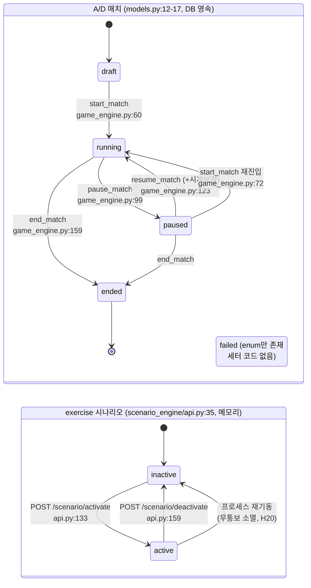

# H축 감사 — 훈련 운영 오케스트레이션

정적 분석 전용. 도커/스크립트 미실행. 모든 판정은 `경로:라인` 근거를 동반한다.
감사 대상 리비전: 작업트리 현재 상태(2026-08-14).

---

## 0. 요약 판정 테이블

| # | 기능 | 판정 | 근거 `path:line` | 실전 영향 |
|---|---|---|---|---|
| H1 | 인젝트 **시간 기반 트리거** | **미구현** | `services/injects/main.py:142-170` 이 유일한 생성 경로. 파일 전체(302L)에 `threading`·`asyncio.create_task`·스케줄러 없음 | 교관이 손으로 누르지 않으면 인젝트는 영원히 발생하지 않는다 |
| H2 | 인젝트 **조건 기반 트리거** | **미구현** | `services/injects/main.py` 전체에 event_collector 구독·SSE 소비 코드 없음. 통신은 단방향 발신 1건뿐(`main.py:239-243`) | "자산 침해 시 언론 전화" 같은 연동 불가 |
| H3 | 인젝트 **콘텐츠(시나리오 정의)** | **미구현** | `scenarios/**/*.yaml` 15개 전수 grep 결과 `inject` 키 0건. `services/scenario_engine/loader.py:162` 의 `inject_initial_state`는 패치상태 시딩으로 인젝트와 무관 | 엔진 라이브러리 4건(`main.py:40-67`)만 존재. 시나리오별 인젝트 각본 없음 |
| H4 | 인젝트 **중복 발화·전달 실패 처리** | **미구현** | `main.py:162` 매 호출 새 UUID 생성, 멱등키 없음. 전달은 pull 방식(`/injects/inbox`)이라 전달 실패 개념 자체가 없음 | 교관 더블클릭 = 같은 인젝트 2건 중복 배달, 회수 API 없음(`DELETE` 엔드포인트 부재) |
| H5 | 인젝트 채점 이벤트 발행 | **부분구현** | `main.py:239-243` `except httpx.HTTPError: pass` — 실패를 삼킨다. 재시도·DLQ 없음 | event_collector가 순간 다운이면 인젝트 점수가 최종 스코어에서 영구 누락 |
| H6 | 인젝트 UI | **미구현** | `dashboards/` 전체에 `injects`/`inbox` 참조 0건 (grep 확인) | 참가팀이 인젝트를 볼 화면이 없다. API 직접 호출만 가능 |
| H7 | 화이트팀 **힌트 배포** | **미구현** | `Hint` 모델은 `shared/challenge_schema.py:37,47` 에만 존재. 이를 import·서빙하는 코드 0건 | 문서 `docs/29:128`("Red Team Liaison — 힌트 승인 여부 판단")의 힌트 승인 대상 자체가 없음 |
| H8 | 화이트팀 **문제 비활성화** | **부분구현(A/D 한정)** | A/D: `services/attack_defense/api.py:838-865` + `repositories.py:193` (`enabled=1` 필터). Live Fire/exercise: 해당 API 없음 | exercise 모드에서 결함 문제를 빼는 유일한 수단은 전역 킬스위치(전 트윈 정지) |
| H9 | 화이트팀 **라운드 일시정지** | **구현(A/D) / 미구현(exercise)** | A/D: `game_engine.py:99-157` + 전파 검증(하단 2절). exercise: `services/scenario_engine/api.py:133-171` 에 activate/deactivate만 존재 | Live Fire 훈련은 중단 없이 종료뿐. 인프라 장애 시 시간 보정 불가 |
| H10 | 화이트팀 **개별 팀 롤백** | **부분구현(A/D 한정)** | A/D 인스턴스 단위: `api.py:822-836` → `patch_pipeline.py:586`. Live Fire: `services/range_control/main.py:216-226` 은 **전역 리셋만** | exercise 훈련 중 한 팀 환경만 되돌릴 방법 없음. 리셋하면 전 팀 점수·이벤트가 함께 날아감 |
| H11 | 참가자 **공지 채널** | **부분구현(내용 손실)** | `api.py:867-880` 로 발행하나 `api.py:1707-1711` 이 비운영자에게 `metadata`를 제거 → 참가자는 메시지 본문을 못 본다 | "10분 연장" 공지가 참가자 화면엔 `operator_announcement / published` 라는 빈 줄 하나로만 뜬다 |
| H12 | 공지 UI(발신) | **미구현** | `dashboards/livefire/src/attackDefense/AttackDefenseApp.tsx` 및 `api.ts` 에 announcement 호출 0건. `cli.py:304-469` 에도 announce 서브커맨드 없음 | 공지를 보내려면 교관이 raw `curl` 을 쳐야 한다 |
| H13 | 방송 오버레이 성격 | **관전/중계 전용** | `BroadcastOverlay.tsx` → `api.ts:64` `/public/matches/{id}/broadcast`. 토큰 없이 조회. `docs/attack-defense-operations.md:196` "must not receive an operator token" | 참가자 공지 채널이 **아님**. 긴급 공지 경로로 오인 금지 |
| H14 | 라운드/체커 tick 구동 | **구현(단일 프로세스 스레드)** | `api.py:245-249` lifespan에서 daemon 스레드 1개 → `game_engine.py:371-373` `run_forever` | cron·외부 스케줄러 없음. API 프로세스가 죽으면 tick 정지 |
| H15 | tick 프로세스 사망 시 복구 | **구현** | `api.py:200-249` 재기동 시 running 매치 재개, `db.match_lock` 리스 + `stable_id` 멱등 | 재기동만 하면 라운드 재개. 다만 **정지 구간만큼 라운드가 그냥 흘러간다**(H16) |
| H16 | tick 정지 구간 시간 보정 | **미구현** | `pause_match`만 `ends_at` 보정(`game_engine.py:138-147`). 크래시 다운타임 보정 경로 없음 | 30분 다운 → 재기동 즉시 `now >= ends_at` 이라 라운드가 체커 한 번 못 돌고 종료·채점됨 |
| H17 | 토너먼트 브래킷 운영 | **구현** | `tournament.py:20`(seed_order) `:211`(seed) `:300`(start) `:331`(reconcile) `:349`(_materialize_fixture) `:509`(finalize_fixture) | 재기동 복구는 `api.py:206-243`에서 수행 |
| H18 | 훈련 상태 머신(A/D) | **명시적** | `services/attack_defense/models.py:12-35` MatchStatus/RoundStatus + ROUND_TRANSITIONS | 3절 다이어그램 참조 |
| H19 | 훈련 상태 머신(exercise) | **암묵적** | `services/scenario_engine/api.py:35` `_active_trackers: dict` — 존재=진행, 부재=미진행. 2상태뿐 | 준비·일시정지·종료 구분 없음 |
| H20 | exercise 훈련 상태 영속성 | **미구현** | `services/scenario_engine/` 전체에 sqlite·write_text·DATA_DIR 0건 (grep 확인) | scenario_engine 재기동 = 진행 중 훈련 전부 소멸. 재활성화 시 `api.py:135` 409도 안 나고 처음부터 재시작 |
| H21 | exercise 훈련 타이머 | **미구현(호출자 없음)** | `api.py:258-264` `phase-clock`은 `elapsed_sec`를 **호출자가 넘겨야** 함. 서버 측 시작시각 저장 없음. 대시보드·스크립트 어디도 호출 안 함(grep 0건) | 남은 시간 표시가 어디에도 없다 |
| H22 | 팀 일시정지(`/safety/team-pause`) | **껍데기** | `range_control/main.py:292,359-367` 메모리 set에 기록만. 소비자 0건(전 저장소 grep). UI도 표시만(`RangeControlPanel.tsx:54`), 호출 함수 `rangeControl.ts:32`는 어디서도 import 안 됨 | 버튼을 눌러도(누를 UI도 없지만) 점수·체커·포털 어디에도 전파되지 않는다 |
| H23 | verify-baseline 의 GO 판정 | **오판정(치명)** | `range_control/main.py:263` `safe_probe.run()` → `shared/safe_probe.py:20-22,197+` 타깃이 **하드코딩 `localhost`**. 컨테이너 내부에서 전량 연결실패 → `safe_probe.py:291-292` 에서 결과 목록에 미포함 → `summary.patched==0` → `main.py:274` `passed=True` | 아무것도 검증하지 않고 "✅ 다음 훈련 시작 가능"(`main.py:283`)을 반환한다 |
| H24 | 시나리오 noise 스펙 | **미연결** | `scenario_engine/loader.py:94` 에 `NoiseSpec` 파싱만. 소비자 0건. 실제 노이즈는 `services/siem/api/main.py:59,264` 의 정적 env `SIEM_NOISE_EPS` | 시나리오별 노이즈 난이도 설정이 전혀 반영되지 않음 |
| H25 | instructor_api·range_control 전용 테스트 | **부재** | `tests/` 하위에 두 서비스 대상 테스트 파일 없음(PHASE 1 확정) | 오케스트레이션 레이어 회귀 감지 수단 없음 |
| H26 | `/instructor/audit` 인가 | **미구현** | `services/instructor_api/main.py:165-167` — `authorization` 파라미터 자체가 없다 | 참가자가 교관 개입 이력(점수조정·이벤트주입 사유 전문)을 그대로 열람 가능 |

---

## 1. 화이트팀 개입 도구 4종 — 개별 판정

| 도구 | API 존재 | UI 노출 | 전파 범위(실측 코드 경로) | 종합 |
|---|---|---|---|---|
| **① 힌트 배포** | ❌ 없음 | ❌ 없음 | — | **미구현**. `shared/challenge_schema.py:37,47` 의 `Hint` 는 정의만 있고 참조하는 서비스가 하나도 없다. 우회 수단은 `instructor_api/main.py:119-138` 의 `event/inject`(문서 `docs/29:61-62`가 "힌트성 이벤트"로 부르는 것) 뿐인데, 이는 이벤트 타임라인에 항목 하나를 꽂을 뿐 힌트 텍스트를 팀에 전달하지 못한다 |
| **② 문제 비활성화** | ⚠️ A/D만 (`attack_defense/api.py:838-865`) | ❌ 없음 (`AttackDefenseApp.tsx` 에 enable/disable 버튼 없음, `cli.py`에 서브커맨드 없음) | 전파됨: `repositories.py:193` `WHERE enabled=1` → 인스턴스·체커·채점 대상에서 제외. **단 exercise 모드에는 대응물 없음** | **부분구현**. A/D는 API만 있고 조작 수단이 raw HTTP뿐 |
| **③ 라운드 일시정지** | ✅ A/D (`api.py:663-679` → `game_engine.py:99-157`) / ❌ exercise | ✅ A/D (`AttackDefenseApp.tsx:562-565`, 확인 다이얼로그 `components.tsx:487`) | **실제 전파 확인**: (a) tick 중단 `game_engine.py:204-208` (`status != running` 조기반환), (b) tick_all 대상 제외 `game_engine.py:182` (`{"running"}`), (c) 플래그 제출 거부 `flag_service.py:166` (`match["status"] == "running"` 요구), (d) 재개 시 라운드 종료시각·플래그 유효기간 보정 `game_engine.py:138-147` | **구현(A/D)·미구현(exercise)**. A/D 쪽은 축 전체에서 가장 완성도 높은 부분 |
| **④ 개별 팀 환경 롤백** | ⚠️ A/D 인스턴스 단위만 (`api.py:822-836` restart/rollback → `patch_pipeline.py:586` `queue_instance_operation`) | ✅ A/D (`AttackDefenseApp.tsx:549-550`) | 비동기 큐 방식 — 실제 실행은 **호스트 러너가 `cli.py:451 runtime-work` 를 돌려야** 반영(`api.py:1506` jobs/claim). 러너 미가동 시 요청은 큐에 쌓인 채 아무 일도 안 일어남 | **부분구현**. exercise 모드는 `range_control/main.py:216-226` 전역 리셋뿐 — 한 팀만 되돌릴 수 없다 |

> `POST /safety/team-pause`(`range_control/main.py:359`)는 위 ③의 exercise 대응물처럼 보이지만 **소비자가 0건인 메모리 플래그**다(H22). 4종 판정에 산입하지 않았다.

---

## 2. 런북 대조표

### 2-A. `docs/29_instructor_operations_manual.md` (2026-07-24 동결)

| 문서 지시 | 위치 | 코드 실존 | 근거 / 비고 |
|---|---|---|---|
| `python infra/deploy/checklist.py --repo-root .` | `docs/29:12` | ✅ | `infra/deploy/checklist.py:112` 에 `--repo-root` |
| `python infra/ci/isolation_test.py` | `docs/29:13` | ✅ | 파일 존재 |
| `POST /instructor/scenario/start` | `docs/29:20,140` | ✅ | `instructor_api/main.py:78` |
| health 확인 포트 `8001 8002 8003 8010 8020 8030 8080` | `docs/29:47` | ⚠️ **불완전** | 7개 모두 게시되어 있으나(`docker-compose.yml:534,542,550,71` 등), 트윈 8개(8201~8211)·`range_control:8055`(`docker-compose.yml:169`)·`instructor_api:8050`·A/D `8100`(`docker-compose.yml:233`)·`injects:8096` 이 전부 빠져 있다. 이 체크를 통과해도 훈련 진행 서비스가 죽어 있을 수 있다 |
| `python shared/safe_probe.py` | `docs/29:52` | ✅ | `shared/safe_probe.py:349` `__main__`. **호스트에서** 실행해야 유효(하드코딩 localhost) |
| "노이즈 생성기 시작(시나리오에 설정되어 있으면 자동, 수동이면 여기서)" | `docs/29:54` | ❌ **거짓** | 시나리오 `noise:` 는 `loader.py:94` 에서 파싱만 되고 소비되지 않는다. 실제 노이즈는 `siem/api/main.py:59,264` 정적 env. **수동 시작 명령도 존재하지 않는다**(빈 지시) |
| `docker compose restart <service>` (트윈 다운 시) | `docs/29:69` | ✅ 일반 명령 | 단, 트윈 재시작 후 **진행 중 라운드/점수 정합 복구 절차가 없다** |
| `/scores/reconcile` → `/instructor/audit` → `/instructor/score/adjust` (치팅 대응) | `docs/29:70` | ✅ 3건 모두 | `scoring_engine/main.py:297`, `instructor_api/main.py:165`, `:141`. **단 `/instructor/audit` 는 무인증**(H26) — 치팅 조사 이력을 치팅 의심자가 읽는다 |
| `POST /instructor/killswitch` / `/instructor/killswitch/release` | `docs/29:71` | ⚠️ **포트 오도** | 문서는 `/instructor/*` 계열을 8050(`docs/29:86`)로 예시했으나, killswitch는 `config_service/main.py:220,231`(8030)에만 있다. `instructor_api` 에 프록시 없음. 실제 교관 콘솔은 제3의 경로 `range_control:8055/safety/emergency-stop`(`range_control/main.py:329`)를 쓴다 — **런북에 이 경로가 전혀 없다** |
| `isolate_host` 로 자산 격리 | `docs/29:72` | ⚠️ 존재하나 미지정 | `services/edr/api/main.py:355`. 문서에 엔드포인트·포트·인증 방법이 없어 그대로 따를 수 없다 |
| `GET /config/patches` | `docs/29:73` | ✅ | `config_service/main.py:128` |
| "중간 안내 방송" 3회(시작 10분 후 / 중간 / 종료 5분 전) | `docs/29:75-78` | ❌ **채널 없음** | exercise 모드에 공지 API가 없다. A/D의 `announcements`(`api.py:867`)는 별개 서비스이고 본문이 참가자에게 전달되지 않는다(H11) |
| `curl -X POST :8050/instructor/scenario/end` | `docs/29:86-88` | ✅ | `instructor_api/main.py:99` |
| `curl :8020/scores`, `/scores/reconcile` | `docs/29:91-92` | ✅ | `scoring_engine/main.py:297` |
| `curl :8090/report/aar` | `docs/29:95` | ✅ | `aar_report/main.py:47` |
| Live Fire Replay 기능으로 재생 | `docs/29:107` | ✅ 백엔드 | `event_collector/main.py:255` `/replay/events` |
| "Red Team Liaison — 힌트 승인 여부 판단" | `docs/29:128` | ❌ | 힌트 기능 자체가 없다(H7) |

**장애 유형별 복구 절차 판정** (`docs/29:65-73` 표 5행 기준)

| 장애 유형 | 런북 절차 | 판정 |
|---|---|---|
| 트윈 다운 | `docker compose restart` | **부분** — 재시작 후 점수/라운드 정합 복구 단계 없음 |
| 네트워크 단절(팀 간 누설) | `isolate_host` + 격리 회귀테스트 | **부분** — 엔드포인트 미명시, 훈련 계속/중단 판단 기준 없음 |
| **채점 정지** (scoring_engine·A/D tick 다운) | **없음** | **미구현**. 런북에 항목 자체가 없다. A/D 다운타임 시간 보정 수단도 없음(H16) |
| **DB 손상** | **없음** | **미구현**. `docs/attack-defense-operations.md:109-115` 에 A/D 백업/복원만 있고, exercise 계열(injects.db·range_baselines.json·range_matches.json)의 백업 절차는 어느 문서에도 없다 |
| 교관 API 자체 다운 | **없음** | **미구현** |

### 2-B. `docs/attack-defense-operations.md` (08-12 갱신)

| 문서 지시 | 위치 | 코드 실존 | 근거 |
|---|---|---|---|
| `ad ha-status` | `:39` | ✅ | `cli.py:338` |
| `ad runtime-work --compose-file --project` | `:55-57` | ✅ | `cli.py:451,463-464` |
| `ad runtime-reconcile --runtime kubernetes --kube-context --apply-kubernetes --reason` | `:67-71` | ✅ | `cli.py:454-468` |
| `ad koth-configure ... --weight 1` | `:126` | ❌ **인자명 불일치** | `cli.py:346` 은 `--score-weight`. 문서대로 치면 argparse 오류로 즉시 실패 |
| `ad koth-configure --disable --reason` | `:133-134` | ✅ | `cli.py:342,347` |
| "KOTH 변경 전 draft이거나 pause" | `:119-120` | ✅ 강제됨 | `koth.py:96-97` |
| `ad stealth-configure ...` 전 pause 요구 | `:144-152` | ✅ 강제됨 | `stealth.py:119-121`, 인자 `cli.py:352-361` |
| `ad capture-upload / capture-list` | `:93-95` | ✅ | `cli.py:430,438` |
| `tournament-seed / -reconcile / -fixture-start / -fixture-finalize --winner-entry-id` | `:170-185` | ✅ | `cli.py:408-428` |
| 재기동 시 running 매치 복구 | `:17-21` | ✅ | `api.py:200-249` |
| `:8100/metrics` 스크랩 | `:81` | ✅ | `docker-compose.yml:233`, `api.py:362` |
| `http://localhost:5178/broadcast/overlay?...` | `:199` | ⚠️ **compose 미게시** | 5178은 `scripts/training_environment.py:30` 의 dev 서버 포트일 뿐 `docker-compose*.yml` 에 없다. 라우팅 자체는 `App.tsx:38` 에 존재 |
| "Pause/resume with an audit reason" | `:10-11` | ✅ | `api.py:663-679`, 사유 필수 |

---

## 3. 훈련 상태 머신

### 누락 전이 / 결함

| 누락 | 근거 | 결과 |
|---|---|---|
| exercise 에 `paused` 상태 자체가 없음 | `scenario_engine/api.py:133-171` | Live Fire 훈련은 중단 불가. 인프라 장애 시 "그냥 흘려보내기" 또는 "종료" 2택 |
| exercise 에 `준비(ready)` 상태 없음 | 동상 | 리허설/사전점검 중임을 시스템이 구분 못 함. `verify-baseline` 결과와 상태가 무관 |
| `MatchStatus.failed` 로 가는 전이 없음 | `models.py:17` 정의 / `game_engine.py:180-192` 는 예외를 audit만 남기고 running 유지 | 체커가 매 tick 터져도 매치는 영구 `running`. 자동 정지 안전장치 없음 |
| exercise `active` → 영속 저장 없음 | `scenario_engine/` sqlite/write 0건 | 재기동 시 상태 소멸(H20) |
| A/D `paused` 와 range_control `_PAUSED_TEAMS` 가 서로 모름 | `range_control/main.py:292` ↔ `game_engine.py:99` | 두 개의 무관한 "정지" 개념이 공존. 교관이 어느 쪽을 눌렀는지 시스템이 통합 표시하지 못함 |

---

## 4. 결함 목록 (심각도 순, 발생 시나리오 포함)

### C1 — `verify-baseline` 가 검증 없이 GO를 반환 (치명)
`range_control/main.py:263` → `shared/safe_probe.py:20-22, 197-212` 는 트윈 주소를 `http://localhost:820x` 로 하드코딩하며 env 오버라이드가 없다. `range_control` 는 컨테이너로 뜬다(`docker-compose.yml:164-169`). 컨테이너 내부의 localhost에는 트윈이 없으므로 모든 probe가 `RequestException` 으로 떨어지고, `safe_probe.py:291-292` 는 실패한 체크를 결과 목록에서 **제외**한다. 따라서 `summary.total==0, patched==0` → `main.py:263` `all_vulnerable=True` → health(컨테이너 DNS라 통과) + events==0 과 결합해 `passed=True`, `"✅ 다음 훈련 시작 가능"`(`main.py:283`).

> **발생 시나리오**: 2회차 훈련 준비로 교관이 초기화 후 UI의 "검증" 버튼(`RangeControlPanel.tsx:77-79`)을 누른다. 초록불이 뜬다. 실제로는 이전 회차 Blue팀의 패치가 트윈에 그대로 남아 있고, 2회차 Red팀은 모든 취약점이 막힌 레인지에서 3시간을 헤맨다. 교관은 마지막까지 원인을 모른다 — 시스템이 이미 "통과"라고 말했기 때문이다.

### C2 — 인젝트 엔진에 트리거가 하나도 없고 시나리오 콘텐츠도 없다 (높음)
`services/injects/main.py` 302줄에 스케줄러·백그라운드 태스크·이벤트 구독이 전무하다. 유일한 생성 경로는 교관의 수동 `POST /injects/dispatch`(`:142`)이며, 이를 호출하는 UI도 CLI도 없다(대시보드 grep 0건, `cli.py` 서브커맨드 0건). 게다가 `scenarios/**/*.yaml` 15개 중 인젝트를 정의한 파일은 0건이다.

> **발생 시나리오**: 훈련 3시간차, 시나리오상 "규제기관 72시간 신고" 인젝트가 나갈 타이밍이다. 아무 일도 일어나지 않는다. 교관이 알아채더라도 눌러야 할 버튼이 없어, 터미널을 열어 `curl -X POST :8096/injects/dispatch -d '{"template_id":"regulator-notice","team_ids":[...]}'` 를 팀 수만큼 손으로 조립해야 한다. 그 사이 참가팀은 인젝트가 도착했는지조차 볼 화면이 없다.

### C3 — 참가자 공지 채널이 사실상 없다 (높음)
A/D 공지 발행은 `api.py:867-880` 에 있으나 메시지는 `metadata` 에만 담긴다. `_public_event`(`api.py:1680-1726`)는 `operator_view` 가 아닌 구독자에게 `metadata` 를 **붙이지 않는다**(`:1707-1711` 이 유일한 metadata 부여 분기). 참가자 UI는 `components.tsx:459-464` 에서 `event.type`·`event.result` 만 렌더한다. exercise 모드에는 공지 API 자체가 없다.

> **발생 시나리오**: 훈련 3시간차에 정전으로 30분 연장을 결정한다. 교관이 `announcements` 를 호출하면(호출 UI가 없으니 curl로) 참가팀 화면에는 `operator announcement / published` 라는 한 줄이 severity `low` 배지와 함께 뜬다. **"30분 연장"이라는 문구는 어디에도 표시되지 않는다.** 결국 교관이 육성으로 외쳐야 하고, 원격 참가팀에는 그 방법조차 없다.

### C4 — exercise 훈련 상태가 메모리에만 있고 타이머가 없다 (높음)
`scenario_engine/api.py:35` `_active_trackers` 가 전부다. 영속화 코드 0건. `phase-clock`(`:258`)은 경과시간을 호출자가 넘겨야 하고 호출자가 존재하지 않는다.

> **발생 시나리오**: 훈련 3시간차에 scenario_engine 컨테이너가 OOM으로 재시작된다. 활성 시나리오 목록이 빈다. 교관이 `/scenario/activate` 를 다시 호출하면 트래커가 stage 1부터 새로 시작하므로, 지금까지 팀들이 통과한 진행도가 초기화된다(`api.py:135` 의 중복 방지도 무력화 — 이미 목록이 비었으므로 409가 아니라 성공한다). 남은 시간이 얼마인지 물어도 답할 시스템이 없다.

### C5 — exercise 모드에는 일시정지·팀 단위 롤백·문제 비활성화가 모두 없다 (높음)
`instructor_api/main.py` 의 개입 수단은 scenario start/end, event inject, score adjust 4개뿐(`:78,:99,:119,:141`). `range_control` 의 리셋은 전역(`:216-226`). `team-pause` 는 소비자 없는 메모리 플래그(`:292,359-367`)이며 이를 호출하는 UI 코드조차 없다(`rangeControl.ts:32` 는 export 후 미사용).

> **발생 시나리오**: 훈련 3시간차, A팀의 트윈 컨테이너만 손상돼 A팀이 진행 불가 상태가 된다. 화이트팀이 쓸 수 있는 것은 (a) 전체 훈련 종료, (b) 전 팀 리셋(다른 팀 점수·이벤트 전부 소멸), (c) 아무것도 안 하고 A팀 점수를 사후 `score/adjust` 로 보정 — 셋뿐이다. A팀만 정지시키고 A팀 환경만 되돌리는 선택지는 존재하지 않는다.

### C6 — A/D tick 다운타임에 대한 시간 보정이 없다 (중간)
`pause_match`/`resume_match` 만 `ends_at` 을 밀어준다(`game_engine.py:138-147`). 프로세스 크래시로 인한 정지는 재기동 시 그대로 흘러간 시각을 마주한다(`game_engine.py:226-231` 이 `now >= ends_at` 이면 즉시 `scoring` 전이).

> **발생 시나리오**: 라운드 길이 10분. A/D API가 12분간 다운. 재기동 직후 첫 tick에서 해당 라운드는 체커를 단 한 번도 돌리지 못한 채 `scoring` 으로 넘어가 확정된다. 전 팀 가용성 점수가 그 라운드에서 근거 없이 확정되고, ledger는 append-only라 되돌릴 수 없다(`docs/attack-defense-operations.md:107` "Never update ledger rows").

### C7 — 런북이 존재하지 않는 명령·경로를 지시한다 (중간)
- `docs/29:54` 노이즈 수동 시작: 명령 없음, 시나리오 `noise:` 도 미연결(`loader.py:94` 파싱만).
- `docs/29:71` killswitch: `instructor_api`(8050)에 없고 `config_service`(8030)에만 있다(`config_service/main.py:220`). 실제 교관 콘솔이 쓰는 `range_control:8055/safety/emergency-stop`(`range_control/main.py:329`)은 런북에 없다.
- `docs/29:128` 힌트 승인: 힌트 기능 부재.
- `docs/attack-defense-operations.md:126` `--weight` → 실제 `--score-weight`(`cli.py:346`). 붙여넣으면 즉시 실패.
- `docs/29:47` health 포트 목록에 트윈·A/D·range_control·instructor_api 누락.

> **발생 시나리오**: 훈련 당일 새벽, 교관이 런북 §2를 그대로 따라 7개 포트 health를 확인하고 GO를 낸다. 트윈 11개 중 3개가 죽어 있다. 시작 20분 뒤 Red팀이 "타깃이 안 열린다"고 신고한다.

### C8 — 화이트팀 개입 수단이 UI에 노출되지 않는다 (중간)
문제 비활성화(`api.py:838`), 공지(`api.py:867`), 라운드 연장(`api.py:694`)은 API만 있고 UI·CLI 진입점이 없다. exercise 콘솔(`InstructorConsole.tsx`)이 제공하는 것은 scenario start/end, score adjust, audit 조회 + `RangeControlPanel`(긴급정지·리셋·스냅샷·검증·매치생성)뿐이다.

> **발생 시나리오**: 훈련 3시간차에 특정 문제의 채점 버그가 발견된다. 화이트팀은 해당 문제만 비활성화하려 하지만 콘솔에 버튼이 없다. 교관 토큰을 셸에 export하고 curl 을 조립하는 동안 참가팀은 버그난 문제를 계속 푼다.

### C9 — 인젝트 중복 발화 방지·회수 수단 없음 (중간)
`main.py:162` 는 호출마다 새 ID를 만든다. `Idempotency-Key` 미지원, 단건 삭제 API 없음(`admin/reset`(`:292`)의 전량 삭제뿐).

> **발생 시나리오**: 응답 없는 API에 교관이 재시도를 누른다. 전 팀 인박스에 동일 언론 인젝트가 2건씩 쌓이고, 스코어보드 `delivered` 분모가 부풀어(`main.py:272-285`) 대응률이 실제의 절반으로 계산된다. 되돌리려면 전체 인젝트 DB를 비우는 수밖에 없다.

### C10 — `/instructor/audit` 무인증 (중간, H축 범위 내 영향)
`instructor_api/main.py:165-167` 는 `authorization` 인자를 받지 않는다. 같은 파일의 다른 4개 엔드포인트는 모두 `_require_instructor` 를 호출한다(`:82,:104,:123,:146`).

> **발생 시나리오**: 훈련 중 참가팀이 `:8050/instructor/audit` 를 조회해 교관의 점수 조정 사유("B팀 익스플로잇 중복 카운트 정정")를 읽는다. 화이트팀의 판단 근거가 실시간 노출되어 이의제기 절차의 공정성이 무너진다.

### C11 — 인젝트 채점 이벤트 유실 (낮음)
`main.py:239-243` 이 `httpx.HTTPError` 를 조용히 삼킨다. 재시도·아웃박스 없음. 인젝트 점수가 최종 스코어에 반영되지 않아도 어디에도 기록이 남지 않는다.

### C12 — 시나리오 `noise:` 스펙이 무시된다 (낮음)
`loader.py:94` `NoiseSpec` 소비자 0건. 실제 노이즈 EPS는 `siem/api/main.py:59` 정적 env. 시나리오 난이도 설계의 한 축이 작동하지 않는다.

---

## 5. UNVERIFIED 목록

| 항목 | 왜 미확인 | 확인 방법 |
|---|---|---|
| C1의 실제 발현 | 컨테이너 실행 금지. 코드상 localhost 하드코딩과 예외 제외 로직은 확정이나, `network_mode` 나 미확인 오버레이로 컨테이너 localhost에 트윈이 매핑될 가능성을 실행 없이 배제 못 함 | `docker compose exec range_control curl -s localhost:8201/health` → 실패 확인 후 `curl -X POST localhost:8055/ranges/r1/verify-baseline` 응답의 `detail.probe.total` 이 0인지 확인. 0이면 C1 확정 |
| `queue_instance_operation` 롤백의 종단 실행 | 호스트 러너(`cli.py:451 runtime-work`) 실행 필요 | 러너 미가동 상태에서 rollback 호출 후 `runtime_jobs` 테이블에 `status='queued'` 로 남는지 확인 |
| A/D pause 중 패치 제출 차단 여부 | `patch_pipeline.py` 의 매치 상태 검사를 전수 추적하지 않음 | `patch_pipeline.py` 에서 `match["status"]` 검사 지점 grep, 없으면 pause 중 패치 제출 가능 = 전파 누락 1건 추가 |
| `docker-compose.prod.yml:43-44` 의 `environment` 리스트 오버라이드가 base의 `EVENT_COLLECTOR_URL` 등을 보존하는지 | Compose 병합 규칙은 리스트→맵 변환 후 병합이 정설이나 버전 의존 | `docker compose -f docker-compose.yml -f docker-compose.prod.yml config` 출력에서 range_control 환경변수 개수 확인 |
| 5178 포트의 프로덕션 서빙 경로 | compose에 없음. `scripts/training_environment.py:30` dev 서버만 확인 | prod에서 Live Fire 정적 앱을 어떤 포트/프록시로 서빙하는지 `infra/` 확인. 없으면 `docs/attack-defense-operations.md:199` 방송 런북은 dev 전용 |
| exercise 모드에서 킬스위치가 채점을 멈추는지 | `config_service` 킬스위치는 트윈 미들웨어(`power_plant/main.py:68` 등)를 막을 뿐, scoring_engine 소비를 멈추는지는 미추적 | 킬스위치 활성 상태에서 event_collector에 이벤트를 수동 주입해 `/scores` 변동 여부 확인 |
