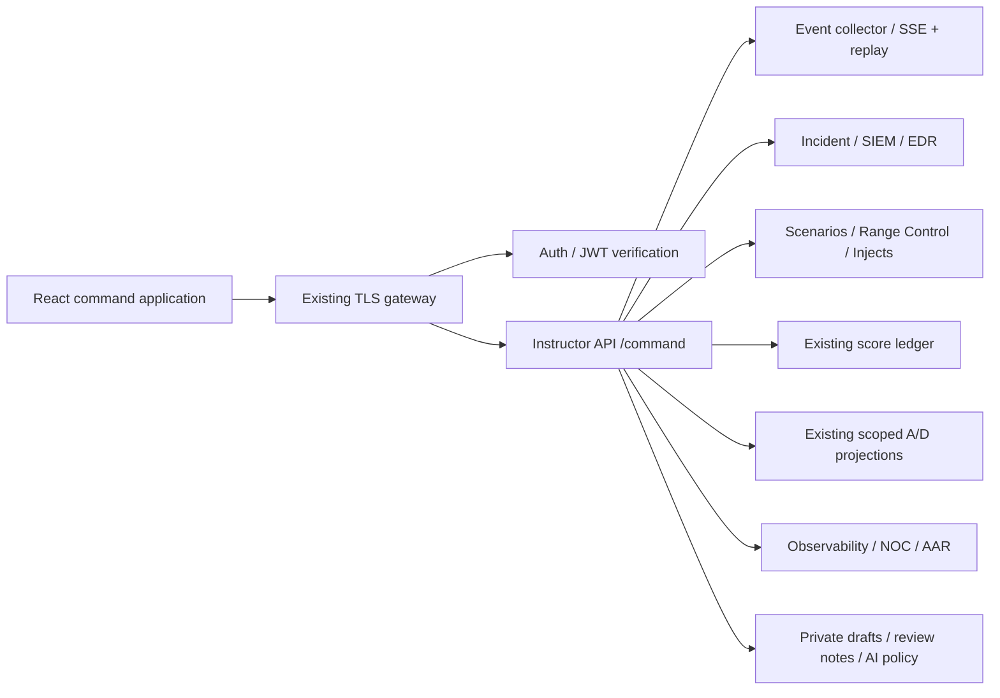

# Cyber Range Command architecture

2026-09-09 · Incremental migration of the existing cyber-range platform.

## Decisions

**ADR 01 — Retain the service architecture.** The existing FastAPI services, shared
contracts, SQLite stores, isolated twins, scoring engine, challenge portal, and
PostgreSQL-backed A/D engine remain authoritative. The new command UI does not run
attacks, infer points, or write directly to service databases.

**ADR 02 — Extend Instructor API with a command boundary.** `/command/*` verifies
identity, checks capabilities, scopes records, and calls a fixed upstream allowlist.
JWT sessions also pass Auth revocation verification. Static role tokens remain
supported; unscoped Red/Blue tokens cannot access scoped exercise evidence. The new
boundary explicitly ignores `RBAC_ALLOW_INSECURE_DEV` and never fails open.

**ADR 03 — Share source without replacing every workspace.**
`dashboards/shared` exports `@cyber-range/command-system`, a local `file:` package.
The new React application lives in the existing `dashboards/control-tower` path.
The five specialist React applications adopt the shared tokens and workspace bar;
their internal tools and routing remain available. No package registry, cloud
hosting service, external font CDN, or new monorepo runner is needed. Run `npm ci`
after changing shared source: `install-links=true` installs a package copy.

**ADR 04 — Strict TypeScript and small route bundles.** Command models validate
unknown JSON at the boundary. Complex workspaces load with React `lazy` and
`Suspense`. Common transport handles headers, aborts, timeouts, non-JSON errors,
and authorization failures. Secrets are held in memory or existing HTTP cookies,
never URL query strings, local storage, drafts, or generated image prompts.

**ADR 05 — Evidence and inventory are distinct.** The sector inventory names the
existing 11 lab environments. Protocol labels describe configured capabilities;
they are not a live probe. Asset state changes require explicit source events.
Unknown initial state, unavailable service data, absent latency, and missing ATT&CK
mappings remain unknown. Decorative generated imagery never supplies graph nodes,
telemetry, severity, scores, labels, or controls.

**ADR 06 — Bounded live updates.** Authenticated fetch SSE parses multiline frames,
retains an in-memory resume cursor, batches UI updates at 150ms, and applies capped
exponential reconnect delays. Buffers contain at most 5,000 events, 200 notices and
20 pinned IDs. Event lists render an 18-row window. Durable snapshots reconcile
non-streamed sources every 30s. Score, safety and phase notices invalidate only
related snapshot sections. A scope change clears old evidence and rejects late
responses. Observers use a delayed, sanitized durable snapshot; they never open
privileged SSE. The collector now journals source events transactionally and uses its existing
process-local bus as a wake-up signal. Retained cursors survive restart; reset or
retention gaps trigger an explicit reload. See [service ownership](SERVICE_SCOPE.md).

**ADR 07 — Historical state has one clock.** Replay uses retained events, actual
score ledger timestamps, and incident timeline entries at or before the cursor.
Current assignee/status never backfill the past. Scenario-attributed cases use their
persisted ownership; older cases require exact evidence links. Configuration changes
come from scoped patch/isolation audit records, independently of patch verification
events. Signed, snapshot-bound collector pages replace the Command UI's 50,000-event
window. AAR requests select scenario-owned service evidence and page alert records.
Unknown initial asset state and unrecorded configuration remain unavailable.

**ADR 08 — Author the existing YAML schema.** Visual edits operate on YAML syntax
nodes, preserving unknown fields and comments. Switching modes never serializes.
Multi-document sources remain intact. Validation uses the actual runtime loader,
existing semantic linter and dry-run timeline. Publishing requires a reason,
confirmation, a matching SHA-256 revision, and no affected active tracker. Sources
are atomically written to `scenario_data:/data/authored` and restored at startup. Direct Studio publication also appends durable intent and
completion records to `/data/authoring-audit.jsonl`.
A process lock serializes writes in the supported single-worker scenario service.
Multiple scenario-engine writers are not supported by this filesystem design.

**ADR 09 — Commands remain human decisions.** Emergency stop, release, reset and
scenario lifecycle actions require explicit confirmation and a reason. Instructor
Audit records intent, completion, partial reset or failure. An upstream outage is
not successful release or a healthy state. Cancellation buttons default to
`type=button`. No automatic AI action executor exists.

**ADR 10 — Optional local AI, transparent training evidence.** AI is disabled until
`COMMAND_AI_URL`, `COMMAND_AI_MODEL` and instructor policy are configured. The
adapter targets an administrator-configured Ollama-compatible `/api/chat` service.
It sends server-selected, role-authorized context and treats telemetry as untrusted
content. UI output is labeled AI-generated suggestions with source references.
Policy controls trainee assistance; solutions/flags are never included as model
context. A prompt is not a guarantee of model behavior: instructors must evaluate
their chosen local model before enabling assistance. Training recommendations use
published difficulty and authenticated personal grader observations where available.
The legacy team response remains as an explicitly labeled fallback. Hint usage,
active working time and quality evidence remain unavailable, not opaque skill scores.
See [Personal training](PERSONAL_TRAINING.md).

## Command endpoints

All paths below are relative to `/command` (gateway `/api/instructor/command`).

| Endpoint | Contract / authority |
|---|---|
| `GET /session` | Actor, actual role, memberships, server capabilities, observer delay |
| `GET /snapshot?scenario_id=&sections=` | Source status/data/provenance/time and static sector inventory |
| `GET /stream?scenario_id=` | Authenticated, scoped SSE; `Last-Event-ID` header |
| `GET /assets/{id}` | Existing sector and role-permitted training catalog context |
| `GET /resources/{name}` | Fixed capability-checked service reads; no arbitrary URL proxy |
| `GET /search?q=&scenario_id=` | Role-filtered catalog matches and partial-source indicator |
| `GET /incidents/{id}` | Instructor or owning Blue team; other cases return 404 |
| `POST /incidents/{id}/{transition,note,assign}` | Existing Incident Service lifecycle and audit |
| `POST /promote` | Instructor or scoped Blue promotion of a verified SIEM alert |
| `POST /control` | Confirmed/reasoned fixed safety and scenario actions |
| `GET /audit` | Instructor audit records |
| `GET /replay`, `GET /replay/page`, `GET /aar` | Snapshot-bound history pages / exercise-scoped AAR |
| `GET/POST /annotations` | Persisted instructor AAR notes |
| `GET /scenarios/{id}/source`, `POST /scenarios/validate` | Existing YAML and actual runtime validation |
| `GET /drafts`, `POST /scenarios/{id}/{draft,publish}` | Private instructor drafts / explicit published source |
| `POST /injects/dispatch`, `POST /injects/{id}/respond` | Existing inject service, instructor/own-team scope |
| `GET /competition?match_id=` | Existing A/D observer/competitor/operator projections |
| `GET /training` | Team completion plus additive, scoped personal evidence source |
| `POST /training/challenges/{cid}/start` | Explicit idempotent personal practice start |
| `GET/POST /copilot/policy`, `POST /copilot` | Instructor policy / optional non-executing suggestions |

Source envelopes use `ready`, `unavailable`, `unauthorized`, or `error`. Missing
values are `null` rather than successful zero measurements. UI loading, stale
snapshot time, reconnect, degraded, empty, unauthorized and error states are explicit.

## Role boundaries

| Role | Command workspace access |
|---|---|
| Instructor | All command workflows, source authoring, global SOC and audit |
| Blue | Own team/exercise events, own incidents, replay, inject inbox, training |
| Red | Own Red events and authorized range training; no Blue incident/SOC data |
| Observer | Allowlisted delayed event fields, sector inventory and public A/D projection |
| Competitor | Membership-bound A/D projection, published training and optional policy assistance |
| Operator | Existing privileged A/D command projection |

There is no newly invented `admin` role. Existing platform administration remains
with the instructor and the established A/D operator model. Scoped Blue SIEM/EDR
views are enabled only when receiving-service scope is active and the JWT has team
and exercise membership. Global SOC and platform aggregates remain instructor-only.
The local compatibility profile retains its established isolated-range assumptions.

## Deployment and rollback

`make training-up` builds Control Tower and continues to serve port 5180. The
production gateway builds all six React applications with the same local shared
package and serves Command at `/control/`. Existing specialist paths and beginner
startup remain. Back up the existing instructor audit volume and the new
`scenario_data` volume before changing deployments. Drafts, annotations and AI policy
are additive tables in the existing Instructor API database.

Rollback the frontend/service image revisions together. Score rules are unchanged. Ownership columns, stream journal and configuration
history are additive migrations; retain these databases and safety audit journals.
An old service image cannot enforce the new production scope, so a rollback must
restore the previously isolated deployment boundary as well.
Keep `scenario_data` during rollback so authored sources can be exported/reapplied.
Do not use `docker compose down -v` as a routine upgrade or rollback procedure.

Production readiness still requires the acceptance and long-duration
load work listed in `NEXTGEN_ROADMAP.md`. This migration is not a security
certification or a declaration that every requested future capability is complete.

**ADR 11 — Enforce ownership in the receiving services.** The production profile
turns on shared ASGI identity/scope checks, including WebSockets. Durable ownership
columns and SQL filters protect reads and mutations. Unknown ownership does not
become the caller's team. Blue SOC capability is enabled only with this rollout and
valid team/exercise membership. Receiving services recheck JWT revocation; frontend
navigation remains a convenience rather than authority.

**ADR 12 — Keep service secrets out of compromised lab processes.** Each sensor
gets a domain-separated credential for its own asset. The production ingest proxy
forwards that identity. Its privileges cover only own-asset telemetry and agent
operations, not global reads or administration. Paired Red/Blue inventory keeps
actor score attribution distinct from defensive ownership. See SERVICE_SCOPE.md
for deployment and retained compatibility rules.

**ADR 13 — Preserve safety intent across reset.** Direct dangerous legacy operations
in strict mode require confirmation/reason and an fsynced intent/outcome journal.
A reset does not clear this journal or the EDR action audit table. Native instructor
confirmation uses the shared accessible dialog, and unknown emergency state no
longer renders as an inactive stop in that workspace.

**ADR 14 — Extend the visual editor against executable phase contracts.** Phase
creation and investigation/recovery controls reuse the runtime YAML schema. Numeric
phase IDs and explicit dependencies remain stable. The preview now distinguishes
phase completion rules from projected event durations; planning-only fields are
labeled instead of presented as automated rules. Unapplied typed criteria block
save/validation/mode changes. See [Scenario Studio](SCENARIO_STUDIO.md).

**ADR 15 — Separate individual evidence from competition scoring.** Nullable
verified actor attribution is appended to the existing portal audit. Personal
reads use actor + team + exercise + side; the original team solve and scoring
contracts remain authoritative. Explicit start records support honest elapsed time;
legacy attribution and uncollected measurements are not inferred.

**ADR 16 — Verify actual deployment dependency behavior.** The production FastAPI
version retains included routers. Receiving-service RBAC resolves its effective
route contexts, including nested prefixes, while retaining support for the local
flattened-route representation. Exact templates and methods still gate access;
unknown/global sibling routes inherit no participant grant. Real Docker checks
cover the new router. CI provisions PostgreSQL so A/D replica tests no longer skip.
