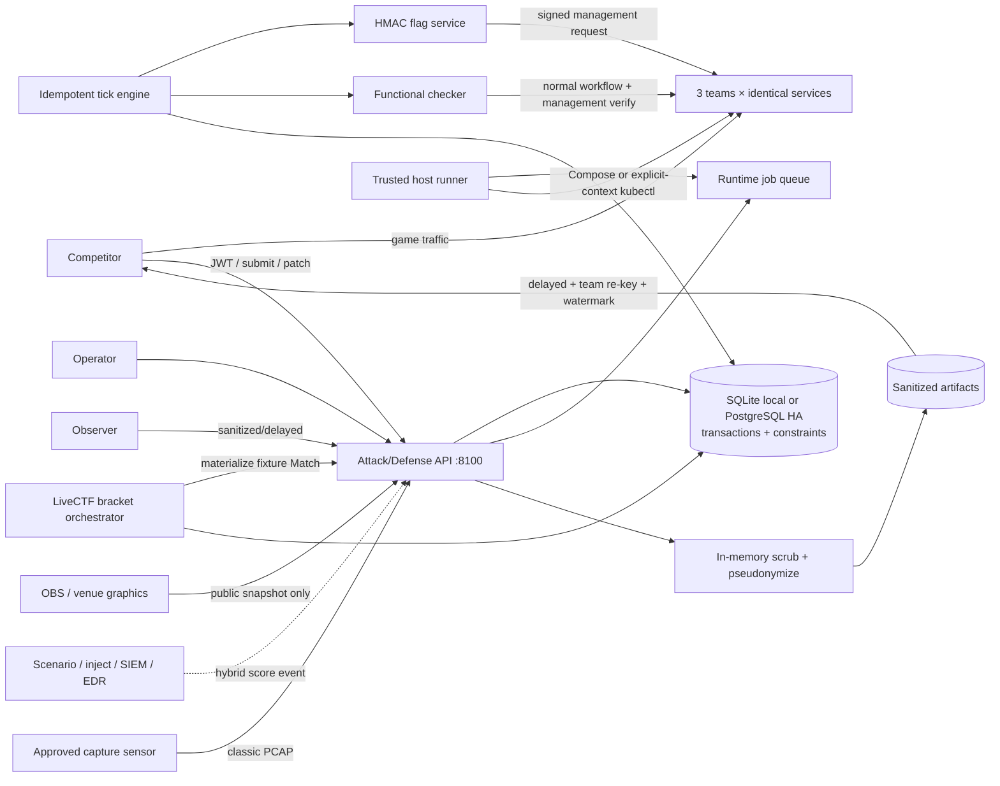

# Attack/Defense and Hybrid Live Fire Architecture

## Mode boundaries

The platform supports three independent modes:

| Mode | Owner | Required loop | Score domains |
|---|---|---|---|
| `exercise` | Existing `range_control`, `scenario_engine`, `injects`, `scoring_engine` | Operator Red scenario → Blue detection, containment, recovery and reporting | Existing red/blue exercise score |
| `attack_defense` | `services/attack_defense` | Symmetric services → rotating flags → checker → team-to-team submission → round finalization | Attack, Defense, Availability, Penalty, Adjustment |
| `hybrid_live_fire` | Attack/Defense engine plus optional legacy integration events | Symmetric A/D loop plus operator Red scenarios and mission injects | Attack, Flag Defense, Availability, Detection, Containment, Recovery, Incident Response, Mission Inject, Penalty |

No A/D round or flag behavior is injected into `exercise`. Mission injects are
not required by `attack_defense`. Hybrid composition is explicit in the Match
mode and its enabled score categories.

LiveCTF tournament orchestration sits above these modes. It accepts only
`attack_defense` or `hybrid_live_fire`, materializes each fixture as a fresh
ordinary Match, and never introduces a fourth `mode` value. Tournament entry
identity is mapped to a new Match-local team identity for every stage so Match
flags, patches, scores and credentials remain isolated.

## Components



Responsibility is divided under `services/attack_defense/`:

- `game_engine`: lease, recovery, state transitions, tick sequencing.
- `flag_service`: deterministic opaque tokens, lookup hashes, validation and
  expiry.
- `checker`: randomized functional workflows, timeouts, retry classification,
  signed management calls.
- `scoring`: policy and append-only ledger projection/recalculation.
- `service_fabric`: runtime protocol, declared Compose runtime, trusted
  host-side Compose adapter.
- `kubernetes_runtime`: deterministic namespace/manifest builder, restricted
  Pod Security and NetworkPolicy validation, digest-pinned rollout/restart/
  inspect adapter and cluster-DNS endpoint derivation.
- `patch_pipeline`: registry inspection, policy scan, sandbox/live jobs,
  post-deploy check and rollback.
- `network_policy`: dangerous runtime setting rejection.
- `evidence`: sanitized append-only audit events.
- `pcap_privacy`: fail-closed classic-PCAP parsing, in-memory raw-data scrub,
  address pseudonymization, delayed team-specific release and watermark audit.
- `tournament`: deterministic bracket seeding, isolated fixture materialization,
  restart reconciliation and score/referee based advancement.
- Public broadcast projection: a versioned, no-store whitelist composed from
  delayed scores, aggregate service posture and the public tournament bracket;
  it never consumes operator state or the event stream.
- `api`, `schemas`, `repositories`, `migrations`: transport and persistence.
- `mode_strategies`: `MatchModeStrategy`, `AttackPolicy`, `CheckerPolicy`,
  `InjectPolicy`, `ServiceDeploymentPolicy`, and `ScoreVisibilityPolicy`.

The browser graphics route is intentionally outside the role-aware operations
shell. Even if the browser profile contains an operator token, it calls only
`/public/matches/{id}/broadcast` without authorization. This makes the backend
field whitelist—not UI hiding—the disclosure boundary. See
[Broadcast Graphics Overlay](attack-defense-broadcast.md).

## Round processing

`pending → initializing → active → scoring → finalized` is the only normal
transition sequence. Each round has a stable ID and correlation ID derived from
match and sequence. Initialization issues one flag per team/service, injects it,
records `put_flag`, and runs the full functional checker. Active ticks run
periodic checks. Scoring writes deterministic target deltas to the append-only
ledger, then expires flags outside the configured round window.

SQLite `BEGIN IMMEDIATE`, uniqueness constraints, and a persisted expiring
engine lease make repeated local ticks safe. With
`ATTACK_DEFENSE_DATABASE_URL`, all replicas instead share PostgreSQL and hold a
session advisory lock for the entire Match tick. Startup scans persisted
`running` Matches, database time drives deadlines, and API rate limits are
shared UPSERT counters. See
[High-Availability Mode](attack-defense-high-availability.md).

## Runtime security boundary

The API does not mount `/var/run/docker.sock`. Patch and restart actions create
idempotent `runtime_jobs`. A trusted host operator runs:

```bash
python3 -m services.attack_defense.cli ad runtime-work
```

The runner validates service/project names and invokes Docker Compose for one
declared service. With `GAME_RUNTIME=kubernetes`, it instead requires an
explicit context and opt-in apply flag, validates a deny-by-default restricted
resource bundle, applies it over stdin and waits for Deployment readiness.
Candidate images first replace the management-only sandbox, then pass real
workflow/flag checks. Only then is a live job queued. A failed post-deploy check
queues rollback to the stored previous image.

## Implementation record

- Phase 0: baseline 248 tests passed; gap and rollback analysis written.
- Phase 1: migrations, models, round engine, flag lifecycle, ledger, submission
  and mode strategy APIs.
- Phase 2: three-team/six-instance Compose fabric, Vulnerable Notes, File Vault,
  management injector and checker.
- Phase 3: Attack/Defense/Availability calculation, hybrid domains, weighted
  scoreboard, deterministic recalculation.
- Phase 4: registry policy, persisted sandbox/deploy/rollback jobs.
- Phase 5: operator/participant APIs, audit, metrics, CLI, demo, policies,
  load profile and operations documentation.

## Optional KOTH composition

KOTH is implemented as a policy layer, not a new Match mode. It composes only
with `attack_defense` and `hybrid_live_fire`, leaving the exercise strategy and
CCE inject workflow unchanged. An accepted opponent flag submission atomically
acquires, captures or renews a team/service hill in the same transaction as the
Attack ledger entry. Ownership is an append-only round lease.

At round finalization the scoring service derives a `koth` target from the
latest active lease. Points are awarded only when the victim service has
successful `put_flag`, `get_flag`, and `benign_workflow` checks for that round.
This keeps hill ownership and service functionality independently auditable.
See [KOTH Policy](attack-defense-koth.md).

## Optional Stealth composition

Stealth is another symmetric-mode policy layer, not a Match mode. The flag
service creates an internal incident in the same transaction as an accepted
submission. Defender reports carry only an indicator SHA-256 and safe summary;
the external response never reveals whether a report matched. At the detection
deadline the scoring service deterministically awards either `stealth_attack`
to the attacker or `stealth_detection` to the victim.

Operators receive real-time internal state. Competitors receive only their own
attacker-redacted incidents after the disclosure round; observers receive a
delayed service aggregate. Public scoreboard and KOTH state use the same delay
floor, while immediate incident and KOTH ownership SSE events are suppressed.
See [Stealth Mode Policy](attack-defense-stealth.md).

## LiveCTF tournament composition

The tournament service pre-creates stable bracket stages and fixtures, then
materializes only fixtures whose two entry slots are known. A materialized
fixture receives fresh Match/team/service IDs and is thereafter handled by the
normal Game Engine. Finalization reads that Match's authoritative operator
scoreboard, advances one stable entry in the same transaction, and reconciles
the next stage. Exact ties require an explicit referee decision and reason.

Public projections omit Match IDs and identity subjects. Tournament-scoped JWTs
cannot submit flags or patches; every fixture requires fresh Match-local claims.
See [LiveCTF Tournament Orchestration](attack-defense-tournament.md).
