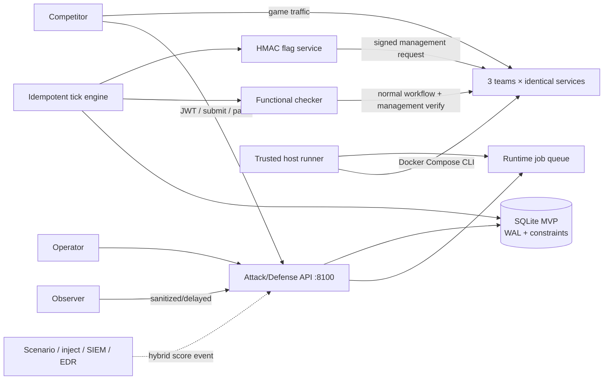

# Attack/Defense and Hybrid Live Fire Architecture

## Mode boundaries

The platform supports three independent modes:

| Mode | Owner | Required loop | Score domains |
|---|---|---|---|
| `exercise` | Existing `range_control`, `scenario_engine`, `injects`, `scoring_engine` | Operator Red scenario → Blue detection, containment, recovery and reporting | Existing red/blue exercise score |
| `attack_defense` | `services/attack_defense` | Symmetric services → rotating flags → checker → team-to-team submission → round finalization | Attack, Defense, Availability, Penalty, Adjustment |
| `hybrid_live_fire` | Attack/Defense engine plus optional legacy integration events | Symmetric A/D loop plus operator Red scenarios and mission injects | Attack, Flag Defense, Availability, Detection, Containment, Recovery, Incident Response, Mission Inject, Penalty |

No A/D round or flag behavior is injected into `exercise`. Mission injects are
not required by `attack_defense`. Hybrid composition is explicit in the Match
mode and its enabled score categories.

## Components



Responsibility is divided under `services/attack_defense/`:

- `game_engine`: lease, recovery, state transitions, tick sequencing.
- `flag_service`: deterministic opaque tokens, lookup hashes, validation and
  expiry.
- `checker`: randomized functional workflows, timeouts, retry classification,
  signed management calls.
- `scoring`: policy and append-only ledger projection/recalculation.
- `service_fabric`: runtime protocol, declared Compose runtime, trusted
  host-side Compose adapter.
- `patch_pipeline`: registry inspection, policy scan, sandbox/live jobs,
  post-deploy check and rollback.
- `network_policy`: dangerous runtime setting rejection.
- `evidence`: sanitized append-only audit events.
- `api`, `schemas`, `repositories`, `migrations`: transport and persistence.
- `mode_strategies`: `MatchModeStrategy`, `AttackPolicy`, `CheckerPolicy`,
  `InjectPolicy`, `ServiceDeploymentPolicy`, and `ScoreVisibilityPolicy`.

## Round processing

`pending → initializing → active → scoring → finalized` is the only normal
transition sequence. Each round has a stable ID and correlation ID derived from
match and sequence. Initialization issues one flag per team/service, injects it,
records `put_flag`, and runs the full functional checker. Active ticks run
periodic checks. Scoring writes deterministic target deltas to the append-only
ledger, then expires flags outside the configured round window.

SQLite `BEGIN IMMEDIATE`, uniqueness constraints, and a persisted expiring
engine lease make repeated local ticks safe. Startup scans persisted `running`
matches. A production multi-host deployment must replace the lease with
PostgreSQL advisory locks.

## Runtime security boundary

The API does not mount `/var/run/docker.sock`. Patch and restart actions create
idempotent `runtime_jobs`. A trusted host operator runs:

```bash
python3 -m services.attack_defense.cli ad runtime-work
```

The runner validates service/project names and invokes Docker Compose for one
declared service. Candidate images first replace the management-only sandbox,
then pass real workflow/flag checks. Only then is a live job queued. A failed
post-deploy check queues rollback to the stored previous image.

## Implementation record

- Phase 0: baseline 248 tests passed; gap and rollback analysis written.
- Phase 1: migrations, models, round engine, flag lifecycle, ledger, submission
  and mode strategy APIs.
- Phase 2: three-team/six-instance Compose fabric, Vulnerable Notes, File Vault,
  management injector and checker.
- Phase 3: Attack/Defense/Availability calculation, hybrid domains, weighted
  scoreboard, deterministic recalculation.
- Phase 4: registry policy, persisted sandbox/deploy/rollback jobs.
- Phase 5: operator/participant APIs, audit, metrics, CLI, demo, policies,
  load profile and operations documentation.
